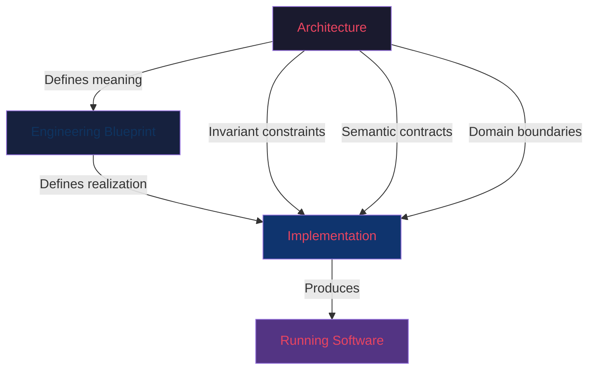
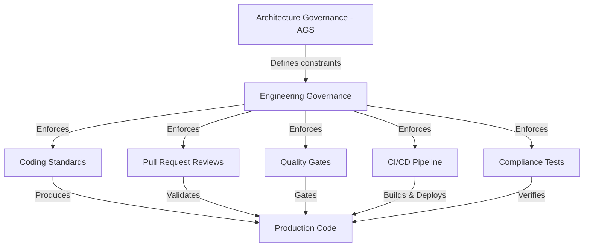
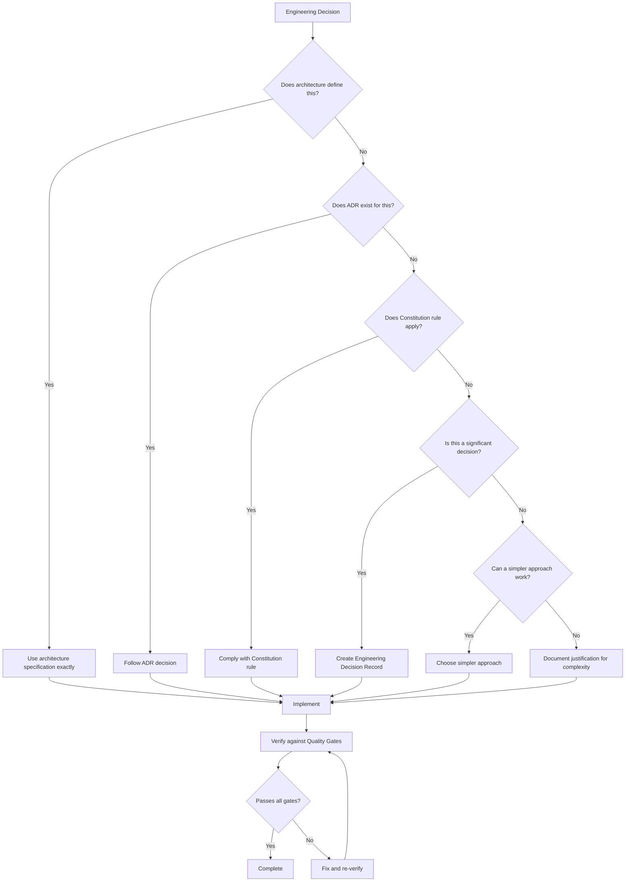

# 00 — Engineering Vision

**Version:** 1.0  
**Status:** Normative  
**Parent:** RIOS Master Architecture Blueprint (MAB)  
**Cross-References:** AGS §3, Constitution §I, ADR-001 through ADR-011

---

## 1. Purpose

This document defines the engineering philosophy, principles, goals,
constraints, and quality attributes that govern all RIOS implementation work. It
establishes the relationship between architecture and engineering and provides
the decision-making framework for every engineering choice.

---

## 2. Engineering Philosophy

### 2.1 Core Axiom

> **Engineering exists to realize architecture.**

Engineering does not create meaning. Architecture creates meaning. Engineering
translates that meaning into working software.

### 2.2 Philosophical Pillars

| Pillar                                           | Statement                                                                               | Source             |
| ------------------------------------------------ | --------------------------------------------------------------------------------------- | ------------------ |
| Architecture Sovereignty                         | Architecture owns meaning. Engineering owns realization. Implementation owns execution. | MAB                |
| Technology Servitude                             | Technology serves architecture. Architecture serves research.                           | Volume 0 §3        |
| Maintainability Over Cleverness                  | Simple, readable code is always preferred over clever optimizations.                    | Constitution §I    |
| Explicitness Over Implicit Behavior              | Every behavior, rule, and boundary must be explicitly defined.                          | DMS, AGS           |
| Consistency Over Novelty                         | Established patterns are preferred over experimental approaches.                        | AGS §3 Objective 1 |
| Long-term Evolution Over Short-term Optimization | Decisions that serve 10-year maintainability are preferred over 10ms latency gains.     | AGS §3 Objective 4 |

### 2.3 Architecture–Engineering Relationship

**Rules:**

- Engineering SHALL NOT contradict architecture. (Constitution §0.2)
- Engineering SHALL NOT introduce architectural concepts. (Constitution §0.3)
- Engineering decisions are temporary. Architecture decisions are permanent.
  (AGS §2)
- When engineering convenience conflicts with architectural integrity,
  architecture SHALL prevail.

---

## 3. Engineering Principles

### 3.1 Primary Engineering Principles

| ID     | Principle                      | Description                                                                        | Architecture Basis         |
| ------ | ------------------------------ | ---------------------------------------------------------------------------------- | -------------------------- |
| EP-001 | Domain-Driven Realization      | Every code structure maps to a domain concept.                                     | DDM, DMS                   |
| EP-002 | Event-Driven State             | State changes only through domain events.                                          | ADR-002, ARCH-003          |
| EP-003 | Command-Query Separation       | Write operations are strictly separated from read operations.                      | ADR-001                    |
| EP-004 | Aggregate Integrity            | Aggregate boundaries enforce invariants at all times.                              | ADR-005                    |
| EP-005 | Interface-Based Collaboration  | Cross-domain interaction occurs only through published interfaces.                 | DOM §4, ADR-006            |
| EP-006 | Evidence Before Implementation | Every implementation decision traces to architectural evidence.                    | ATM                        |
| EP-007 | Test-First Verification        | Implementation is verified through comprehensive testing before acceptance.        | Constitution §VIII         |
| EP-008 | Continuous Documentation       | Documentation evolves alongside code. Stale documentation is a governance failure. | Constitution §10.2 EVO-006 |
| EP-009 | Semantic Fidelity              | All code uses canonical terminology from the CTD.                                  | CTD, Constitution §1.2     |
| EP-010 | Dependency Discipline          | Dependencies flow downward only in the canonical DAG.                              | DDM §5                     |

### 3.2 Engineering Anti-Principles

These are approaches RIOS explicitly rejects.

| Anti-Principle                     | Reason for Rejection                                      | Source                       |
| ---------------------------------- | --------------------------------------------------------- | ---------------------------- |
| CRUD-first design                  | Allows subjective narrative to override verifiable facts. | ADR-001                      |
| God objects / services             | Violates single responsibility and domain boundaries.     | Constitution §2.5 FA-DDD-015 |
| Shared mutable state               | Creates unpredictable behavior and testing difficulties.  | Constitution §4.3 FA-IMP-001 |
| Infrastructure-driven architecture | Technology decisions must not drive domain decisions.     | AGS §3 Objective 5           |
| Premature optimization             | Violates evidence-before-implementation principle.        | Constitution §4.3 FA-IMP-015 |

---

## 4. Engineering Goals

### 4.1 Strategic Goals

| ID     | Goal                                     | Success Metric                                                   | Timeline |
| ------ | ---------------------------------------- | ---------------------------------------------------------------- | -------- |
| EG-001 | Deterministic AI-assisted implementation | AI agents can implement features without architectural ambiguity | Phase 1  |
| EG-002 | Architecture compliance automation       | 100% of code passes architecture compliance tests                | Phase 1  |
| EG-003 | Decade-long maintainability              | Code written today remains comprehensible in 2036                | Ongoing  |
| EG-004 | Zero architectural drift                 | All code maps to architecture; no orphaned concepts              | Ongoing  |
| EG-005 | Research integrity preservation          | Evidence chain is complete and verifiable in all implementations | Phase 1  |
| EG-006 | Developer onboarding in < 1 day          | New developers can contribute meaningful code within first day   | Phase 2  |

### 4.2 Tactical Goals

| ID      | Goal                                    | Implementation Strategy                          |
| ------- | --------------------------------------- | ------------------------------------------------ |
| EG-T001 | Every module has a clear domain owner   | Module naming follows domain prefix convention   |
| EG-T002 | Every interface has a semantic contract | Semantic contract documentation embedded in code |
| EG-T003 | Every aggregate has invariant tests     | Test-first aggregate development                 |
| EG-T004 | Every domain event is immutable         | Value object pattern for all events              |
| EG-T005 | Every projection is deterministic       | Same events always produce same projection       |
| EG-T006 | Zero circular dependencies              | Architecture compliance tests enforce DAG        |

---

## 5. Engineering Constraints

### 5.1 Immutable Constraints (From Architecture)

These constraints are inherited from the architecture and CANNOT be changed by
engineering.

| ID     | Constraint                                           | Source            | Enforcement          |
| ------ | ---------------------------------------------------- | ----------------- | -------------------- |
| EC-001 | Research Identity is a read-only projection          | ADR-001, ARCH-003 | Architecture tests   |
| EC-002 | Event stream is append-only                          | ADR-002, ARCH-002 | Database constraints |
| EC-003 | CQRS separation is mandatory                         | ADR-001           | Code structure       |
| EC-004 | Domain boundaries are inviolable                     | DDM, DOM          | Module boundaries    |
| EC-005 | Dependencies flow downward only                      | DDM §5            | Architecture tests   |
| EC-006 | Every concept has one Primary Owner                  | DOM §4 DOM-P-001  | Code review          |
| EC-007 | Semantic contracts are mandatory for all interfaces  | ADR-006           | Contract tests       |
| EC-008 | Canonical terminology SHALL be used in all code      | CTD               | Naming review        |
| EC-009 | No aggregate may change state without a domain event | ARCH-003          | Aggregate tests      |
| EC-010 | Technology independence at architecture level        | AGS §3            | Architecture review  |

### 5.2 Engineering Constraints

These constraints are established by engineering for implementation quality.

| ID      | Constraint                                        | Rationale                                       |
| ------- | ------------------------------------------------- | ----------------------------------------------- |
| EC-E001 | TypeScript is the primary implementation language | Type safety, ecosystem maturity, team expertise |
| EC-E002 | All code must pass strict TypeScript checks       | Prevents runtime type errors                    |
| EC-E003 | Maximum method length: 30 lines                   | Readability (Constitution §4.3 FA-IMP-012)      |
| EC-E004 | Maximum class public methods: 10                  | Simplicity (Constitution §4.3 FA-IMP-013)       |
| EC-E005 | Test coverage minimum: 80% for domain logic       | Verification confidence                         |
| EC-E006 | All public APIs must have OpenAPI specifications  | API contract clarity                            |
| EC-E007 | No `any` types in domain code                     | Type safety                                     |
| EC-E008 | All database changes through migrations only      | Schema versioning                               |
| EC-E009 | All configuration through environment variables   | 12-factor app compliance                        |
| EC-E010 | All secrets through secret management service     | Security compliance                             |

---

## 6. Engineering Quality Attributes

### 6.1 Quality Attribute Priorities

Quality attributes are ordered by priority. When conflicts arise,
higher-priority attributes prevail.

| Priority | Attribute           | Definition                                              | Target                              |
| -------- | ------------------- | ------------------------------------------------------- | ----------------------------------- |
| 1        | **Correctness**     | System behavior matches architecture specification      | 100%                                |
| 2        | **Maintainability** | Code can be understood and modified by any engineer     | Qualitative: < 30 min comprehension |
| 3        | **Reliability**     | System operates correctly under stated conditions       | 99.9% uptime                        |
| 4        | **Security**        | System protects data and resists threats                | Zero critical vulnerabilities       |
| 5        | **Performance**     | System responds within acceptable timeframes            | P95 < 200ms for queries             |
| 6        | **Scalability**     | System handles growing load gracefully                  | Linear scaling to 10x load          |
| 7        | **Accessibility**   | System is usable by all people                          | WCAG 2.1 AA compliance              |
| 8        | **Testability**     | System can be thoroughly verified                       | 80%+ domain logic coverage          |
| 9        | **Observability**   | System behavior can be understood from external outputs | Full distributed tracing            |
| 10       | **Portability**     | System can operate in different environments            | Docker-based portability            |

### 6.2 Quality Attribute Scenarios

| Scenario | Quality Attribute | Stimulus                         | Response                                  | Measure                           |
| -------- | ----------------- | -------------------------------- | ----------------------------------------- | --------------------------------- |
| QA-S01   | Correctness       | New feature implementation       | Feature matches architecture spec         | Architecture compliance test pass |
| QA-S02   | Maintainability   | Engineer reads unfamiliar module | Understands purpose and structure         | < 30 minutes                      |
| QA-S03   | Reliability       | Database connection lost         | System queues writes, serves cached reads | No data loss                      |
| QA-S04   | Performance       | Identity projection query        | Returns synthesized identity              | P95 < 200ms                       |
| QA-S05   | Security          | Unauthorized API access attempt  | Request rejected with audit log entry     | 100% rejection rate               |
| QA-S06   | Scalability       | 10x traffic increase             | System scales horizontally                | Linear response time              |

---

## 7. Engineering Governance

### 7.1 Governance Model

Engineering governance is subordinate to architecture governance.

### 7.2 Engineering Decision Authority

| Decision Type          | Authority Level                        | Documentation Required |
| ---------------------- | -------------------------------------- | ---------------------- |
| Architecture change    | Architecture Governance Board          | ADR (mandatory)        |
| Technology selection   | Engineering Lead + Architecture Review | Tech Decision Record   |
| Library addition       | Engineering Lead                       | Dependency review      |
| Coding standard change | Engineering Team                       | Style guide update     |
| Refactoring approach   | Domain Owner + Peer Review             | Refactoring plan       |
| Implementation detail  | Individual Engineer                    | Code comments          |

### 7.3 Review Requirements

| Change Class           | Review Required                    | Source |
| ---------------------- | ---------------------------------- | ------ |
| Class A — Editorial    | Self-review                        | AGS §8 |
| Class B — Minor        | Peer review                        | AGS §8 |
| Class C — Significant  | Domain owner + architecture review | AGS §8 |
| Class D — Foundational | Full governance review + ADR       | AGS §8 |

---

## 8. Technology Independence

### 8.1 Architecture is Technology-Independent

The RIOS architecture defines meaning, not implementation. Engineering selects
technology to realize architecture.

**Rule:** Architecture documents SHALL NOT contain technology references.
(Editorial Standard §6)

### 8.2 Technology Selection Criteria

| Criterion                 | Weight | Description                                             |
| ------------------------- | ------ | ------------------------------------------------------- |
| Architecture alignment    | 30%    | Does the technology support architectural requirements? |
| Long-term maintainability | 25%    | Will the technology be maintained for 10+ years?        |
| Ecosystem maturity        | 20%    | Is the ecosystem stable with active community?          |
| Team expertise            | 15%    | Can the team effectively use this technology?           |
| Performance               | 10%    | Does the technology meet performance requirements?      |

---

## 9. Long-Term Maintainability

### 9.1 Maintainability Principles

| Principle                     | Implementation                                    |
| ----------------------------- | ------------------------------------------------- |
| Code reads like documentation | Self-documenting names, clear structure           |
| Every decision has a reason   | Comments explain WHY, not WHAT                    |
| Complexity is justified       | Complex code requires ADR or inline justification |
| Duplication is eliminated     | DRY within domain boundaries                      |
| Dependencies are minimized    | Every dependency has a documented justification   |
| Tests are documentation       | Tests describe expected behavior                  |

### 9.2 Maintainability Metrics

| Metric                           | Target              | Measurement                   |
| -------------------------------- | ------------------- | ----------------------------- |
| Cyclomatic complexity per method | ≤ 10                | Static analysis               |
| Lines per method                 | ≤ 30                | Static analysis               |
| Public methods per class         | ≤ 10                | Static analysis               |
| Coupling between modules         | Minimal             | Architecture compliance tests |
| Documentation coverage           | 100% of public APIs | Doc generation                |
| Test coverage (domain logic)     | ≥ 80%               | Coverage reports              |

---

## 10. Engineering Decision Framework

When facing an engineering decision, follow this framework:

---

## 11. Verification Checklist

Before considering any engineering task complete, verify:

- [ ] Implementation matches architecture specification
- [ ] Canonical terminology from CTD is used
- [ ] Domain boundaries are respected
- [ ] Dependency direction is maintained
- [ ] Semantic contracts are satisfied
- [ ] All tests pass (unit, integration, architecture)
- [ ] Documentation is updated
- [ ] No forbidden actions are violated (Constitution §XI)
- [ ] Quality gates are passed (18-Quality-Gates.md)
- [ ] Traceability is maintained

---

_This document is part of the RIOS Engineering Blueprint. It is subordinate to
the Master Architecture Blueprint, Architecture Governance Standard, and all
normative architecture documents._
