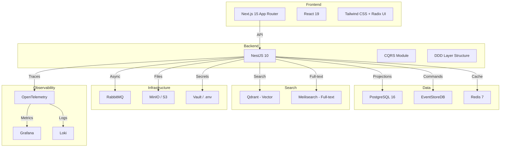
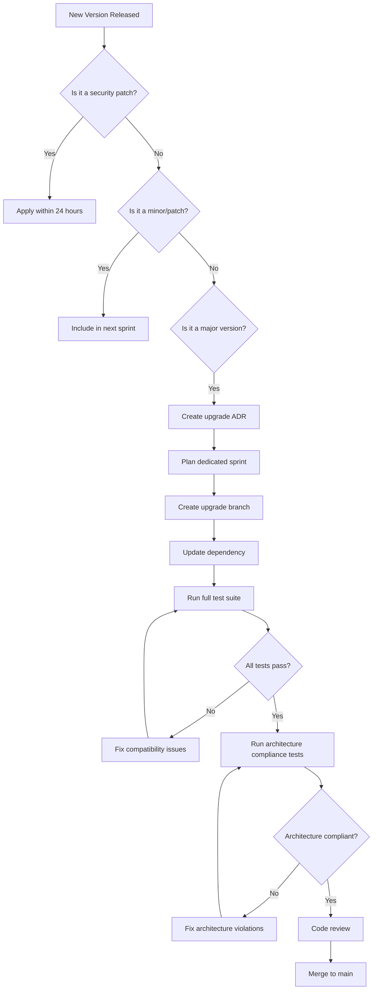

# 01 — Technology Strategy

**Version:** 1.0  
**Status:** Normative  
**Parent:** RIOS Master Architecture Blueprint (MAB)  
**Cross-References:** ADR-001 through ADR-011, AGS §3 Objective 5, Constitution
§I

---

## 1. Purpose

This document defines the complete technology stack for RIOS. Every technology
selection is justified against architectural requirements, long-term
maintainability, and engineering quality attributes defined in
[00-Engineering-Vision.md](00-Engineering-Vision.md).

> Architecture is technology-independent. Engineering selects technology to
> realize architecture. Technology serves architecture, never the reverse.

---

## 2. Technology Selection Criteria

| Criterion                 | Weight | Description                                           |
| ------------------------- | ------ | ----------------------------------------------------- |
| Architecture alignment    | 30%    | Supports CQRS, Event Sourcing, DDD, domain boundaries |
| Long-term maintainability | 25%    | Active maintenance, LTS releases, 10+ year horizon    |
| Ecosystem maturity        | 20%    | Stable APIs, large community, proven in production    |
| Team expertise            | 15%    | TypeScript/Node.js ecosystem proficiency              |
| Performance               | 10%    | Meets P95 < 200ms query latency target                |

---

## 3. Technology Stack Overview

### 3.1 Full Stack Summary

| Layer              | Technology                                 | Purpose                                 | Version           |
| ------------------ | ------------------------------------------ | --------------------------------------- | ----------------- |
| Language           | TypeScript                                 | Primary implementation language         | 5.x               |
| Runtime            | Node.js                                    | Server-side execution                   | 22 LTS            |
| Backend Framework  | NestJS                                     | CQRS/DDD-structured API framework       | 10.x              |
| Frontend Framework | Next.js                                    | React-based SSR/SSG application         | 15.x (App Router) |
| UI Library         | React                                      | Component-based UI                      | 19.x              |
| Design System      | Tailwind CSS + Radix UI                    | Accessible, composable UI primitives    | Latest            |
| Database           | PostgreSQL                                 | Primary relational data store           | 16.x              |
| Event Store        | EventStoreDB                               | Append-only event stream store          | 23.x+             |
| Cache              | Redis                                      | In-memory cache, session store, pub/sub | 7.x               |
| Vector Database    | Qdrant                                     | Semantic search, embedding storage      | Latest            |
| Search Engine      | Meilisearch                                | Full-text keyword search                | Latest            |
| Message Broker     | RabbitMQ                                   | Async command/event processing          | 3.x               |
| Container Runtime  | Docker                                     | Local development, deployment packaging | Latest            |
| Orchestration      | Docker Compose (local) / Kubernetes (prod) | Service orchestration                   | Latest            |
| CI/CD              | GitHub Actions                             | Build, test, deploy automation          | Latest            |
| Monitoring         | OpenTelemetry + Grafana                    | Metrics, traces, dashboards             | Latest            |
| Logging            | Pino + Loki                                | Structured JSON logging                 | Latest            |
| Object Storage     | MinIO (local) / S3 (prod)                  | File and asset storage                  | Latest            |
| Secret Management  | HashiCorp Vault (prod) / .env (local)      | Secret storage                          | Latest            |
| API Documentation  | Swagger / OpenAPI 3.1                      | API specification                       | Latest            |

### 3.2 Architecture Diagram

---

## 4. Technology Decision Records

### 4.1 TypeScript — Primary Language

| Aspect                      | Decision                                                                                                                                                                |
| --------------------------- | ----------------------------------------------------------------------------------------------------------------------------------------------------------------------- |
| **Purpose**                 | Primary implementation language for both frontend and backend                                                                                                           |
| **Why Selected**            | Type safety enforces domain model correctness at compile time; shared types between frontend/backend; largest ecosystem for web development; strong DDD library support |
| **Alternatives Considered** | Go (strong typing but no frontend sharing), Rust (excellent safety but slower development velocity), Java (enterprise-proven but heavier for this domain)               |
| **Tradeoffs**               | Runtime type erasure requires runtime validation at boundaries; less performant than compiled languages                                                                 |
| **Integration Strategy**    | Monorepo with shared TypeScript project references                                                                                                                      |
| **Upgrade Strategy**        | Follow TypeScript release cycle; adopt new features incrementally                                                                                                       |
| **Deprecation Strategy**    | N/A — language is primary technology                                                                                                                                    |
| **Compatibility**           | ES2022 target for backend, ES2017 target for frontend                                                                                                                   |
| **Lifecycle**               | Indefinite — primary language                                                                                                                                           |
| **Architecture Alignment**  | Supports ADR-005 (DDD) through rich type system; supports CQRS through class-based command/query separation                                                             |

### 4.2 NestJS — Backend Framework

| Aspect                      | Decision                                                                                                                                                                                                  |
| --------------------------- | --------------------------------------------------------------------------------------------------------------------------------------------------------------------------------------------------------- |
| **Purpose**                 | Structured backend framework with native CQRS support                                                                                                                                                     |
| **Why Selected**            | First-class CQRS module (`@nestjs/cqrs`); decorator-based DI aligns with DDD; module system maps to domain boundaries; strong TypeScript integration; structured project layout enforces layer separation |
| **Alternatives Considered** | Express (too minimal for DDD), Fastify (performant but no CQRS structure), AdonisJS (good DX but smaller ecosystem), Custom framework (high maintenance cost)                                             |
| **Tradeoffs**               | Opinionated structure requires adherence to NestJS patterns; decorator-heavy code; learning curve for DI concepts                                                                                         |
| **Integration Strategy**    | NestJS modules map 1:1 to RIOS domains; CQRS module handles command/query bus                                                                                                                             |
| **Upgrade Strategy**        | Follow major version releases with dedicated upgrade sprints                                                                                                                                              |
| **Deprecation Strategy**    | Abstract NestJS-specific decorators behind domain interfaces where possible                                                                                                                               |
| **Compatibility**           | Node.js 22 LTS                                                                                                                                                                                            |
| **Lifecycle**               | 5+ years — active community, enterprise adoption                                                                                                                                                          |
| **Architecture Alignment**  | Native CQRS support (ADR-001); module system enforces domain boundaries (DDM); DI supports aggregate isolation (ADR-005)                                                                                  |

### 4.3 Next.js — Frontend Framework

| Aspect                      | Decision                                                                                                                                                                                                |
| --------------------------- | ------------------------------------------------------------------------------------------------------------------------------------------------------------------------------------------------------- |
| **Purpose**                 | Server-rendered React application with App Router                                                                                                                                                       |
| **Why Selected**            | App Router enables Server Components (reduce client bundle); SSR/SSG for SEO; React Server Components align with read-model projections; file-based routing maps to domain navigation; strong ecosystem |
| **Alternatives Considered** | Remix (good but smaller ecosystem), SvelteKit (performant but less mature), Angular (enterprise but heavier), Astro (content-focused but less interactive)                                              |
| **Tradeoffs**               | Server Components complexity; Vercel-centric ecosystem; frequent major updates                                                                                                                          |
| **Integration Strategy**    | Next.js consumes backend API via REST/GraphQL; Server Components fetch read-models directly                                                                                                             |
| **Upgrade Strategy**        | Follow Next.js release cycle; adopt App Router features incrementally                                                                                                                                   |
| **Deprecation Strategy**    | Abstract data fetching behind service layer to reduce framework coupling                                                                                                                                |
| **Compatibility**           | React 19, Node.js 22                                                                                                                                                                                    |
| **Lifecycle**               | 5+ years — backed by Vercel, massive community                                                                                                                                                          |
| **Architecture Alignment**  | Server Components consume read-model projections (ADR-001 query side); SSR serves identity views (Volume V)                                                                                             |

### 4.4 PostgreSQL — Primary Database

| Aspect                      | Decision                                                                                                                                             |
| --------------------------- | ---------------------------------------------------------------------------------------------------------------------------------------------------- |
| **Purpose**                 | Relational store for read-model projections, user data, configuration                                                                                |
| **Why Selected**            | ACID compliance for projection consistency; JSONB for flexible schemas; mature migration tooling; excellent indexing; proven at scale; open-source   |
| **Alternatives Considered** | MySQL (less JSONB support), MongoDB (no ACID for projections), CockroachDB (over-engineered for current scale), SQLite (insufficient for production) |
| **Tradeoffs**               | Requires schema migrations; vertical scaling limits (mitigated by read replicas)                                                                     |
| **Integration Strategy**    | TypeORM or Prisma for projection repositories; raw SQL for performance-critical queries                                                              |
| **Upgrade Strategy**        | Follow PostgreSQL major version cycle; use logical replication for zero-downtime upgrades                                                            |
| **Deprecation Strategy**    | Abstract ORM behind repository interfaces                                                                                                            |
| **Compatibility**           | Node.js via pg driver                                                                                                                                |
| **Lifecycle**               | 10+ years — 30+ year track record                                                                                                                    |
| **Architecture Alignment**  | Stores read-model projections (ADR-001 query side); supports eventual consistency model                                                              |

### 4.5 EventStoreDB — Event Store

| Aspect                      | Decision                                                                                                                                                                              |
| --------------------------- | ------------------------------------------------------------------------------------------------------------------------------------------------------------------------------------- |
| **Purpose**                 | Append-only event stream store for domain events                                                                                                                                      |
| **Why Selected**            | Purpose-built for event sourcing; native event streaming; projection support; subscription model; exactly-once semantics; persistent subscriptions                                    |
| **Alternatives Considered** | PostgreSQL-based event store (possible but lacks streaming features), Kafka (over-engineered for domain events), DynamoDB Streams (vendor lock-in), Custom implementation (high risk) |
| **Tradeoffs**               | Additional infrastructure component; learning curve; smaller community than general databases                                                                                         |
| **Integration Strategy**    | @eventstore/db-client for Node.js; NestJS CQRS module integration                                                                                                                     |
| **Upgrade Strategy**        | Follow EventStoreDB release cycle; use LTS versions                                                                                                                                   |
| **Deprecation Strategy**    | Abstract event store behind repository interface; event format is architecture-owned                                                                                                  |
| **Compatibility**           | gRPC protocol                                                                                                                                                                         |
| **Lifecycle**               | 5+ years — backed by Event Store Limited                                                                                                                                              |
| **Architecture Alignment**  | Implements ARCH-002 (append-only event stream); supports ADR-002 (event sourcing); enforces ARCH-003 (events as source of truth)                                                      |

### 4.6 Redis — Cache & Pub/Sub

| Aspect                      | Decision                                                                                                                                          |
| --------------------------- | ------------------------------------------------------------------------------------------------------------------------------------------------- |
| **Purpose**                 | In-memory cache, session storage, pub/sub for real-time updates                                                                                   |
| **Why Selected**            | Sub-millisecond latency for read-model caching; pub/sub for projection notifications; session storage; rate limiting counters; proven reliability |
| **Alternatives Considered** | Memcached (no pub/sub), DragonflyDB (newer, less proven), Valkey (Redis fork, evaluate stability)                                                 |
| **Tradeoffs**               | Memory-bound; data loss on crash (mitigated by persistence config)                                                                                |
| **Integration Strategy**    | ioredis for Node.js; NestJS cache manager integration                                                                                             |
| **Upgrade Strategy**        | Follow Redis release cycle; use Redis 7+ for module support                                                                                       |
| **Deprecation Strategy**    | Abstract behind cache interface                                                                                                                   |
| **Compatibility**           | RESP3 protocol                                                                                                                                    |
| **Lifecycle**               | 10+ years — industry standard                                                                                                                     |
| **Architecture Alignment**  | Caches read-model projections (ADR-001 query side)                                                                                                |

### 4.7 Qdrant — Vector Database

| Aspect                      | Decision                                                                                                                                                                       |
| --------------------------- | ------------------------------------------------------------------------------------------------------------------------------------------------------------------------------ |
| **Purpose**                 | Vector storage and similarity search for semantic knowledge retrieval                                                                                                          |
| **Why Selected**            | High-performance vector search; filtering support; Rust-based (performance); OpenAPI-native; supports multiple distance metrics; collection-based organization maps to domains |
| **Alternatives Considered** | Pinecone (SaaS lock-in), Weaviate (heavier), Milvus (complex setup), pgvector (insufficient for scale)                                                                         |
| **Tradeoffs**               | Additional infrastructure; embedding generation pipeline required                                                                                                              |
| **Integration Strategy**    | @qdrant/js-client-rest for Node.js; batch embedding pipeline                                                                                                                   |
| **Upgrade Strategy**        | Follow Qdrant release cycle                                                                                                                                                    |
| **Deprecation Strategy**    | Abstract behind search repository interface                                                                                                                                    |
| **Compatibility**           | REST and gRPC                                                                                                                                                                  |
| **Lifecycle**               | 5+ years — active development, growing adoption                                                                                                                                |
| **Architecture Alignment**  | Supports knowledge retrieval (Volume II); enables semantic search for Research Objects                                                                                         |

### 4.8 RabbitMQ — Message Broker

| Aspect                      | Decision                                                                                                                                            |
| --------------------------- | --------------------------------------------------------------------------------------------------------------------------------------------------- |
| **Purpose**                 | Async command processing, event distribution, background job queuing                                                                                |
| **Why Selected**            | Reliable message delivery; routing flexibility; dead letter queues; proven in enterprise; supports AMQP; management UI                              |
| **Alternatives Considered** | Kafka (over-engineered for command processing), AWS SQS (vendor lock-in), Redis Streams (less reliable delivery), NATS (less mature for enterprise) |
| **Tradeoffs**               | Additional infrastructure; message ordering guarantees require careful queue design                                                                 |
| **Integration Strategy**    | amqplib for Node.js; NestJS microservice transport                                                                                                  |
| **Upgrade Strategy**        | Follow RabbitMQ release cycle; use quorum queues for reliability                                                                                    |
| **Deprecation Strategy**    | Abstract behind message bus interface                                                                                                               |
| **Compatibility**           | AMQP 0.9.1                                                                                                                                          |
| **Lifecycle**               | 10+ years — VMware/Broadcom backed                                                                                                                  |
| **Architecture Alignment**  | Supports async command handling (ADR-001); enables cross-domain event distribution (DDM)                                                            |

---

## 5. Technology Decision Matrix

### 5.1 Decision Matrix — Backend Framework

| Criterion                 | Weight | NestJS   | Express  | Fastify  | AdonisJS | Custom   |
| ------------------------- | ------ | -------- | -------- | -------- | -------- | -------- |
| Architecture alignment    | 30%    | 5        | 2        | 2        | 4        | 5        |
| Long-term maintainability | 25%    | 4        | 4        | 4        | 3        | 2        |
| Ecosystem maturity        | 20%    | 4        | 5        | 4        | 3        | 1        |
| Team expertise            | 15%    | 4        | 5        | 3        | 3        | 2        |
| Performance               | 10%    | 4        | 4        | 5        | 4        | 5        |
| **Weighted Score**        |        | **4.35** | **3.70** | **3.30** | **3.35** | **2.90** |

### 5.2 Decision Matrix — Event Store

| Criterion                 | Weight | EventStoreDB | PostgreSQL | Kafka    | DynamoDB | Custom   |
| ------------------------- | ------ | ------------ | ---------- | -------- | -------- | -------- |
| Architecture alignment    | 30%    | 5            | 3          | 3        | 2        | 4        |
| Long-term maintainability | 25%    | 4            | 5          | 4        | 4        | 2        |
| Ecosystem maturity        | 20%    | 3            | 5          | 5        | 4        | 1        |
| Team expertise            | 15%    | 2            | 5          | 3        | 3        | 2        |
| Performance               | 10%    | 5            | 3          | 5        | 4        | 4        |
| **Weighted Score**        |        | **3.90**     | **4.20**   | **3.80** | **3.30** | **2.50** |

> **Note:** PostgreSQL scores highest on maintainability/ecosystem but
> EventStoreDB is selected for its purpose-built event sourcing capabilities
> (streaming, subscriptions, projections). The architecture alignment score
> differential is decisive. PostgreSQL remains the read-model store.

### 5.3 Decision Matrix — Vector Database

| Criterion                 | Weight | Qdrant   | Pinecone | Weaviate | Milvus   | pgvector |
| ------------------------- | ------ | -------- | -------- | -------- | -------- | -------- |
| Architecture alignment    | 30%    | 4        | 3        | 4        | 4        | 3        |
| Long-term maintainability | 25%    | 4        | 3        | 4        | 3        | 5        |
| Ecosystem maturity        | 20%    | 4        | 4        | 3        | 3        | 4        |
| Team expertise            | 15%    | 4        | 3        | 3        | 2        | 5        |
| Performance               | 10%    | 5        | 5        | 4        | 5        | 2        |
| **Weighted Score**        |        | **4.15** | **3.45** | **3.65** | **3.30** | **3.85** |

### 5.4 Decision Matrix — Message Broker

| Criterion                 | Weight | RabbitMQ | Kafka    | SQS      | Redis Streams | NATS     |
| ------------------------- | ------ | -------- | -------- | -------- | ------------- | -------- |
| Architecture alignment    | 30%    | 4        | 3        | 3        | 3             | 3        |
| Long-term maintainability | 25%    | 4        | 4        | 4        | 4             | 3        |
| Ecosystem maturity        | 20%    | 5        | 5        | 5        | 4             | 3        |
| Team expertise            | 15%    | 4        | 3        | 4        | 4             | 2        |
| Performance               | 10%    | 4        | 5        | 4        | 5             | 5        |
| **Weighted Score**        |        | **4.20** | **3.80** | **3.85** | **3.80**      | **3.10** |

---

## 6. Dependency Management Strategy

### 6.1 Dependency Categories

| Category          | Policy                                                | Examples               |
| ----------------- | ----------------------------------------------------- | ---------------------- |
| Core framework    | Pinned to major version; upgrade in dedicated sprints | NestJS, Next.js, React |
| Domain libraries  | Pinned to minor version; upgrade after testing        | @nestjs/cqrs, typeorm  |
| Utility libraries | Pinned to minor version; auto-update patches          | lodash, date-fns       |
| Development tools | Latest compatible version                             | ESLint, Prettier, Jest |
| Security patches  | Applied immediately within 24 hours                   | All dependencies       |

### 6.2 Dependency Rules

| ID      | Rule                                                              | Rationale                |
| ------- | ----------------------------------------------------------------- | ------------------------ |
| DEP-001 | Every dependency MUST have a documented justification             | Constitution §FA-IMP-010 |
| DEP-002 | Domain layer SHALL NOT depend on infrastructure libraries         | Constitution §FA-DEP-003 |
| DEP-003 | Dependencies SHALL be audited quarterly for security              | Security best practice   |
| DEP-004 | Circular dependencies are PROHIBITED                              | Constitution §FA-DEP-002 |
| DEP-005 | Dependencies MUST support Node.js 22 LTS                          | Runtime compatibility    |
| DEP-006 | Dependencies MUST have TypeScript type definitions                | Type safety              |
| DEP-007 | Dependencies MUST be actively maintained (commit within 6 months) | Long-term viability      |

### 6.3 Dependency Security

- **Automated scanning:** Dependabot / Snyk on every PR
- **License compliance:** Allowlist: MIT, Apache-2.0, BSD-2-Clause,
  BSD-3-Clause, ISC
- **Vulnerability response:** Critical = 24h, High = 72h, Medium = 1 sprint

---

## 7. Upgrade Strategy

### 7.1 Upgrade Cadence

| Technology   | Cadence             | Process                                       |
| ------------ | ------------------- | --------------------------------------------- |
| TypeScript   | Every minor release | Update, run type checks, fix errors           |
| Node.js      | Every LTS release   | Update Dockerfile, run full test suite        |
| NestJS       | Every major release | Dedicated sprint, follow migration guide      |
| Next.js      | Every minor release | Update, verify SSR/SSG behavior               |
| PostgreSQL   | Every major release | Test with logical replication, staged rollout |
| EventStoreDB | Every LTS release   | Test event replay, projection compatibility   |
| Redis        | Every major release | Update client, verify pub/sub behavior        |

### 7.2 Upgrade Workflow

---

## 8. Deprecation Strategy

### 8.1 Technology Deprecation Process

| Step | Action                             | Timeline   |
| ---- | ---------------------------------- | ---------- |
| 1    | Identify deprecation notice        | Day 0      |
| 2    | Create technology decision record  | Week 1     |
| 3    | Evaluate replacement options       | Week 2     |
| 4    | Create migration plan              | Week 3     |
| 5    | Implement replacement in parallel  | Sprint 1–2 |
| 6    | Deprecate old technology interface | Sprint 3   |
| 7    | Remove old technology              | Sprint 4   |

### 8.2 Abstraction Layers for Portability

| Technology   | Abstraction              | Interface                 |
| ------------ | ------------------------ | ------------------------- |
| PostgreSQL   | Repository interface     | `IProjectionRepository`   |
| EventStoreDB | Event store interface    | `IEventStore`             |
| Redis        | Cache interface          | `ICacheService`           |
| Qdrant       | Vector search interface  | `IVectorSearchRepository` |
| RabbitMQ     | Message bus interface    | `IMessageBus`             |
| MinIO/S3     | Object storage interface | `IObjectStorage`          |

These interfaces live in the domain/application layer. Implementations live in
the infrastructure layer. This ensures technology can be swapped without
changing domain logic. (Constitution §3.3 — repository interfaces in domain
layer)

---

## 9. Compatibility Matrix

| Frontend   | Backend        | Database      | Event Store           | Cache     | Search            |
| ---------- | -------------- | ------------- | --------------------- | --------- | ----------------- |
| Next.js 15 | NestJS 10      | PostgreSQL 16 | EventStoreDB 23       | Redis 7   | Qdrant latest     |
| React 19   | TypeScript 5.x | TypeORM 0.3   | @eventstore/db-client | ioredis 5 | @qdrant/js-client |
| Node.js 22 | Node.js 22     | pg 8          | gRPC                  | RESP3     | REST              |

---

## 10. Long-Term Technology Roadmap

| Phase      | Timeline   | Technology Focus                               |
| ---------- | ---------- | ---------------------------------------------- |
| Foundation | Q3–Q4 2026 | Core stack setup, CI/CD, local development     |
| Alpha      | Q1–Q2 2027 | Identity + Knowledge domains, basic UI         |
| Beta       | Q3–Q4 2027 | All domains, search, AI integration            |
| GA         | Q1 2028    | Production hardening, monitoring, security     |
| Evolution  | 2028+      | Performance optimization, scaling, new domains |

---

## 11. Technology Review Checklist

Before adding any new technology to the stack:

- [ ] Architecture alignment documented
- [ ] Alternatives evaluated (minimum 3)
- [ ] Decision matrix generated
- [ ] Security audit completed
- [ ] License compatibility verified
- [ ] Long-term maintenance plan documented
- [ ] Abstraction interface defined
- [ ] Integration test plan created
- [ ] Team training plan created
- [ ] Deprecation plan documented

---

_This document is part of the RIOS Engineering Blueprint. It is subordinate to
the Master Architecture Blueprint, Architecture Governance Standard, and all
normative architecture documents._
