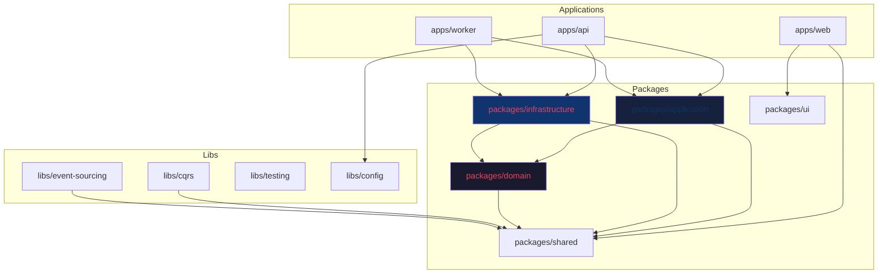

# 02 — Repository Architecture

**Version:** 1.0  
**Status:** Normative  
**Parent:** RIOS Master Architecture Blueprint (MAB)  
**Cross-References:** DDM §5, DOM §6, Constitution §2, ADR-005

---

## 1. Purpose

This document defines the repository strategy, workspace layout, package
organization, naming conventions, and directory hierarchy for RIOS. It
translates the Domain Dependency Matrix (DDM) into a concrete file system
structure that enforces architectural boundaries at the code level.

---

## 2. Repository Strategy

### 2.1 Monorepo Decision

| Criterion                         | Monorepo                                | Polyrepo                    | Decision     |
| --------------------------------- | --------------------------------------- | --------------------------- | ------------ |
| Shared domain types               | Natural via workspace references        | Requires package publishing | **Monorepo** |
| Atomic cross-domain changes       | Single commit                           | Multiple coordinated PRs    | **Monorepo** |
| Dependency enforcement            | Built-in via project references         | Package version constraints | **Monorepo** |
| CI/CD simplicity                  | Single pipeline with affected detection | Per-repo pipelines          | **Monorepo** |
| Developer onboarding              | Clone once, full context                | Multiple repos to manage    | **Monorepo** |
| Architecture boundary enforcement | Via workspace configuration             | Via package boundaries      | **Monorepo** |

**Decision:** RIOS SHALL use a **monorepo** managed by **Turborepo** for build
orchestration.

**Rationale:** The canonical domain dependency graph (DDM §5) requires strict
dependency flow. A monorepo enables workspace-level dependency enforcement,
atomic cross-domain changes when needed, and shared type definitions without
package publishing overhead. Turborepo provides caching, affected detection, and
parallel execution.

### 2.2 Workspace Tooling

| Tool                              | Purpose                                                            |
| --------------------------------- | ------------------------------------------------------------------ |
| **Turborepo**                     | Build orchestration, caching, affected detection                   |
| **pnpm**                          | Package manager with workspace support, strict dependency hoisting |
| **TypeScript Project References** | Type-safe cross-workspace imports with boundary enforcement        |
| **ESLint**                        | Code quality, import boundary rules                                |
| **Prettier**                      | Code formatting consistency                                        |

---

## 3. Repository Layout

### 3.1 Top-Level Structure

```
rios/
├── .github/                          # GitHub configuration
│   ├── workflows/                    # CI/CD pipelines
│   ├── CODEOWNERS                    # Domain ownership enforcement
│   └── PULL_REQUEST_TEMPLATE.md      # PR template with compliance checklist
│
├── apps/                             # Deployable applications
│   ├── api/                          # NestJS backend API
│   ├── web/                          # Next.js frontend application
│   └── worker/                       # Background job processor
│
├── packages/                         # Shared packages
│   ├── domain/                       # Domain layer (pure business logic)
│   ├── application/                  # Application layer (CQRS handlers)
│   ├── infrastructure/               # Infrastructure layer (implementations)
│   ├── shared/                       # Cross-cutting utilities
│   └── ui/                           # Shared UI components (design system)
│
├── libs/                             # Internal libraries
│   ├── cqrs/                         # CQRS infrastructure helpers
│   ├── event-sourcing/               # Event sourcing utilities
│   ├── testing/                      # Test utilities and builders
│   └── config/                       # Shared configuration
│
├── infrastructure/                   # Infrastructure as code
│   ├── docker/                       # Dockerfiles and compose
│   ├── k8s/                          # Kubernetes manifests
│   └── terraform/                    # Cloud infrastructure
│
├── docs/                             # Documentation
│   ├── architecture/                 # Architecture documents (symlinked)
│   ├── engineering/                  # Engineering Blueprint (this document)
│   ├── adr/                          # Architecture Decision Records
│   └── api/                          # Generated API documentation
│
├── scripts/                          # Build and utility scripts
│   ├── build.sh
│   ├── test.sh
│   ├── migrate.sh
│   └── seed.sh
│
├── turbo.json                        # Turborepo configuration
├── pnpm-workspace.yaml               # pnpm workspace configuration
├── tsconfig.base.json                # Base TypeScript configuration
├── .eslintrc.base.js                 # Base ESLint configuration
├── .prettierrc                       # Prettier configuration
├── docker-compose.yml                # Local development services
├── docker-compose.test.yml           # Test environment services
├── Makefile                          # Common development commands
└── README.md                         # Project overview
```

### 3.2 Application Structure — `apps/api/`

```
apps/api/
├── src/
│   ├── main.ts                       # Application entry point
│   ├── app.module.ts                 # Root application module
│   │
│   ├── modules/                      # Domain modules
│   │   ├── identity/                 # Identity domain
│   │   │   ├── identity.module.ts
│   │   │   ├── commands/
│   │   │   ├── queries/
│   │   │   ├── event-handlers/
│   │   │   ├── controllers/
│   │   │   └── index.ts
│   │   │
│   │   ├── knowledge/                # Knowledge domain
│   │   │   ├── knowledge.module.ts
│   │   │   ├── commands/
│   │   │   ├── queries/
│   │   │   ├── event-handlers/
│   │   │   ├── controllers/
│   │   │   └── index.ts
│   │   │
│   │   ├── narrative/                # Narrative domain
│   │   ├── publication/              # Publication domain
│   │   ├── visualization/            # Visualization domain
│   │   ├── motion/                   # Motion domain
│   │   ├── engineering/              # Engineering domain
│   │   └── evolution/                # Evolution domain
│   │
│   ├── shared/                       # Shared application concerns
│   │   ├── middleware/
│   │   ├── filters/
│   │   ├── guards/
│   │   ├── interceptors/
│   │   └── pipes/
│   │
│   └── config/                       # Configuration
│       ├── app.config.ts
│       ├── database.config.ts
│       ├── event-store.config.ts
│       ├── redis.config.ts
│       └── search.config.ts
│
├── test/                             # Application-level tests
│   ├── integration/
│   └── e2e/
│
├── nest-cli.json
├── tsconfig.json
└── package.json
```

### 3.3 Domain Package — `packages/domain/`

```
packages/domain/
├── src/
│   ├── index.ts                      # Public API barrel export
│   │
│   ├── identity/                     # Identity bounded context
│   │   ├── index.ts
│   │   │
│   │   ├── aggregates/               # Aggregate roots
│   │   │   ├── ResearchIdentity.ts
│   │   │   └── index.ts
│   │   │
│   │   ├── entities/                 # Entities
│   │   │   ├── ResearcherProfile.ts
│   │   │   └── index.ts
│   │   │
│   │   ├── value-objects/            # Value objects
│   │   │   ├── ResearcherIdentifier.ts
│   │   │   ├── IntellectualDirection.ts
│   │   │   ├── ResearchMaturity.ts
│   │   │   └── index.ts
│   │   │
│   │   ├── events/                   # Domain events
│   │   │   ├── IdentityCreated.ts
│   │   │   ├── IntellectualDirectionChanged.ts
│   │   │   └── index.ts
│   │   │
│   │   ├── services/                 # Domain services
│   │   │   ├── IdentitySynthesisService.ts
│   │   │   └── index.ts
│   │   │
│   │   ├── repositories/             # Repository interfaces
│   │   │   ├── IResearchIdentityRepository.ts
│   │   │   └── index.ts
│   │   │
│   │   ├── factories/                # Domain factories
│   │   │   ├── ResearchIdentityFactory.ts
│   │   │   └── index.ts
│   │   │
│   │   ├── policies/                 # Domain policies
│   │   │   ├── IdentityVerificationPolicy.ts
│   │   │   └── index.ts
│   │   │
│   │   └── errors/                   # Domain-specific errors
│   │       ├── IdentityNotFoundError.ts
│   │       ├── InvariantViolationError.ts
│   │       └── index.ts
│   │
│   ├── knowledge/                    # Knowledge bounded context
│   │   ├── index.ts
│   │   ├── aggregates/
│   │   │   ├── ResearchAgenda.ts
│   │   │   ├── ResearchArea.ts
│   │   │   ├── ResearchQuestion.ts
│   │   │   └── index.ts
│   │   ├── entities/
│   │   │   ├── ScientificClaim.ts
│   │   │   ├── Evidence.ts
│   │   │   └── index.ts
│   │   ├── value-objects/
│   │   │   ├── KnowledgeIdentifier.ts
│   │   │   ├── ScientificReasoning.ts
│   │   │   ├── MethodologicalPreference.ts
│   │   │   ├── ResearchObject.ts
│   │   │   └── index.ts
│   │   ├── events/
│   │   │   ├── ResearchAgendaCreated.ts
│   │   │   ├── KnowledgeAssetAdded.ts
│   │   │   └── index.ts
│   │   ├── services/
│   │   │   ├── KnowledgeSynthesisService.ts
│   │   │   └── index.ts
│   │   ├── repositories/
│   │   │   ├── IResearchAgendaRepository.ts
│   │   │   ├── IKnowledgeRepository.ts
│   │   │   └── index.ts
│   │   ├── factories/
│   │   ├── policies/
│   │   └── errors/
│   │
│   ├── narrative/                    # Narrative bounded context
│   │   └── ... (same structure)
│   │
│   ├── publication/                  # Publication bounded context
│   │   └── ... (same structure)
│   │
│   ├── visualization/                # Visualization bounded context
│   │   └── ... (same structure)
│   │
│   ├── motion/                       # Motion bounded context
│   │   └── ... (same structure)
│   │
│   ├── engineering/                  # Engineering bounded context
│   │   └── ... (same structure)
│   │
│   └── evolution/                    # Evolution bounded context
│       └── ... (same structure)
│
├── tsconfig.json
└── package.json
```

### 3.4 Application Package — `packages/application/`

```
packages/application/
├── src/
│   ├── index.ts
│   │
│   ├── identity/                     # Identity application services
│   │   ├── index.ts
│   │   │
│   │   ├── commands/                 # Command definitions
│   │   │   ├── CreateResearchIdentityCommand.ts
│   │   │   ├── UpdateIntellectualDirectionCommand.ts
│   │   │   ├── handlers/
│   │   │   │   ├── CreateResearchIdentityHandler.ts
│   │   │   │   ├── UpdateIntellectualDirectionHandler.ts
│   │   │   │   └── index.ts
│   │   │   └── index.ts
│   │   │
│   │   ├── queries/                  # Query definitions
│   │   │   ├── GetResearchIdentityQuery.ts
│   │   │   ├── handlers/
│   │   │   │   ├── GetResearchIdentityHandler.ts
│   │   │   │   └── index.ts
│   │   │   └── index.ts
│   │   │
│   │   ├── event-handlers/           # Domain event handlers
│   │   │   ├── IdentityProjectionHandler.ts
│   │   │   └── index.ts
│   │   │
│   │   ├── services/                 # Application services
│   │   │   ├── IdentityApplicationService.ts
│   │   │   └── index.ts
│   │   │
│   │   └── dto/                      # Data transfer objects
│   │       ├── ResearchIdentityDTO.ts
│   │       └── index.ts
│   │
│   ├── knowledge/                    # Knowledge application services
│   │   └── ... (same structure)
│   │
│   ├── narrative/
│   ├── publication/
│   ├── visualization/
│   ├── motion/
│   ├── engineering/
│   └── evolution/
│
├── tsconfig.json
└── package.json
```

### 3.5 Infrastructure Package — `packages/infrastructure/`

```
packages/infrastructure/
├── src/
│   ├── index.ts
│   │
│   ├── persistence/                  # Database implementations
│   │   ├── postgres/
│   │   │   ├── identity/
│   │   │   │   ├── ResearchIdentityProjectionRepository.ts
│   │   │   │   └── index.ts
│   │   │   ├── knowledge/
│   │   │   ├── narrative/
│   │   │   ├── publication/
│   │   │   ├── entities/             # TypeORM entities
│   │   │   ├── migrations/           # Database migrations
│   │   │   └── index.ts
│   │   │
│   │   ├── event-store/
│   │   │   ├── EventStoreRepository.ts
│   │   │   ├── EventSerializer.ts
│   │   │   └── index.ts
│   │   │
│   │   └── index.ts
│   │
│   ├── cache/                        # Cache implementations
│   │   ├── RedisCacheService.ts
│   │   └── index.ts
│   │
│   ├── search/                       # Search implementations
│   │   ├── vector/
│   │   │   ├── QdrantVectorRepository.ts
│   │   │   └── index.ts
│   │   ├── fulltext/
│   │   │   ├── MeilisearchRepository.ts
│   │   │   └── index.ts
│   │   └── index.ts
│   │
│   ├── messaging/                    # Message broker implementations
│   │   ├── RabbitMQMessageBus.ts
│   │   └── index.ts
│   │
│   ├── storage/                      # Object storage implementations
│   │   ├── S3ObjectStorage.ts
│   │   └── index.ts
│   │
│   ├── ai/                           # AI service implementations
│   │   ├── LLMService.ts
│   │   ├── EmbeddingService.ts
│   │   └── index.ts
│   │
│   └── external/                     # External service integrations
│       ├── email/
│       ├── orcid/
│       └── index.ts
│
├── tsconfig.json
└── package.json
```

### 3.6 Shared Package — `packages/shared/`

```
packages/shared/
├── src/
│   ├── index.ts
│   │
│   ├── types/                        # Shared type definitions
│   │   ├── identifiers.ts
│   │   ├── events.ts
│   │   ├── results.ts
│   │   └── index.ts
│   │
│   ├── errors/                       # Cross-cutting error types
│   │   ├── DomainError.ts
│   │   ├── ApplicationError.ts
│   │   ├── InfrastructureError.ts
│   │   └── index.ts
│   │
│   ├── logging/                      # Logging utilities
│   │   ├── Logger.ts
│   │   └── index.ts
│   │
│   ├── validation/                   # Validation utilities
│   │   ├── validators.ts
│   │   └── index.ts
│   │
│   └── constants/                    # Shared constants
│       ├── domain-events.ts
│       ├── error-codes.ts
│       └── index.ts
│
├── tsconfig.json
└── package.json
```

---

## 4. Domain-to-Package Mapping

This table maps every architecture domain to its package locations.

| Domain        | Domain Package                       | Application Package                       | Infrastructure Package                                            | API Module                            |
| ------------- | ------------------------------------ | ----------------------------------------- | ----------------------------------------------------------------- | ------------------------------------- |
| Identity      | `packages/domain/src/identity/`      | `packages/application/src/identity/`      | `packages/infrastructure/src/persistence/postgres/identity/`      | `apps/api/src/modules/identity/`      |
| Knowledge     | `packages/domain/src/knowledge/`     | `packages/application/src/knowledge/`     | `packages/infrastructure/src/persistence/postgres/knowledge/`     | `apps/api/src/modules/knowledge/`     |
| Narrative     | `packages/domain/src/narrative/`     | `packages/application/src/narrative/`     | `packages/infrastructure/src/persistence/postgres/narrative/`     | `apps/api/src/modules/narrative/`     |
| Publication   | `packages/domain/src/publication/`   | `packages/application/src/publication/`   | `packages/infrastructure/src/persistence/postgres/publication/`   | `apps/api/src/modules/publication/`   |
| Visualization | `packages/domain/src/visualization/` | `packages/application/src/visualization/` | `packages/infrastructure/src/persistence/postgres/visualization/` | `apps/api/src/modules/visualization/` |
| Motion        | `packages/domain/src/motion/`        | `packages/application/src/motion/`        | `packages/infrastructure/src/persistence/postgres/motion/`        | `apps/api/src/modules/motion/`        |
| Engineering   | `packages/domain/src/engineering/`   | `packages/application/src/engineering/`   | `packages/infrastructure/src/persistence/postgres/engineering/`   | `apps/api/src/modules/engineering/`   |
| Evolution     | `packages/domain/src/evolution/`     | `packages/application/src/evolution/`     | `packages/infrastructure/src/persistence/postgres/evolution/`     | `apps/api/src/modules/evolution/`     |

---

## 5. Dependency Graph (Workspace Level)



**Enforced Rules:**

- Domain package imports ONLY from Shared package
- Application package imports from Domain and Shared
- Infrastructure package imports from Domain and Shared
- Applications import from Application, Infrastructure, and Libs
- NO reverse dependencies (Constitution §FA-DEP-001)
- NO circular dependencies (Constitution §FA-DEP-002)

---

## 6. Naming Conventions

### 6.1 Package Naming

| Type        | Convention               | Example                  |
| ----------- | ------------------------ | ------------------------ |
| Application | `@rios/app-{name}`       | `@rios/app-api`          |
| Package     | `@rios/{layer}-{domain}` | `@rios/domain-knowledge` |
| Library     | `@rios/lib-{name}`       | `@rios/lib-cqrs`         |
| Shared      | `@rios/shared`           | `@rios/shared`           |
| UI          | `@rios/ui`               | `@rios/ui`               |

### 6.2 File Naming

| Type                   | Convention                               | Example                                 |
| ---------------------- | ---------------------------------------- | --------------------------------------- |
| Aggregate              | PascalCase singular noun                 | `ResearchIdentity.ts`                   |
| Entity                 | PascalCase singular noun                 | `ResearcherProfile.ts`                  |
| Value Object           | PascalCase singular noun                 | `ResearcherIdentifier.ts`               |
| Domain Event           | PascalCase past-tense verb               | `IdentityCreated.ts`                    |
| Command                | PascalCase verb + noun + Command         | `CreateResearchIdentityCommand.ts`      |
| Query                  | PascalCase verb + noun + Query           | `GetResearchIdentityQuery.ts`           |
| Command Handler        | PascalCase + Handler suffix              | `CreateResearchIdentityHandler.ts`      |
| Query Handler          | PascalCase + Handler suffix              | `GetResearchIdentityHandler.ts`         |
| Repository (interface) | I-prefix PascalCase                      | `IResearchIdentityRepository.ts`        |
| Repository (impl)      | PascalCase + Repository suffix           | `PostgresResearchIdentityRepository.ts` |
| Domain Service         | PascalCase + Service suffix              | `IdentitySynthesisService.ts`           |
| Application Service    | PascalCase + ApplicationService suffix   | `IdentityApplicationService.ts`         |
| Factory                | PascalCase + Factory suffix              | `ResearchIdentityFactory.ts`            |
| Policy                 | PascalCase + Policy suffix               | `IdentityVerificationPolicy.ts`         |
| Module                 | kebab-case module name                   | `identity.module.ts`                    |
| Controller             | PascalCase + Controller suffix           | `IdentityController.ts`                 |
| Config                 | kebab-case + .config suffix              | `database.config.ts`                    |
| Test file              | `{source}.spec.ts` or `{source}.test.ts` | `ResearchIdentity.spec.ts`              |

### 6.3 Directory Naming

| Type                  | Convention         | Example                                      |
| --------------------- | ------------------ | -------------------------------------------- |
| Domain directory      | lowercase singular | `identity/`, `knowledge/`                    |
| Layer directory       | lowercase plural   | `aggregates/`, `entities/`, `value-objects/` |
| Application directory | lowercase plural   | `commands/`, `queries/`, `event-handlers/`   |
| Test directory        | lowercase          | `__tests__/`, `test/`                        |

### 6.4 Class/Interface Naming

| Type                 | Convention                           | Example                         |
| -------------------- | ------------------------------------ | ------------------------------- |
| Aggregate root class | PascalCase, no prefix/suffix         | `ResearchIdentity`              |
| Entity class         | PascalCase, no prefix/suffix         | `ResearcherProfile`             |
| Value object class   | PascalCase, no prefix/suffix         | `ResearcherIdentifier`          |
| Domain event class   | PascalCase, past tense, Event suffix | `IdentityCreatedEvent`          |
| Command class        | PascalCase, Command suffix           | `CreateResearchIdentityCommand` |
| Query class          | PascalCase, Query suffix             | `GetResearchIdentityQuery`      |
| Repository interface | I-prefix                             | `IResearchIdentityRepository`   |
| Service interface    | I-prefix                             | `IIdentitySynthesisService`     |
| Factory class        | PascalCase, Factory suffix           | `ResearchIdentityFactory`       |

---

## 7. Versioning Strategy

### 7.1 Semantic Versioning

All packages follow Semantic Versioning 2.0.0:

```
MAJOR.MINOR.PATCH
```

| Component | When to Increment                                     |
| --------- | ----------------------------------------------------- |
| MAJOR     | Breaking API change, architectural change (Class C/D) |
| MINOR     | New feature, new entity, new value object (Class B)   |
| PATCH     | Bug fix, documentation update (Class A)               |

### 7.2 Internal Package Versioning

| Strategy        | Description                                |
| --------------- | ------------------------------------------ |
| **Lockstep**    | All packages share the same version number |
| **Independent** | Each package has its own version           |

**Decision:** Lockstep versioning. RIOS domains form a cohesive system. A
version bump in one domain likely requires coordinated changes in others.

### 7.3 Version Tags

```
v1.0.0          # Release tag
v1.0.0-alpha.1  # Pre-release
v1.0.0-rc.1     # Release candidate
```

---

## 8. TypeScript Project References

### 8.1 Configuration

```jsonc
// tsconfig.base.json (root)
{
  "compilerOptions": {
    "target": "ES2022",
    "module": "commonjs",
    "lib": ["ES2022"],
    "strict": true,
    "esModuleInterop": true,
    "skipLibCheck": true,
    "forceConsistentCasingInFileNames": true,
    "resolveJsonModule": true,
    "declaration": true,
    "declarationMap": true,
    "sourceMap": true,
    "noImplicitAny": true,
    "noUnusedLocals": true,
    "noUnusedParameters": true,
    "noFallthroughCasesInSwitch": true,
  },
}
```

### 8.2 Project References Order

```jsonc
// packages/domain/tsconfig.json
{
  "extends": "../../tsconfig.base.json",
  "compilerOptions": {
    "outDir": "./dist",
    "rootDir": "./src"
  },
  "references": [
    { "path": "../shared" }
  ]
}

// packages/application/tsconfig.json
{
  "extends": "../../tsconfig.base.json",
  "compilerOptions": {
    "outDir": "./dist",
    "rootDir": "./src"
  },
  "references": [
    { "path": "../domain" },
    { "path": "../shared" }
  ]
}

// packages/infrastructure/tsconfig.json
{
  "extends": "../../tsconfig.base.json",
  "compilerOptions": {
    "outDir": "./dist",
    "rootDir": "./src"
  },
  "references": [
    { "path": "../domain" },
    { "path": "../shared" }
  ]
}
```

---

## 9. CODEOWNERS Configuration

```text
# Domain Ownership (enforced by CODEOWNERS)
# Maps to Domain Ownership Matrix (DOM)

# Identity Domain
packages/domain/src/identity/          @rios/identity-team
packages/application/src/identity/     @rios/identity-team
apps/api/src/modules/identity/         @rios/identity-team

# Knowledge Domain
packages/domain/src/knowledge/         @rios/knowledge-team
packages/application/src/knowledge/    @rios/knowledge-team
apps/api/src/modules/knowledge/        @rios/knowledge-team

# Narrative Domain
packages/domain/src/narrative/         @rios/narrative-team
packages/application/src/narrative/    @rios/narrative-team
apps/api/src/modules/narrative/        @rios/narrative-team

# Publication Domain
packages/domain/src/publication/       @rios/publication-team
packages/application/src/publication/  @rios/publication-team
apps/api/src/modules/publication/      @rios/publication-team

# Infrastructure (shared ownership)
packages/infrastructure/               @rios/platform-team

# Architecture (governance board)
docs/architecture/                     @rios/architecture-board
docs/adr/                              @rios/architecture-board
```

---

## 10. Turborepo Configuration

```jsonc
// turbo.json
{
  "$schema": "https://turbo.build/schema.json",
  "tasks": {
    "build": {
      "dependsOn": ["^build"],
      "outputs": ["dist/**"],
    },
    "test": {
      "dependsOn": ["build"],
      "outputs": ["coverage/**"],
    },
    "test:e2e": {
      "dependsOn": ["build"],
      "outputs": [],
    },
    "lint": {
      "outputs": [],
    },
    "typecheck": {
      "dependsOn": ["^build"],
      "outputs": [],
    },
    "dev": {
      "cache": false,
      "persistent": true,
    },
    "migrate": {
      "cache": false,
    },
    "seed": {
      "cache": false,
    },
  },
}
```

---

## 11. Documentation Layout

```
docs/
├── architecture/                     # Symlinked or copied from architecture repo
│   ├── Foundation/
│   ├── ATLAS/
│   ├── Volumes/
│   ├── Standards/
│   └── README.md
│
├── engineering/                      # This Engineering Blueprint
│   ├── 00-Engineering-Vision.md
│   ├── 01-Technology-Strategy.md
│   ├── 02-Repository-Architecture.md
│   └── ... (all other engineering docs)
│
├── adr/                              # Architecture Decision Records
│   ├── ADR-001-CQRS-Pattern.md
│   ├── ADR-002-Event-Sourcing.md
│   └── ... (all ADRs)
│
└── api/                              # Generated API documentation
    └── openapi.yaml
```

---

## 12. Repository Setup Checklist

When initializing the RIOS repository:

- [ ] Initialize monorepo with pnpm workspaces
- [ ] Configure Turborepo
- [ ] Set up TypeScript project references
- [ ] Configure ESLint with import boundary rules
- [ ] Configure Prettier
- [ ] Set up Docker Compose for local development
- [ ] Create CODEOWNERS file
- [ ] Set up GitHub Actions workflows
- [ ] Create PR template with compliance checklist
- [ ] Configure Dependabot
- [ ] Initialize all package `tsconfig.json` files
- [ ] Verify dependency direction with architecture compliance test
- [ ] Set up pre-commit hooks (husky + lint-staged)

---

_This document is part of the RIOS Engineering Blueprint. It is subordinate to
the Master Architecture Blueprint, Architecture Governance Standard, and all
normative architecture documents._
