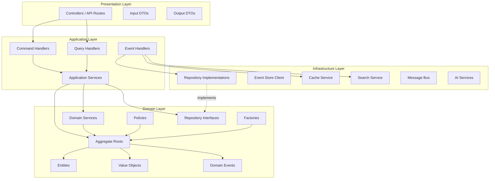
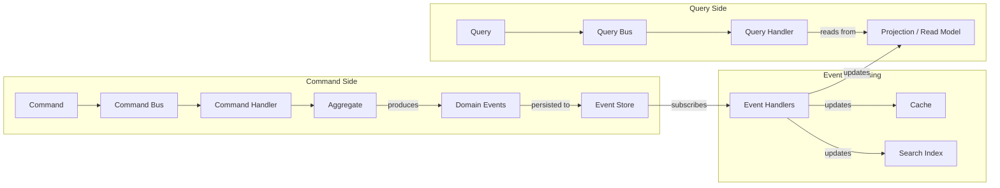
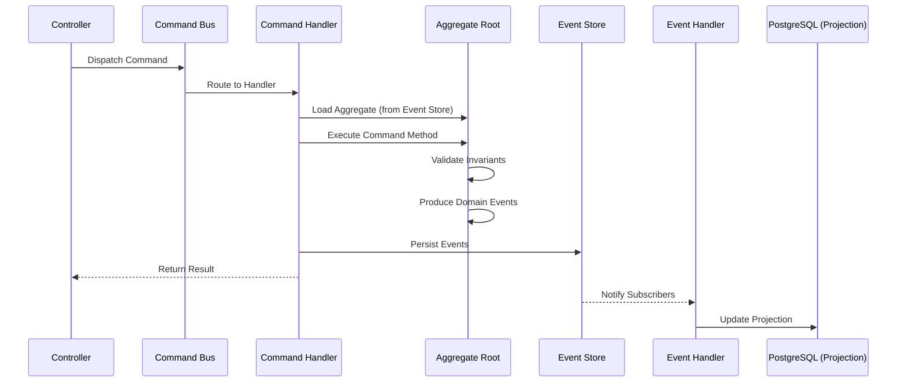
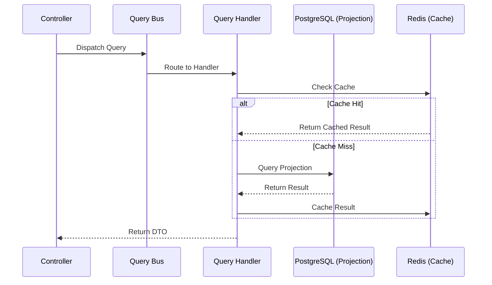
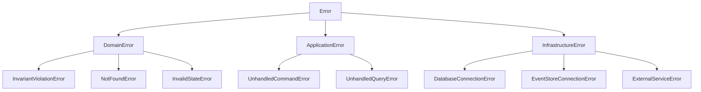

# 03 — Backend Engineering

**Version:** 1.0  
**Status:** Normative  
**Parent:** RIOS Master Architecture Blueprint (MAB)  
**Cross-References:** DMS, ADR-001 (CQRS), ADR-002 (Event Sourcing), ADR-005
(DDD), Constitution §2–§4, Volumes I–IV

---

## 1. Purpose

This document defines the complete backend engineering specification for RIOS.
It translates the Domain Model Specification (DMS) and Domain-Driven Design
decisions (ADR-005) into concrete NestJS implementation patterns.

---

## 2. Layered Architecture

### 2.1 Layer Overview



### 2.2 Layer Rules

| Rule   | Description                                                                         | Source                        |
| ------ | ----------------------------------------------------------------------------------- | ----------------------------- |
| LR-001 | Domain layer has ZERO external dependencies                                         | Constitution §2.2, §3.2       |
| LR-002 | Domain layer imports ONLY from `@rios/shared`                                       | 02-Repository-Architecture §5 |
| LR-003 | Application layer depends on Domain layer only                                      | 02-Repository-Architecture §5 |
| LR-004 | Infrastructure layer depends on Domain layer only                                   | 02-Repository-Architecture §5 |
| LR-005 | Presentation layer depends on Application layer only                                | NestJS module structure       |
| LR-006 | Repository interfaces are defined in Domain layer                                   | Constitution §3.3             |
| LR-007 | Repository implementations are in Infrastructure layer                              | Constitution §3.3             |
| LR-008 | Domain logic SHALL NOT exist in Application, Presentation, or Infrastructure layers | Constitution §2.4             |

---

## 3. CQRS Implementation

### 3.1 CQRS Architecture



### 3.2 Command Flow



### 3.3 Query Flow



### 3.4 Command-Query Separation Rules

| ID       | Rule                                                        | Source                             |
| -------- | ----------------------------------------------------------- | ---------------------------------- |
| CQRS-001 | Commands MUST modify state through aggregates only          | ADR-001, ARCH-003                  |
| CQRS-002 | Commands MUST persist domain events to event store          | ADR-002                            |
| CQRS-003 | Queries MUST read from projections, NEVER from event store  | ADR-001                            |
| CQRS-004 | Queries MUST NEVER modify state                             | ADR-001, Constitution §FA-ARCH-011 |
| CQRS-005 | Commands and queries MUST be in separate classes            | ADR-001                            |
| CQRS-006 | Command handlers MUST NOT return domain entities            | ADR-001                            |
| CQRS-007 | Event handlers are the ONLY mechanism to update projections | ADR-001, ARCH-003                  |

---

## 4. Domain Layer Implementation

### 4.1 Aggregate Root

```typescript
// packages/domain/src/identity/aggregates/ResearchIdentity.ts

import { AggregateRoot } from '@nestjs/cqrs';
import { ResearcherIdentifier } from '../value-objects/ResearcherIdentifier';
import { IntellectualDirection } from '../value-objects/IntellectualDirection';
import { IdentityCreatedEvent } from '../events/IdentityCreated';
import { IntellectualDirectionChangedEvent } from '../events/IntellectualDirectionChanged';
import { InvariantViolationError } from '../errors/InvariantViolationError';

/**
 * Research Identity Aggregate Root
 *
 * Architecture: Volume I — Identity Architecture
 * ATM: ATM-IDENTITY-001 through ATM-IDENTITY-010
 * ADR: ADR-001 (CQRS), ADR-002 (Event Sourcing), ADR-005 (DDD)
 *
 * Invariants:
 * - Identity must have a valid Researcher Identifier
 * - Intellectual Direction must contain at least one research direction
 * - Identity is derived from evidence, never self-declaration
 * - Historical context is preserved (additive only)
 */
export class ResearchIdentity extends AggregateRoot {
  private _researcherId!: ResearcherIdentifier;
  private _intellectualDirection!: IntellectualDirection;
  private _isInitialized: boolean = false;

  // Factory method — creates identity through domain event
  static create(researcherId: ResearcherIdentifier): ResearchIdentity {
    const identity = new ResearchIdentity();
    identity.apply(new IdentityCreatedEvent(researcherId.value));
    return identity;
  }

  // Command method — updates direction through domain event
  changeIntellectualDirection(direction: IntellectualDirection): void {
    this.ensureInitialized();

    // Invariant: Direction must not be empty
    if (direction.isEmpty()) {
      throw new InvariantViolationError(
        'Intellectual Direction must contain at least one research direction',
      );
    }

    // Event Sourcing: emit event, do not mutate directly
    this.apply(
      new IntellectualDirectionChangedEvent(
        this._researcherId.value,
        direction.value,
      ),
    );
  }

  // Event handler — called by AggregateRoot when event is applied
  onIdentityCreatedEvent(event: IdentityCreatedEvent): void {
    this._researcherId = ResearcherIdentifier.from(event.researcherId);
    this._intellectualDirection = IntellectualDirection.empty();
    this._isInitialized = true;
  }

  onIntellectualDirectionChangedEvent(
    event: IntellectualDirectionChangedEvent,
  ): void {
    this._intellectualDirection = IntellectualDirection.from(event.directions);
  }

  // Query methods (read-only)
  get researcherId(): ResearcherIdentifier {
    return this._researcherId;
  }

  get intellectualDirection(): IntellectualDirection {
    return this._intellectualDirection;
  }

  private ensureInitialized(): void {
    if (!this._isInitialized) {
      throw new InvariantViolationError(
        'Identity must be initialized before modification',
      );
    }
  }
}
```

### 4.2 Value Object

```typescript
// packages/domain/src/identity/value-objects/ResearcherIdentifier.ts

import { ValueObject } from '@rios/shared';

interface ResearcherIdentifierProps {
  value: string;
}

/**
 * Researcher Identifier Value Object
 *
 * Architecture: Volume I §3
 * CTD: "Researcher" — the human being whose identity RIOS represents
 *
 * Invariants:
 * - Must be a valid UUID
 * - Once created, cannot be changed (immutable)
 * - Equality is by value, not reference
 */
export class ResearcherIdentifier extends ValueObject<ResearcherIdentifierProps> {
  private constructor(props: ResearcherIdentifierProps) {
    super(props);
  }

  static from(value: string): ResearcherIdentifier {
    if (!ResearcherIdentifier.isValid(value)) {
      throw new Error(`Invalid Researcher Identifier: ${value}`);
    }
    return new ResearcherIdentifier({ value });
  }

  static generate(): ResearcherIdentifier {
    // Uses crypto.randomUUID() or UUID library
    return new ResearcherIdentifier({ value: crypto.randomUUID() });
  }

  private static isValid(value: string): boolean {
    const uuidRegex =
      /^[0-9a-f]{8}-[0-9a-f]{4}-[0-9a-f]{4}-[0-9a-f]{4}-[0-9a-f]{12}$/i;
    return uuidRegex.test(value);
  }

  get value(): string {
    return this.props.value;
  }

  // Value equality — Constitution §2.5 FA-DDD-007
  equals(other: ResearcherIdentifier): boolean {
    return this.value === other.value;
  }
}
```

### 4.3 Domain Event

```typescript
// packages/domain/src/identity/events/IdentityCreated.ts

/**
 * Identity Created Domain Event
 *
 * Architecture: Volume I §6
 * Immutable — Constitution §2.5 FA-DDD-008
 * Append-only — ARCH-002
 */
export class IdentityCreatedEvent {
  public readonly eventType = 'IdentityCreated';
  public readonly occurredOn: Date;
  public readonly researcherId: string;
  public readonly version = 1;

  constructor(researcherId: string) {
    this.researcherId = Object.freeze(researcherId);
    this.occurredOn = Object.freeze(new Date());
    Object.freeze(this);
  }
}
```

### 4.4 Domain Service

```typescript
// packages/domain/src/identity/services/IdentitySynthesisService.ts

import { ResearchIdentity } from '../aggregates/ResearchIdentity';
import { ResearchAgenda } from '../../knowledge/aggregates/ResearchAgenda';

/**
 * Identity Synthesis Service
 *
 * Architecture: Volume I — Identity emerges from knowledge
 * Principle: IA-01 — Identity Precedes Presentation
 * Principle: IA-03 — Knowledge Before Achievement
 *
 * Synthesizes Research Identity from knowledge contributions.
 * Identity is read-only — this service creates projections,
 * it does NOT modify the identity aggregate directly.
 */
export class IdentitySynthesisService {
  /**
   * Synthesize identity projection from knowledge domain data.
   *
   * Semantic Contract:
   * - Purpose: Derive intellectual direction from research evidence
   * - Input: Research Identity (read model) + Knowledge data
   * - Output: Synthesized identity projection
   * - Consistency: Eventually consistent
   * - Ownership: Identity Domain
   */
  synthesize(
    identity: ResearchIdentity,
    agendas: ResearchAgenda[],
  ): SynthesizedIdentity {
    // Business logic: derive direction from evidence
    const directions = this.extractDirectionsFromAgendas(agendas);
    const maturity = this.assessMaturity(agendas);

    return new SynthesizedIdentity({
      researcherId: identity.researcherId,
      intellectualDirections: directions,
      researchMaturity: maturity,
      synthesizedAt: new Date(),
    });
  }

  private extractDirectionsFromAgendas(agendas: ResearchAgenda[]): string[] {
    // Domain logic: extract recurring themes from research agendas
    // Knowledge Before Achievement — IA-03
    return agendas.flatMap((a) => a.researchDirections);
  }

  private assessMaturity(agendas: ResearchAgenda[]): ResearchMaturityLevel {
    // Domain logic: assess maturity based on evidence
    // Evidence Before Recognition — IA-06
    const totalEvidence = agendas.reduce((sum, a) => sum + a.evidenceCount, 0);

    if (totalEvidence >= 50) return ResearchMaturityLevel.SENIOR;
    if (totalEvidence >= 20) return ResearchMaturityLevel.INTERMEDIATE;
    return ResearchMaturityLevel.EARLY;
  }
}
```

### 4.5 Repository Interface (Domain Layer)

```typescript
// packages/domain/src/identity/repositories/IResearchIdentityRepository.ts

import { ResearchIdentity } from '../aggregates/ResearchIdentity';
import { ResearcherIdentifier } from '../value-objects/ResearcherIdentifier';

/**
 * Research Identity Repository Interface
 *
 * Architecture: Volume I — Identity Architecture
 * ADR: ADR-001 (Query side reads projections)
 *
 * Semantic Contract:
 * - Purpose: Persist and retrieve Research Identity
 * - Consistency: Eventually consistent (projections)
 * - Ownership: Identity Domain
 *
 * Note: This is the PROJECTION repository (read side).
 * Events are persisted via the Event Store, not this repository.
 */
export interface IResearchIdentityRepository {
  findById(id: ResearcherIdentifier): Promise<ResearchIdentity | null>;
  save(identity: ResearchIdentity): Promise<void>;
  delete(id: ResearcherIdentifier): Promise<void>;
}
```

### 4.6 Factory

```typescript
// packages/domain/src/identity/factories/ResearchIdentityFactory.ts

import { ResearchIdentity } from '../aggregates/ResearchIdentity';
import { ResearcherIdentifier } from '../value-objects/ResearcherIdentifier';
import { IntellectualDirection } from '../value-objects/IntellectualDirection';

/**
 * Research Identity Factory
 *
 * Architecture: Volume I — Identity Architecture
 * ADR: ADR-005 (DDD — Factories)
 *
 * Encapsulates complex aggregate creation logic.
 * Ensures all invariants are satisfied at creation time.
 */
export class ResearchIdentityFactory {
  static createWithDirection(
    researcherId: string,
    directions: string[],
  ): ResearchIdentity {
    const id = ResearcherIdentifier.from(researcherId);
    const direction = IntellectualDirection.from(directions);

    const identity = ResearchIdentity.create(id);
    identity.changeIntellectualDirection(direction);

    return identity;
  }
}
```

### 4.7 Policy

```typescript
// packages/domain/src/identity/policies/IdentityVerificationPolicy.ts

import { ResearchIdentity } from '../aggregates/ResearchIdentity';

/**
 * Identity Verification Policy
 *
 * Architecture: Volume I §7 — Identity Verification
 * Principle: IA-06 — Evidence Before Recognition
 *
 * Determines whether a Research Identity has sufficient
 * evidence to be considered verified.
 */
export class IdentityVerificationPolicy {
  /**
   * Semantic Contract:
   * - Purpose: Evaluate identity verification status
   * - Input: Research Identity
   * - Output: Verification result with reasons
   * - Ownership: Identity Domain
   */
  evaluate(identity: ResearchIdentity): VerificationResult {
    const checks = [
      this.checkHasDirection(identity),
      this.checkHasEvidence(identity),
      this.checkContinuity(identity),
    ];

    const passed = checks.every((c) => c.passed);

    return new VerificationResult({
      verified: passed,
      checks,
      evaluatedAt: new Date(),
    });
  }

  private checkHasDirection(identity: ResearchIdentity): VerificationCheck {
    const hasDirection = !identity.intellectualDirection.isEmpty();
    return {
      name: 'has-direction',
      passed: hasDirection,
      reason: hasDirection
        ? 'Identity has intellectual direction'
        : 'Identity lacks intellectual direction',
    };
  }

  // Additional checks follow the same pattern
  // ...
}
```

---

## 5. Application Layer Implementation

### 5.1 Command

```typescript
// packages/application/src/identity/commands/CreateResearchIdentityCommand.ts

export class CreateResearchIdentityCommand {
  constructor(
    public readonly researcherId: string,
    public readonly initialDirections: string[] = [],
  ) {}
}
```

### 5.2 Command Handler

```typescript
// packages/application/src/identity/commands/handlers/CreateResearchIdentityHandler.ts

import { CommandHandler, ICommandHandler, EventBus } from '@nestjs/cqrs';
import { CreateResearchIdentityCommand } from '../CreateResearchIdentityCommand';
import { ResearchIdentityFactory } from '@rios/domain';
import { IResearchIdentityRepository } from '@rios/domain';

@CommandHandler(CreateResearchIdentityCommand)
export class CreateResearchIdentityHandler implements ICommandHandler<CreateResearchIdentityCommand> {
  constructor(
    private readonly repository: IResearchIdentityRepository,
    private readonly eventBus: EventBus,
  ) {}

  async execute(command: CreateResearchIdentityCommand): Promise<void> {
    // 1. Create aggregate via factory
    const identity = ResearchIdentityFactory.createWithDirection(
      command.researcherId,
      command.initialDirections,
    );

    // 2. Persist events to event store (handled by NestJS CQRS internally)
    // 3. Save projection
    await this.repository.save(identity);
  }
}
```

### 5.3 Query

```typescript
// packages/application/src/identity/queries/GetResearchIdentityQuery.ts

export class GetResearchIdentityQuery {
  constructor(public readonly researcherId: string) {}
}
```

### 5.4 Query Handler

```typescript
// packages/application/src/identity/queries/handlers/GetResearchIdentityHandler.ts

import { QueryHandler, IQueryHandler } from '@nestjs/cqrs';
import { GetResearchIdentityQuery } from '../GetResearchIdentityQuery';
import { ResearchIdentityDTO } from '../../dto/ResearchIdentityDTO';
import { IResearchIdentityRepository } from '@rios/domain';
import { ICacheService } from '@rios/shared';

@QueryHandler(GetResearchIdentityQuery)
export class GetResearchIdentityHandler implements IQueryHandler<
  GetResearchIdentityQuery,
  ResearchIdentityDTO
> {
  constructor(
    private readonly repository: IResearchIdentityRepository,
    private readonly cache: ICacheService,
  ) {}

  async execute(query: GetResearchIdentityQuery): Promise<ResearchIdentityDTO> {
    // 1. Check cache first
    const cacheKey = `identity:${query.researcherId}`;
    const cached = await this.cache.get<ResearchIdentityDTO>(cacheKey);
    if (cached) return cached;

    // 2. Query projection from read model
    const identity = await this.repository.findById(
      ResearcherIdentifier.from(query.researcherId),
    );

    if (!identity) {
      throw new IdentityNotFoundError(query.researcherId);
    }

    // 3. Map to DTO
    const dto = ResearchIdentityDTO.fromDomain(identity);

    // 4. Cache result
    await this.cache.set(cacheKey, dto, { ttl: 300 });

    return dto;
  }
}
```

### 5.5 Event Handler (Projection Updater)

```typescript
// packages/application/src/identity/event-handlers/IdentityProjectionHandler.ts

import { EventsHandler, IEventHandler } from '@nestjs/cqrs';
import { IdentityCreatedEvent } from '@rios/domain';
import { IResearchIdentityRepository } from '@rios/domain';
import { ICacheService } from '@rios/shared';

@EventsHandler(IdentityCreatedEvent)
export class IdentityCreatedProjectionHandler implements IEventHandler<IdentityCreatedEvent> {
  constructor(
    private readonly repository: IResearchIdentityRepository,
    private readonly cache: ICacheService,
  ) {}

  async handle(event: IdentityCreatedEvent): Promise<void> {
    // 1. Update read model projection
    const projection = new ResearchIdentityProjection({
      researcherId: event.researcherId,
      createdAt: event.occurredOn,
      directions: [],
      maturity: 'EARLY',
    });
    await this.repository.save(projection);

    // 2. Invalidate cache
    await this.cache.delete(`identity:${event.researcherId}`);
  }
}
```

### 5.6 DTO

```typescript
// packages/application/src/identity/dto/ResearchIdentityDTO.ts

/**
 * Research Identity Data Transfer Object
 *
 * Used for API responses. Maps from domain to transport format.
 * Constitution §3.2: Application layer returns types it defines or DTOs.
 */
export class ResearchIdentityDTO {
  constructor(
    public readonly researcherId: string,
    public readonly intellectualDirections: string[],
    public readonly researchMaturity: string,
    public readonly lastUpdated: string,
    public readonly evidenceCount: number,
  ) {}

  static fromDomain(identity: ResearchIdentity): ResearchIdentityDTO {
    return new ResearchIdentityDTO(
      identity.researcherId.value,
      identity.intellectualDirection.directions,
      identity.maturity.toString(),
      identity.lastUpdated.toISOString(),
      identity.evidenceCount,
    );
  }
}
```

---

## 6. Infrastructure Layer Implementation

### 6.1 Event Store Repository

```typescript
// packages/infrastructure/src/persistence/event-store/EventStoreRepository.ts

import { EventStoreDBClient } from '@eventstore/db-client';
import { IEventStore } from '@rios/domain';

/**
 * Event Store Repository Implementation
 *
 * Implements IEventStore interface defined in domain layer.
 * Constitution §3.3: Infrastructure implements domain interfaces.
 *
 * ARCH-002: Append-only event stream
 * ARCH-003: Events as source of truth
 */
export class EventStoreRepository implements IEventStore {
  constructor(private readonly client: EventStoreDBClient) {}

  async appendEvents(
    streamId: string,
    events: DomainEvent[],
    expectedVersion?: number,
  ): Promise<void> {
    const serializedEvents = events.map((event) => ({
      type: event.eventType,
      data: JSON.stringify(event),
      metadata: {
        eventType: event.eventType,
        version: event.version,
        occurredOn: event.occurredOn.toISOString(),
      },
    }));

    await this.client.appendToStream(streamId, serializedEvents, {
      expectedRevision: expectedVersion ?? BigInt(-1),
    });
  }

  async getEvents(streamId: string): Promise<DomainEvent[]> {
    const result = this.client.readStream(streamId);
    const events: DomainEvent[] = [];

    for await (const resolvedEvent of result) {
      const event = this.deserializeEvent(resolvedEvent);
      if (event) events.push(event);
    }

    return events;
  }

  private deserializeEvent(resolvedEvent: any): DomainEvent | null {
    // Deserialize based on event type metadata
    const eventType = resolvedEvent.event?.metadata?.eventType;
    if (!eventType) return null;

    const data = JSON.parse(resolvedEvent.event?.data?.toString() ?? '{}');

    return EventDeserializer.deserialize(eventType, data);
  }
}
```

### 6.2 Projection Repository (PostgreSQL)

```typescript
// packages/infrastructure/src/persistence/postgres/identity/ResearchIdentityProjectionRepository.ts

import { Repository } from 'typeorm';
import { IResearchIdentityRepository } from '@rios/domain';
import { ResearchIdentity } from '@rios/domain';
import { ResearcherIdentifier } from '@rios/domain';
import { ResearchIdentityEntity } from '../entities/ResearchIdentityEntity';

/**
 * PostgreSQL Projection Repository
 *
 * Implements IResearchIdentityRepository for read-model projections.
 * ADR-001: Projections are read-only models built from events.
 * ARCH-003: Identity is a read-only projection.
 */
export class PostgresResearchIdentityRepository implements IResearchIdentityRepository {
  constructor(
    @InjectRepository(ResearchIdentityEntity)
    private readonly repo: Repository<ResearchIdentityEntity>,
  ) {}

  async findById(id: ResearcherIdentifier): Promise<ResearchIdentity | null> {
    const entity = await this.repo.findOne({
      where: { researcherId: id.value },
    });

    if (!entity) return null;
    return this.toDomain(entity);
  }

  async save(identity: ResearchIdentity): Promise<void> {
    const entity = this.toEntity(identity);
    await this.repo.save(entity);
  }

  async delete(id: ResearcherIdentifier): Promise<void> {
    await this.repo.delete({ researcherId: id.value });
  }

  private toDomain(entity: ResearchIdentityEntity): ResearchIdentity {
    // Map persistence entity to domain aggregate
    // Constitution §3.3: Repository maps domain objects from/to persistence
  }

  private toEntity(identity: ResearchIdentity): ResearchIdentityEntity {
    // Map domain aggregate to persistence entity
  }
}
```

### 6.3 Cache Service

```typescript
// packages/infrastructure/src/cache/RedisCacheService.ts

import Redis from 'ioredis';
import { ICacheService } from '@rios/shared';

export class RedisCacheService implements ICacheService {
  constructor(private readonly redis: Redis) {}

  async get<T>(key: string): Promise<T | null> {
    const value = await this.redis.get(key);
    return value ? JSON.parse(value) : null;
  }

  async set<T>(
    key: string,
    value: T,
    options?: { ttl?: number },
  ): Promise<void> {
    const serialized = JSON.stringify(value);
    if (options?.ttl) {
      await this.redis.setex(key, options.ttl, serialized);
    } else {
      await this.redis.set(key, serialized);
    }
  }

  async delete(key: string): Promise<void> {
    await this.redis.del(key);
  }

  async deletePattern(pattern: string): Promise<void> {
    const keys = await this.redis.keys(pattern);
    if (keys.length > 0) {
      await this.redis.del(...keys);
    }
  }
}
```

---

## 7. NestJS Module Structure

### 7.1 Domain Module Template

```typescript
// apps/api/src/modules/identity/identity.module.ts

import { Module } from '@nestjs/common';
import { CqrsModule } from '@nestjs/cqrs';
import { IdentityController } from './controllers/identity.controller';

// Command Handlers
import { CreateResearchIdentityHandler } from '@rios/application';

// Query Handlers
import { GetResearchIdentityHandler } from '@rios/application';

// Event Handlers
import { IdentityCreatedProjectionHandler } from '@rios/application';

// Infrastructure
import { PostgresResearchIdentityRepository } from '@rios/infrastructure';
import { EventStoreRepository } from '@rios/infrastructure';

const CommandHandlers = [CreateResearchIdentityHandler];
const QueryHandlers = [GetResearchIdentityHandler];
const EventHandlers = [IdentityCreatedProjectionHandler];

@Module({
  imports: [CqrsModule],
  controllers: [IdentityController],
  providers: [
    ...CommandHandlers,
    ...QueryHandlers,
    ...EventHandlers,
    {
      provide: 'IResearchIdentityRepository',
      useClass: PostgresResearchIdentityRepository,
    },
    {
      provide: 'IEventStore',
      useClass: EventStoreRepository,
    },
  ],
})
export class IdentityModule {}
```

### 7.2 Controller

```typescript
// apps/api/src/modules/identity/controllers/identity.controller.ts

import { Controller, Post, Get, Param, Body } from '@nestjs/common';
import { CommandBus, QueryBus } from '@nestjs/cqrs';
import { CreateResearchIdentityCommand } from '@rios/application';
import { GetResearchIdentityQuery } from '@rios/application';
import { ResearchIdentityDTO } from '@rios/application';

@Controller('identities')
export class IdentityController {
  constructor(
    private readonly commandBus: CommandBus,
    private readonly queryBus: QueryBus,
  ) {}

  @Post()
  async create(@Body() dto: CreateIdentityRequest): Promise<void> {
    await this.commandBus.execute(
      new CreateResearchIdentityCommand(dto.researcherId, dto.directions),
    );
  }

  @Get(':id')
  async getIdentity(@Param('id') id: string): Promise<ResearchIdentityDTO> {
    return this.queryBus.execute(new GetResearchIdentityQuery(id));
  }
}
```

---

## 8. Dependency Injection Strategy

### 8.1 DI Tokens

| Interface                     | Token                           | Implementation                       | Module              |
| ----------------------------- | ------------------------------- | ------------------------------------ | ------------------- |
| `IResearchIdentityRepository` | `'IResearchIdentityRepository'` | `PostgresResearchIdentityRepository` | IdentityModule      |
| `IResearchAgendaRepository`   | `'IResearchAgendaRepository'`   | `PostgresResearchAgendaRepository`   | KnowledgeModule     |
| `IEventStore`                 | `'IEventStore'`                 | `EventStoreRepository`               | EventSourcingModule |
| `ICacheService`               | `'ICacheService'`               | `RedisCacheService`                  | CacheModule         |
| `IMessageBus`                 | `'IMessageBus'`                 | `RabbitMQMessageBus`                 | MessagingModule     |
| `IVectorSearchRepository`     | `'IVectorSearchRepository'`     | `QdrantVectorRepository`             | SearchModule        |

### 8.2 DI Rules

| ID     | Rule                                                                    | Source            |
| ------ | ----------------------------------------------------------------------- | ----------------- |
| DI-001 | Interface tokens are strings matching interface names                   | NestJS convention |
| DI-002 | Domain interfaces are injected by token, not by class                   | Constitution §3.3 |
| DI-003 | Infrastructure implementations are registered in infrastructure modules | Layer separation  |
| DI-004 | Domain services are injectable within their domain only                 | DOM ownership     |
| DI-005 | Cross-domain access through published interfaces only                   | DOM §4            |

---

## 9. Configuration

### 9.1 Configuration Strategy

All configuration through environment variables (12-factor app).

```typescript
// apps/api/src/config/app.config.ts

import { registerAs } from '@nestjs/config';

export const appConfig = registerAs('app', () => ({
  port: parseInt(process.env.PORT ?? '3000', 10),
  environment: process.env.NODE_ENV ?? 'development',
  apiPrefix: process.env.API_PREFIX ?? 'api/v1',
  corsOrigins: process.env.CORS_ORIGINS?.split(',') ?? [
    'http://localhost:3001',
  ],
}));

export const databaseConfig = registerAs('database', () => ({
  host: process.env.DB_HOST ?? 'localhost',
  port: parseInt(process.env.DB_PORT ?? '5432', 10),
  username: process.env.DB_USERNAME ?? 'rios',
  password: process.env.DB_PASSWORD,
  database: process.env.DB_NAME ?? 'rios',
  synchronize: process.env.DB_SYNCHRONIZE === 'true',
  logging: process.env.DB_LOGGING === 'true',
}));

export const eventStoreConfig = registerAs('eventstore', () => ({
  connectionString:
    process.env.EVENTSTORE_URL ?? 'esdb://localhost:2113?tls=false',
}));

export const redisConfig = registerAs('redis', () => ({
  host: process.env.REDIS_HOST ?? 'localhost',
  port: parseInt(process.env.REDIS_PORT ?? '6379', 10),
  password: process.env.REDIS_PASSWORD,
}));
```

---

## 10. Background Workers

### 10.1 Worker Application

```typescript
// apps/worker/src/main.ts

import { NestFactory } from '@nestjs/core';
import { WorkerModule } from './worker.module';

async function bootstrap() {
  const app = await NestFactory.createApplicationContext(WorkerModule);
  // Worker processes start automatically via NestJS event handlers
}
bootstrap();
```

### 10.2 Background Job Types

| Job                        | Trigger           | Purpose                                   | Domain      |
| -------------------------- | ----------------- | ----------------------------------------- | ----------- |
| Identity Projection Update | Domain Event      | Rebuild identity projection               | Identity    |
| Knowledge Index Update     | Domain Event      | Update search indexes                     | Knowledge   |
| Embedding Generation       | Domain Event      | Generate vector embeddings                | Knowledge   |
| Narrative Synthesis        | Scheduled / Event | Synthesize narrative from knowledge       | Narrative   |
| Publication Import         | API Request       | Import publications from external sources | Publication |
| Evolution Snapshot         | Scheduled         | Create periodic evolution snapshots       | Evolution   |

---

## 11. Error Handling

### 11.1 Error Hierarchy



### 11.2 Error Handling Rules

| ID      | Rule                                                                      | Source                       |
| ------- | ------------------------------------------------------------------------- | ---------------------------- |
| ERR-001 | Domain errors are thrown by aggregates and domain services                | Layer separation             |
| ERR-002 | Application errors are thrown by command/query handlers                   | Layer separation             |
| ERR-003 | Infrastructure errors are caught and wrapped by infrastructure layer      | Layer separation             |
| ERR-004 | Controllers use exception filters to map errors to HTTP responses         | NestJS convention            |
| ERR-005 | Domain events MUST NOT throw exceptions that affect command processing    | Event sourcing integrity     |
| ERR-006 | All errors MUST include domain context (which aggregate, which invariant) | Constitution §4.3 FA-IMP-004 |

### 11.3 Exception Filter

```typescript
// apps/api/src/shared/filters/domain-exception.filter.ts

@Catch(DomainError)
export class DomainExceptionFilter implements ExceptionFilter {
  catch(exception: DomainError, host: ArgumentsHost) {
    const ctx = host.switchToHttp();
    const response = ctx.getResponse<Response>();

    const status = this.mapErrorToStatus(exception);

    response.status(status).json({
      statusCode: status,
      error: exception.constructor.name,
      message: exception.message,
      domain: exception.domain,
      timestamp: new Date().toISOString(),
    });
  }

  private mapErrorToStatus(error: DomainError): number {
    if (error instanceof InvariantViolationError) return 422;
    if (error instanceof NotFoundError) return 404;
    if (error instanceof InvalidStateError) return 409;
    return 500;
  }
}
```

---

## 12. Validation

### 12.1 Validation Strategy

| Layer          | Validation Type          | Mechanism                        |
| -------------- | ------------------------ | -------------------------------- |
| Presentation   | Input validation         | DTO validation (class-validator) |
| Application    | Command validation       | Command handler pre-checks       |
| Domain         | Business rule validation | Aggregate invariant enforcement  |
| Infrastructure | Data integrity           | Database constraints             |

### 12.2 Validation Rules

| ID      | Rule                                                      | Source                       |
| ------- | --------------------------------------------------------- | ---------------------------- |
| VAL-001 | All API inputs MUST be validated at presentation boundary | Constitution §4.3 FA-IMP-005 |
| VAL-002 | Domain invariants enforced by aggregates                  | ADR-005, Constitution §2.3   |
| VAL-003 | Value objects validate their own construction             | Constitution §2.5 FA-DDD-007 |
| VAL-004 | Commands MUST NOT bypass aggregate validation             | ADR-001                      |
| VAL-005 | Query parameters MUST be sanitized                        | Security best practice       |

---

## 13. Logging

### 13.1 Logging Strategy

```typescript
// Log levels: error, warn, info, debug, verbose

// Domain layer: No logging (pure business logic)
// Application layer: Log command/query execution
// Infrastructure layer: Log external service calls
// Presentation layer: Log HTTP requests/responses
```

### 13.2 Structured Logging Format

```json
{
  "timestamp": "2026-07-17T12:00:00.000Z",
  "level": "info",
  "context": "CreateResearchIdentityHandler",
  "message": "Command executed successfully",
  "domain": "identity",
  "commandType": "CreateResearchIdentityCommand",
  "researcherId": "uuid-here",
  "duration": 45,
  "correlationId": "uuid-here"
}
```

---

## 14. Caching Strategy

### 14.1 Cache Layers

| Layer               | Technology  | Scope              | TTL             |
| ------------------- | ----------- | ------------------ | --------------- |
| L1 — In-process     | Node.js Map | Request-scoped     | Per-request     |
| L2 — Distributed    | Redis       | Cross-instance     | 5 min (default) |
| L3 — Database query | PostgreSQL  | Materialized views | On-event        |

### 14.2 Cache Rules

| ID        | Rule                                                           |
| --------- | -------------------------------------------------------------- |
| CACHE-001 | Cache is invalidated by event handlers when projections update |
| CACHE-002 | Command side NEVER reads from cache                            |
| CACHE-003 | Query side reads from cache first, falls back to projection    |
| CACHE-004 | Cache keys follow pattern: `{domain}:{entity}:{id}`            |
| CACHE-005 | Cache TTL is configurable per domain                           |

---

_This document is part of the RIOS Engineering Blueprint. It is subordinate to
the Master Architecture Blueprint, Architecture Governance Standard, and all
normative architecture documents._
