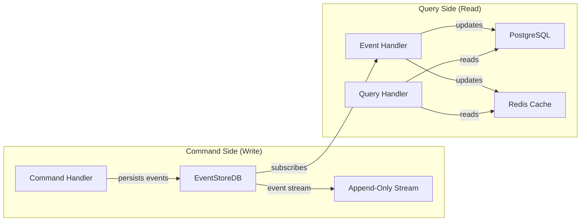
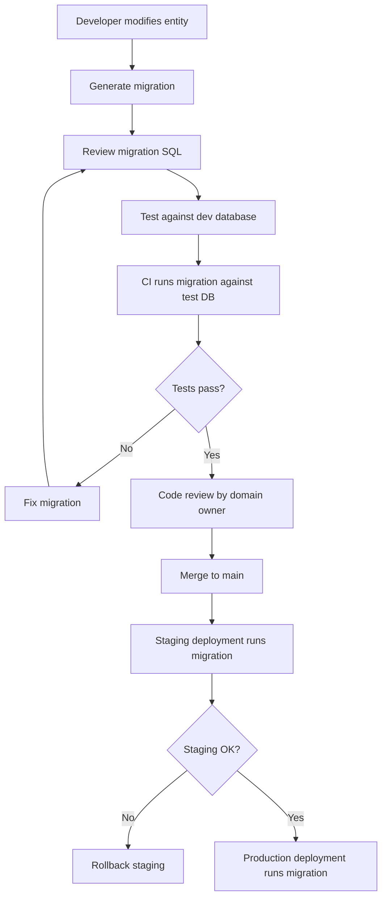

# 05 — Database Engineering

**Version:** 1.0  
**Status:** Normative  
**Parent:** RIOS Master Architecture Blueprint (MAB)  
**Cross-References:** ADR-001 (CQRS), ADR-002 (Event Sourcing), ARCH-002,
ARCH-003, DMS

---

## 1. Purpose

This document defines the complete database engineering standards for RIOS. It
covers the dual-database strategy: EventStoreDB for the command side (event
stream) and PostgreSQL for the query side (read-model projections).

---

## 2. Database Strategy

### 2.1 Dual-Database Architecture



### 2.2 Database Responsibilities

| Database     | Role                          | Data Model               | Consistency            | Source                   |
| ------------ | ----------------------------- | ------------------------ | ---------------------- | ------------------------ |
| EventStoreDB | Event store (source of truth) | Append-only event stream | Strong (per-stream)    | ARCH-002, ARCH-003       |
| PostgreSQL   | Read-model projections        | Relational tables        | Eventual (from events) | ADR-001                  |
| Redis        | Cache + session               | Key-value                | Eventual               | Performance optimization |

### 2.3 Inviolable Rules

| ID     | Rule                                                                      | Source   |
| ------ | ------------------------------------------------------------------------- | -------- |
| DB-001 | Event store is append-only. History is NEVER mutated.                     | ARCH-002 |
| DB-002 | Events are the source of truth. Projections are derived.                  | ARCH-003 |
| DB-003 | Projections are rebuilt from events. They can be destroyed and recreated. | ADR-001  |
| DB-004 | Commands write to EventStoreDB ONLY                                       | ADR-001  |
| DB-005 | Queries read from PostgreSQL projections ONLY                             | ADR-001  |
| DB-006 | No direct modification of projection tables outside event handlers        | CQRS-007 |

---

## 3. Schema Organization

### 3.1 PostgreSQL Schema Layout

```sql
-- Schema per domain (bounded context)
CREATE SCHEMA IF NOT EXISTS identity;
CREATE SCHEMA IF NOT EXISTS knowledge;
CREATE SCHEMA IF NOT EXISTS narrative;
CREATE SCHEMA IF NOT EXISTS publication;
CREATE SCHEMA IF NOT EXISTS visualization;
CREATE SCHEMA IF NOT EXISTS motion;
CREATE SCHEMA IF NOT EXISTS engineering;
CREATE SCHEMA IF NOT EXISTS evolution;
CREATE SCHEMA IF NOT EXISTS shared;       -- Cross-domain shared tables
```

### 3.2 Schema-to-Domain Mapping

| Schema          | Domain        | Tables                                                                                     | Source Volume |
| --------------- | ------------- | ------------------------------------------------------------------------------------------ | ------------- |
| `identity`      | Identity      | `research_identities`, `researcher_profiles`                                               | Volume I      |
| `knowledge`     | Knowledge     | `research_agendas`, `research_areas`, `research_questions`, `evidence`, `research_objects` | Volume II     |
| `narrative`     | Narrative     | `narratives`, `narrative_sections`, `narrative_versions`                                   | Volume III    |
| `publication`   | Publication   | `publications`, `citations`, `contributions`                                               | Volume IV     |
| `visualization` | Visualization | `visualizations`, `graph_configs`                                                          | Volume V      |
| `motion`        | Motion        | `motion_configs`, `animation_states`                                                       | Volume VI     |
| `engineering`   | Engineering   | `builds`, `deployments`, `configs`                                                         | Volume VII    |
| `evolution`     | Evolution     | `evolution_snapshots`, `maturity_records`                                                  | Volume VIII   |
| `shared`        | Shared        | `audit_log`, `outbox`, `domain_event_log`                                                  | Cross-cutting |

### 3.3 Table Design Standards

#### Standard Projection Table Template

```sql
-- Example: Identity projection table
CREATE TABLE identity.research_identities (
    -- Primary key
    id UUID PRIMARY KEY DEFAULT gen_random_uuid(),

    -- Domain identifier (matches domain aggregate ID)
    researcher_id UUID NOT NULL UNIQUE,

    -- Domain data
    intellectual_directions JSONB NOT NULL DEFAULT '[]',
    research_maturity VARCHAR(50) NOT NULL DEFAULT 'EARLY',
    evidence_count INTEGER NOT NULL DEFAULT 0,

    -- Event sourcing metadata
    last_event_id VARCHAR(255) NOT NULL,
    last_event_version BIGINT NOT NULL,
    last_event_timestamp TIMESTAMPTZ NOT NULL,

    -- Audit fields
    created_at TIMESTAMPTZ NOT NULL DEFAULT NOW(),
    updated_at TIMESTAMPTZ NOT NULL DEFAULT NOW(),

    -- Soft delete
    deleted_at TIMESTAMPTZ,
    is_deleted BOOLEAN NOT NULL DEFAULT FALSE
);

-- Indexes
CREATE INDEX idx_research_identities_researcher_id ON identity.research_identities(researcher_id);
CREATE INDEX idx_research_identities_maturity ON identity.research_identities(research_maturity);
CREATE INDEX idx_research_identities_deleted ON identity.research_identities(is_deleted) WHERE is_deleted = FALSE;
```

### 3.4 Table Design Rules

| ID      | Rule                                                                   |
| ------- | ---------------------------------------------------------------------- |
| TBL-001 | Every table MUST have a UUID primary key                               |
| TBL-002 | Every table MUST have `created_at` and `updated_at` timestamps         |
| TBL-003 | Every table MUST have soft delete columns (`deleted_at`, `is_deleted`) |
| TBL-004 | Every projection table MUST have event sourcing metadata columns       |
| TBL-005 | Domain identifiers (from aggregates) MUST have UNIQUE constraints      |
| TBL-006 | JSONB columns for flexible domain data that varies between entities    |
| TBL-007 | VARCHAR lengths MUST be explicitly specified                           |
| TBL-008 | All timestamps MUST be TIMESTAMPTZ (timezone-aware)                    |

---

## 4. Migration Strategy

### 4.1 Migration Tool

**Tool:** TypeORM Migrations

**Location:** `packages/infrastructure/src/persistence/postgres/migrations/`

### 4.2 Migration Rules

| ID      | Rule                                                                                           |
| ------- | ---------------------------------------------------------------------------------------------- |
| MIG-001 | All schema changes MUST go through migrations                                                  |
| MIG-002 | Migrations MUST be forward-only (no down migrations in production)                             |
| MIG-003 | Migrations MUST be idempotent where possible                                                   |
| MIG-004 | Migrations MUST be tested against a copy of production data                                    |
| MIG-005 | Migrations that drop columns MUST be deployed in two phases: (1) stop writing, (2) drop column |
| MIG-006 | Large data migrations MUST be done in batches                                                  |
| MIG-007 | Migrations MUST be reviewed by domain owner                                                    |
| MIG-008 | Migration naming: `{timestamp}-{description}.ts`                                               |

### 4.3 Migration Template

```typescript
// packages/infrastructure/src/persistence/postgres/migrations/1700000000000-CreateResearchIdentities.ts

import { MigrationInterface, QueryRunner } from 'typeorm';

export class CreateResearchIdentities1700000000000 implements MigrationInterface {
  name = 'CreateResearchIdentities1700000000000';

  public async up(queryRunner: QueryRunner): Promise<void> {
    await queryRunner.query(`
      CREATE TABLE IF NOT EXISTS identity.research_identities (
        id UUID PRIMARY KEY DEFAULT gen_random_uuid(),
        researcher_id UUID NOT NULL UNIQUE,
        intellectual_directions JSONB NOT NULL DEFAULT '[]',
        research_maturity VARCHAR(50) NOT NULL DEFAULT 'EARLY',
        evidence_count INTEGER NOT NULL DEFAULT 0,
        last_event_id VARCHAR(255) NOT NULL,
        last_event_version BIGINT NOT NULL,
        last_event_timestamp TIMESTAMPTZ NOT NULL,
        created_at TIMESTAMPTZ NOT NULL DEFAULT NOW(),
        updated_at TIMESTAMPTZ NOT NULL DEFAULT NOW(),
        deleted_at TIMESTAMPTZ,
        is_deleted BOOLEAN NOT NULL DEFAULT FALSE
      );
    `);

    await queryRunner.query(`
      CREATE INDEX idx_research_identities_researcher_id 
      ON identity.research_identities(researcher_id);
    `);
  }

  public async down(queryRunner: QueryRunner): Promise<void> {
    // Down migrations exist for development only
    // Production uses forward-only deployments
    await queryRunner.query(
      `DROP TABLE IF EXISTS identity.research_identities;`,
    );
  }
}
```

### 4.4 Migration Workflow



---

## 5. Repository Mapping (TypeORM Entities)

### 5.1 Entity Template

```typescript
// packages/infrastructure/src/persistence/postgres/entities/ResearchIdentityEntity.ts

import {
  Entity,
  Column,
  PrimaryGeneratedColumn,
  CreateDateColumn,
  UpdateDateColumn,
  Index,
} from 'typeorm';

@Entity({ schema: 'identity', name: 'research_identities' })
export class ResearchIdentityEntity {
  @PrimaryGeneratedColumn('uuid')
  id!: string;

  @Column({ type: 'uuid', unique: true, name: 'researcher_id' })
  @Index()
  researcherId!: string;

  @Column({
    type: 'jsonb',
    default: () => "'[]'",
    name: 'intellectual_directions',
  })
  intellectualDirections!: string[];

  @Column({
    type: 'varchar',
    length: 50,
    default: 'EARLY',
    name: 'research_maturity',
  })
  researchMaturity!: string;

  @Column({ type: 'integer', default: 0, name: 'evidence_count' })
  evidenceCount!: number;

  // Event sourcing metadata
  @Column({ type: 'varchar', length: 255, name: 'last_event_id' })
  lastEventId!: string;

  @Column({ type: 'bigint', name: 'last_event_version' })
  lastEventVersion!: number;

  @Column({ type: 'timestamptz', name: 'last_event_timestamp' })
  lastEventTimestamp!: Date;

  // Audit
  @CreateDateColumn({ type: 'timestamptz', name: 'created_at' })
  createdAt!: Date;

  @UpdateDateColumn({ type: 'timestamptz', name: 'updated_at' })
  updatedAt!: Date;

  // Soft delete
  @Column({ type: 'timestamptz', nullable: true, name: 'deleted_at' })
  deletedAt!: Date | null;

  @Column({ type: 'boolean', default: false, name: 'is_deleted' })
  isDeleted!: boolean;
}
```

### 5.2 Entity Rules

| ID      | Rule                                                              |
| ------- | ----------------------------------------------------------------- |
| ENT-001 | TypeORM entities are infrastructure artifacts, NOT domain objects |
| ENT-002 | Entities map to a single database table                           |
| ENT-003 | Entity column names use snake_case (PostgreSQL convention)        |
| ENT-004 | Entity property names use camelCase (TypeScript convention)       |
| ENT-005 | Repositories handle entity ↔ domain object mapping                |
| ENT-006 | Entities MUST include soft delete columns                         |

---

## 6. Indexes

### 6.1 Index Strategy

| Index Type      | Usage                        | Example                           |
| --------------- | ---------------------------- | --------------------------------- |
| Primary key     | Every table                  | UUID auto-generated               |
| Unique index    | Domain identifiers           | `researcher_id`                   |
| B-tree index    | Equality/range queries       | `created_at`, `research_maturity` |
| GIN index       | JSONB queries                | `intellectual_directions`         |
| Partial index   | Active (non-deleted) records | `WHERE is_deleted = FALSE`        |
| Composite index | Multi-column queries         | `(domain_id, is_deleted)`         |

### 6.2 Index Rules

| ID      | Rule                                                                           |
| ------- | ------------------------------------------------------------------------------ |
| IDX-001 | Every foreign key MUST have an index                                           |
| IDX-002 | Every frequently queried column MUST have an index                             |
| IDX-003 | JSONB columns used in WHERE clauses MUST have GIN indexes                      |
| IDX-004 | Indexes MUST be named: `idx_{table}_{column(s)}`                               |
| IDX-005 | Partial indexes for soft-delete filtered queries                               |
| IDX-006 | Index creation MUST be in a separate migration for large tables (CONCURRENTLY) |

---

## 7. Constraints

### 7.1 Constraint Types

| Constraint  | Usage                                 | Enforcement       |
| ----------- | ------------------------------------- | ----------------- |
| PRIMARY KEY | Every table                           | Database          |
| UNIQUE      | Domain identifiers                    | Database          |
| NOT NULL    | Required fields                       | Database          |
| CHECK       | Domain value ranges                   | Database          |
| FOREIGN KEY | Referential integrity (within schema) | Database          |
| JSON Schema | JSONB column validation               | Application layer |

### 7.2 Constraint Rules

| ID      | Rule                                                                                               |
| ------- | -------------------------------------------------------------------------------------------------- |
| CON-001 | Domain invariants are enforced by aggregates (primary) and database constraints (defense in depth) |
| CON-002 | Foreign keys within the same schema are allowed                                                    |
| CON-003 | Foreign keys across schemas are PROHIBITED (use domain events for cross-domain references)         |
| CON-004 | CHECK constraints for enumerated domain values                                                     |
| CON-005 | NOT NULL for all required fields                                                                   |

---

## 8. Transactions

### 8.1 Transaction Strategy

| Context                   | Transaction Scope                | Isolation Level            |
| ------------------------- | -------------------------------- | -------------------------- |
| Command handling          | Single aggregate per transaction | READ COMMITTED             |
| Projection update         | Single event handler             | READ COMMITTED             |
| Cross-aggregate operation | Saga / Process Manager           | N/A (eventual consistency) |

### 8.2 Transaction Rules

| ID      | Rule                                                       |
| ------- | ---------------------------------------------------------- |
| TXN-001 | One aggregate per transaction (ADR-005)                    |
| TXN-002 | Cross-aggregate consistency via sagas/process managers     |
| TXN-003 | Projection updates are idempotent (safe to replay)         |
| TXN-004 | Event store writes are atomic per stream                   |
| TXN-005 | Database transactions MUST NOT span external service calls |

---

## 9. Soft Delete Policy

### 9.1 Implementation

```sql
-- All queries automatically filter deleted records
CREATE VIEW identity.active_research_identities AS
SELECT * FROM identity.research_identities
WHERE is_deleted = FALSE;
```

### 9.2 Soft Delete Rules

| ID     | Rule                                                              |
| ------ | ----------------------------------------------------------------- |
| SD-001 | All tables use soft delete (`is_deleted`, `deleted_at`)           |
| SD-002 | Default queries filter `is_deleted = FALSE`                       |
| SD-003 | Hard delete allowed only via admin action with audit log          |
| SD-004 | Deleted records retained for 90 days, then purged                 |
| SD-005 | Repository implementations automatically apply soft delete filter |

---

## 10. Audit Policy

### 10.1 Audit Table

```sql
CREATE TABLE shared.audit_log (
    id UUID PRIMARY KEY DEFAULT gen_random_uuid(),
    entity_type VARCHAR(100) NOT NULL,
    entity_id UUID NOT NULL,
    action VARCHAR(50) NOT NULL, -- CREATE, UPDATE, DELETE
    actor_id UUID NOT NULL,
    changes JSONB NOT NULL,
    ip_address INET,
    user_agent TEXT,
    created_at TIMESTAMPTZ NOT NULL DEFAULT NOW()
);

CREATE INDEX idx_audit_log_entity ON shared.audit_log(entity_type, entity_id);
CREATE INDEX idx_audit_log_actor ON shared.audit_log(actor_id);
CREATE INDEX idx_audit_log_created ON shared.audit_log(created_at);
```

### 10.2 Audit Rules

| ID      | Rule                                                      |
| ------- | --------------------------------------------------------- |
| AUD-001 | All state changes MUST be audited                         |
| AUD-002 | Audit log is append-only                                  |
| AUD-003 | Audit includes: actor, action, entity, changes, timestamp |
| AUD-004 | Audit log retained indefinitely                           |
| AUD-005 | Audit log is in a separate schema (`shared`)              |

---

## 11. Event Store Schema

### 11.1 Stream Naming Convention

```
{domain}-{aggregate-type}-{aggregate-id}

Examples:
identity-ResearchIdentity-{uuid}
knowledge-ResearchAgenda-{uuid}
narrative-Narrative-{uuid}
```

### 11.2 Event Store Rules

| ID     | Rule                                                                   |
| ------ | ---------------------------------------------------------------------- |
| ES-001 | Stream IDs follow `{domain}-{AggregateType}-{id}` pattern              |
| ES-002 | Event types are PascalCase past tense (e.g., `IdentityCreated`)        |
| ES-003 | Event data is JSON serialized                                          |
| ES-004 | Event metadata includes: eventType, version, occurredOn, correlationId |
| ES-005 | Expected revision is used for optimistic concurrency                   |

---

## 12. Performance Strategy

### 12.1 Query Optimization

| Strategy           | Implementation                                       |
| ------------------ | ---------------------------------------------------- |
| Read replicas      | PostgreSQL streaming replication for query load      |
| Connection pooling | PgBouncer with transaction-level pooling             |
| Query analysis     | `EXPLAIN ANALYZE` for all slow queries               |
| Materialized views | For complex aggregation queries                      |
| Partitioning       | Time-based partitioning for large tables (audit_log) |

### 12.2 Performance Rules

| ID          | Rule                                                    |
| ----------- | ------------------------------------------------------- |
| PERF-DB-001 | Queries MUST complete within 100ms (P95)                |
| PERF-DB-002 | N+1 queries are PROHIBITED (use joins or batch loading) |
| PERF-DB-003 | Large result sets MUST use cursor-based pagination      |
| PERF-DB-004 | JSONB queries MUST use GIN indexes                      |
| PERF-DB-005 | Connection pool size: min 5, max 20                     |

---

## 13. Backup Strategy

### 13.1 Backup Schedule

| Database     | Method                   | Frequency     | Retention |
| ------------ | ------------------------ | ------------- | --------- |
| PostgreSQL   | pg_dump (logical)        | Daily         | 30 days   |
| PostgreSQL   | WAL archiving (physical) | Continuous    | 7 days    |
| EventStoreDB | Scavenge + backup        | Weekly        | 90 days   |
| Redis        | RDB snapshots            | Every 6 hours | 7 days    |

### 13.2 Recovery Targets

| Metric                         | Target                                |
| ------------------------------ | ------------------------------------- |
| Recovery Point Objective (RPO) | 1 hour (PostgreSQL), 0 (EventStoreDB) |
| Recovery Time Objective (RTO)  | 4 hours                               |
| Event store rebuild time       | < 2 hours from backup                 |

---

## 14. TypeORM Configuration

```typescript
// packages/infrastructure/src/persistence/postgres/database.config.ts

import { TypeOrmModuleOptions } from '@nestjs/typeorm';

export const databaseConfig = (): TypeOrmModuleOptions => ({
  type: 'postgres',
  host: process.env.DB_HOST ?? 'localhost',
  port: parseInt(process.env.DB_PORT ?? '5432', 10),
  username: process.env.DB_USERNAME ?? 'rios',
  password: process.env.DB_PASSWORD,
  database: process.env.DB_NAME ?? 'rios',
  schema: 'public', // Default schema; domain schemas set per entity
  entities: [__dirname + '/entities/**/*.entity.{ts,js}'],
  migrations: [__dirname + '/migrations/**/*.{ts,js}'],
  synchronize: false, // NEVER in production
  logging: process.env.DB_LOGGING === 'true',
  ssl: process.env.DB_SSL === 'true' ? { rejectUnauthorized: false } : false,
  extra: {
    max: 20, // Connection pool max
    idleTimeoutMillis: 30000,
    connectionTimeoutMillis: 2000,
  },
});
```

---

## 15. Database Review Checklist

Before deploying database changes:

- [ ] Migration is idempotent
- [ ] Migration is forward-only
- [ ] Indexes are created for new query patterns
- [ ] Foreign keys are within schema only (no cross-schema FKs)
- [ ] Soft delete columns are included
- [ ] Audit columns are included
- [ ] Event sourcing metadata columns are included
- [ ] Domain identifiers have UNIQUE constraints
- [ ] CHECK constraints for domain value ranges
- [ ] Migration is tested against test database
- [ ] Migration is reviewed by domain owner
- [ ] Performance impact is assessed for large tables

---

_This document is part of the RIOS Engineering Blueprint. It is subordinate to
the Master Architecture Blueprint, Architecture Governance Standard, and all
normative architecture documents._
