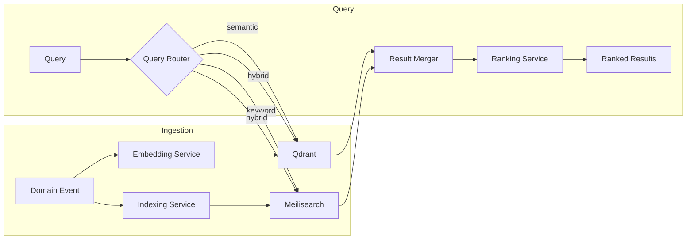
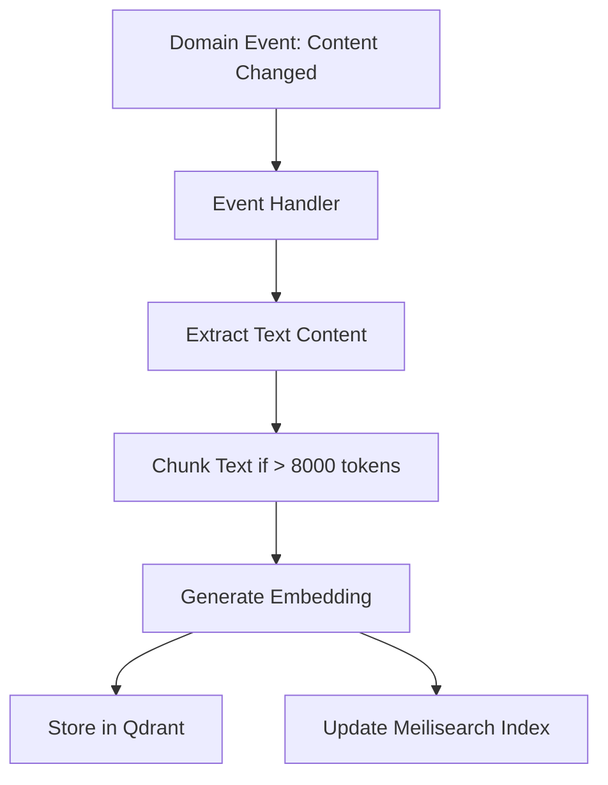

# 06 — Search & Knowledge Retrieval Engineering

**Version:** 1.0  
**Status:** Normative  
**Parent:** RIOS Master Architecture Blueprint (MAB)  
**Cross-References:** Volume II (Knowledge), ADR-003 (Search Strategy), DMS

---

## 1. Purpose

This document defines the complete search and knowledge retrieval engineering
standards for RIOS. It covers vector search (semantic), full-text search
(keyword), and hybrid search strategies.

---

## 2. Search Architecture

### 2.1 Dual-Engine Architecture



### 2.2 Search Engine Responsibilities

| Engine    | Technology  | Search Type                     | Use Case                                      |
| --------- | ----------- | ------------------------------- | --------------------------------------------- |
| Vector    | Qdrant      | Semantic (embedding similarity) | "Find similar research areas"                 |
| Full-text | Meilisearch | Keyword (BM25-based)            | "Find documents containing 'neural networks'" |
| Hybrid    | Both        | Combined semantic + keyword     | Best of both; default for knowledge retrieval |

---

## 3. Vector Search (Qdrant)

### 3.1 Collection Strategy

| Collection          | Domain      | Embedding Source                   | Dimensions            |
| ------------------- | ----------- | ---------------------------------- | --------------------- |
| `knowledge-objects` | Knowledge   | Research Objects, Claims, Evidence | 1536 (OpenAI ada-002) |
| `research-areas`    | Knowledge   | Research Area descriptions         | 1536                  |
| `narratives`        | Narrative   | Narrative sections                 | 1536                  |
| `publications`      | Publication | Publication abstracts, titles      | 1536                  |

### 3.2 Collection Configuration

```typescript
// packages/infrastructure/src/search/vector/QdrantVectorRepository.ts

const COLLECTION_CONFIG = {
  vectors: {
    size: 1536,
    distance: 'Cosine', // Cosine similarity for text embeddings
  },
  optimizers_config: {
    indexing_threshold: 20000,
  },
  replication_factor: 1,
};
```

### 3.3 Vector Search Rules

| ID     | Rule                                                         |
| ------ | ------------------------------------------------------------ |
| VS-001 | Embeddings are generated asynchronously via event handlers   |
| VS-002 | Embedding dimensions are 1536 (OpenAI ada-002 compatible)    |
| VS-003 | Similarity metric is Cosine for text embeddings              |
| VS-004 | Collections are named `{domain}-{entity-type}`               |
| VS-005 | Vector payloads include domain metadata for filtering        |
| VS-006 | Stale embeddings are regenerated when source content changes |

---

## 4. Full-Text Search (Meilisearch)

### 4.1 Index Strategy

| Index          | Domain      | Searchable Fields           | Filterable Fields      |
| -------------- | ----------- | --------------------------- | ---------------------- |
| `knowledge`    | Knowledge   | title, description, content | domain, type, maturity |
| `publications` | Publication | title, abstract, keywords   | year, type, venue      |
| `narratives`   | Narrative   | title, content              | domain, version        |
| `identities`   | Identity    | name, bio, directions       | maturity               |

### 4.2 Meilisearch Configuration

```typescript
const INDEX_CONFIG = {
  searchableAttributes: ['title', 'description', 'content'],
  filterableAttributes: ['domain', 'type', 'createdAt'],
  sortableAttributes: ['createdAt', 'relevance'],
  rankingRules: [
    'words',
    'typo',
    'proximity',
    'attribute',
    'sort',
    'exactness',
  ],
};
```

### 4.3 Full-Text Search Rules

| ID     | Rule                                                  |
| ------ | ----------------------------------------------------- |
| FT-001 | Indexes are updated asynchronously via event handlers |
| FT-002 | Meilisearch handles typo tolerance automatically      |
| FT-003 | Search results include highlight snippets             |
| FT-004 | Index naming follows `{domain}` convention            |
| FT-005 | Filterable fields match domain enum values            |

---

## 5. Embedding Strategy

### 5.1 Embedding Pipeline



### 5.2 Embedding Rules

| ID      | Rule                                                                       |
| ------- | -------------------------------------------------------------------------- |
| EMB-001 | Embeddings are generated by the `EmbeddingService` in infrastructure layer |
| EMB-002 | Text is chunked at 8000 token boundaries with 200 token overlap            |
| EMB-003 | Embedding model is configurable (default: text-embedding-ada-002)          |
| EMB-004 | Embedding generation is idempotent (same content = same embedding)         |
| EMB-005 | Failed embeddings are retried with exponential backoff (max 3 retries)     |

---

## 6. Hybrid Search & Ranking

### 6.1 Hybrid Search Implementation

```typescript
async hybridSearch(query: string, options: HybridSearchOptions): Promise<SearchResult[]> {
  // 1. Generate query embedding
  const embedding = await this.embeddingService.embed(query);

  // 2. Parallel search
  const [vectorResults, keywordResults] = await Promise.all([
    this.vectorRepo.search(embedding, { limit: options.limit * 2 }),
    this.keywordRepo.search(query, { limit: options.limit * 2 }),
  ]);

  // 3. Reciprocal Rank Fusion (RRF)
  const merged = this.reciprocalRankFusion(vectorResults, keywordResults, {
    k: 60, // RRF constant
    vectorWeight: options.semanticWeight ?? 0.6,
    keywordWeight: options.keywordWeight ?? 0.4,
  });

  // 4. Return top results
  return merged.slice(0, options.limit);
}
```

### 6.2 Ranking Strategy

| Factor              | Weight | Description                          |
| ------------------- | ------ | ------------------------------------ |
| Semantic similarity | 60%    | Vector cosine similarity             |
| Keyword relevance   | 40%    | BM25 score from Meilisearch          |
| Recency             | Bonus  | More recent content scores higher    |
| Evidence quality    | Bonus  | Higher quality evidence ranks higher |

---

## 7. Caching Strategy

| Layer              | Scope | TTL      | Invalidation      |
| ------------------ | ----- | -------- | ----------------- |
| Query result cache | Redis | 5 min    | On content change |
| Embedding cache    | Redis | 24 hours | On content change |
| Popular queries    | Redis | 1 hour   | LRU eviction      |

---

## 8. Search Review Checklist

- [ ] Embeddings generated for new content types
- [ ] Meilisearch indexes configured for new searchable fields
- [ ] Hybrid search weights calibrated
- [ ] Cache invalidation tested
- [ ] Search latency < 200ms (P95)
- [ ] Relevance tested with domain-specific queries
