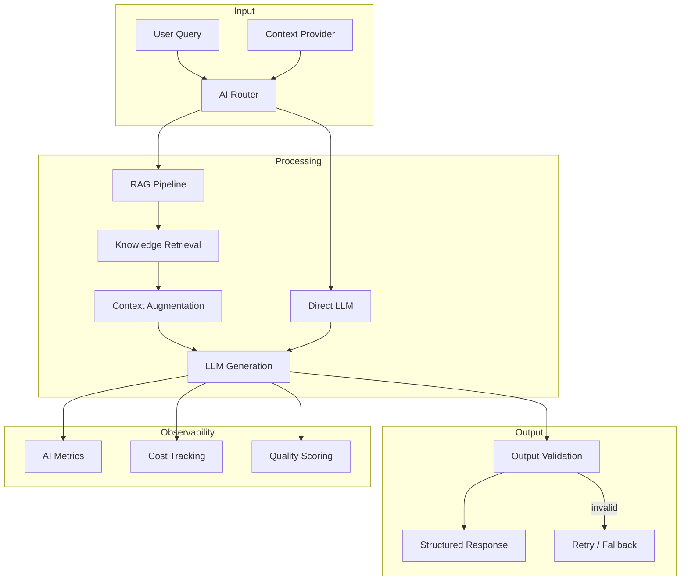
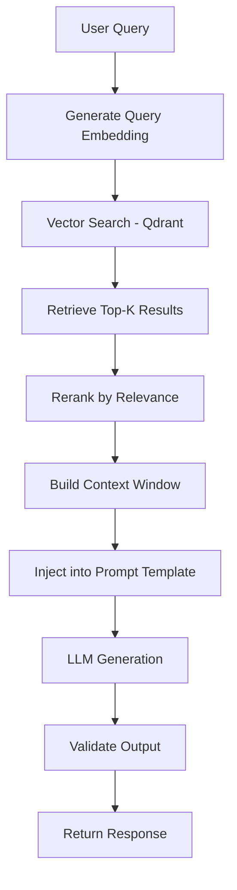

# 07 — AI Engineering

**Version:** 1.0  
**Status:** Normative  
**Parent:** RIOS Master Architecture Blueprint (MAB)  
**Cross-References:** Volume II (Knowledge), Volume III (Narrative), DMS,
ADR-004

---

## 1. Purpose

This document defines the complete AI engineering standards for RIOS. AI is a
tool that serves the architecture — it synthesizes, retrieves, and augments
research intelligence. AI NEVER defines or gates identity, knowledge, or
narrative.

> **Architecture Rule:** Knowledge is the foundation of identity, not AI
> synthesis. AI enhances knowledge retrieval and narrative generation but is
> never the source of truth.

---

## 2. AI Integration Architecture

### 2.1 AI Pipeline Overview



### 2.2 AI Service Boundaries

| AI Function          | Domain Owner       | AI Role                                   | Source          |
| -------------------- | ------------------ | ----------------------------------------- | --------------- |
| Identity synthesis   | Identity Domain    | Derives direction from knowledge evidence | Volume I, IA-03 |
| Knowledge retrieval  | Knowledge Domain   | Semantic search over research objects     | Volume II       |
| Narrative generation | Narrative Domain   | Drafts narrative from knowledge           | Volume III      |
| Publication analysis | Publication Domain | Extracts metadata, analyzes citations     | Volume IV       |
| Research suggestions | Knowledge Domain   | Suggests related research areas           | Volume II       |

---

## 3. LLM Integration

### 3.1 LLM Service Interface

```typescript
// packages/infrastructure/src/ai/LLMService.ts

export interface ILLMService {
  /**
   * Generate text completion.
   *
   * Semantic Contract:
   * - Purpose: Generate AI-assisted content
   * - Input: Prompt + context + options
   * - Output: Structured LLM response
   * - Consistency: Non-deterministic (same input may produce different output)
   * - Ownership: Infrastructure layer
   */
  complete(request: LLMRequest): Promise<LLMResponse>;

  /**
   * Generate structured output (JSON).
   */
  completeStructured<T>(request: LLMRequest, schema: ZodSchema<T>): Promise<T>;
}

export interface LLMRequest {
  systemPrompt: string;
  userPrompt: string;
  context?: string[];
  temperature?: number;
  maxTokens?: number;
  model?: string;
}

export interface LLMResponse {
  content: string;
  tokenUsage: {
    prompt: number;
    completion: number;
    total: number;
  };
  model: string;
  finishReason: 'stop' | 'length' | 'content_filter';
  latencyMs: number;
}
```

### 3.2 LLM Rules

| ID      | Rule                                                             | Source                 |
| ------- | ---------------------------------------------------------------- | ---------------------- |
| LLM-001 | LLM is an infrastructure service, NEVER embedded in domain logic | Constitution §3.2      |
| LLM-002 | LLM responses are validated against expected schemas             | Output validation      |
| LLM-003 | LLM failures are handled gracefully with fallback strategies     | Reliability            |
| LLM-004 | Token usage is tracked per request for cost management           | Operational            |
| LLM-005 | LLM calls are timeout-protected (max 30 seconds)                 | Reliability            |
| LLM-006 | LLM NEVER modifies domain state directly                         | Architecture integrity |

---

## 4. Prompt Architecture

### 4.1 Prompt Template Structure

```typescript
// packages/infrastructure/src/ai/prompts/PromptTemplate.ts

export class PromptTemplate {
  constructor(
    private readonly system: string,
    private readonly user: string,
    private readonly variables: string[],
  ) {}

  render(context: Record<string, string>): Prompt {
    let system = this.system;
    let user = this.user;

    for (const variable of this.variables) {
      const value = context[variable] ?? '';
      system = system.replace(`{{${variable}}}`, value);
      user = user.replace(`{{${variable}}}`, value);
    }

    return { system, user };
  }
}
```

### 4.2 Prompt Templates

| Template               | Purpose                            | Domain      | Model       |
| ---------------------- | ---------------------------------- | ----------- | ----------- |
| `identity-synthesis`   | Synthesize identity from knowledge | Identity    | gpt-4o      |
| `knowledge-retrieval`  | RAG-based knowledge retrieval      | Knowledge   | gpt-4o      |
| `narrative-draft`      | Draft narrative from knowledge     | Narrative   | gpt-4o      |
| `publication-analysis` | Analyze publication metadata       | Publication | gpt-4o-mini |
| `research-suggestions` | Suggest related research           | Knowledge   | gpt-4o-mini |

### 4.3 Prompt Rules

| ID         | Rule                                                       |
| ---------- | ---------------------------------------------------------- |
| PROMPT-001 | System prompts define role and constraints explicitly      |
| PROMPT-002 | User prompts include structured context from RAG retrieval |
| PROMPT-003 | Prompts are version-controlled with change tracking        |
| PROMPT-004 | Prompts include output format instructions (JSON schema)   |
| PROMPT-005 | Prompts are tested with representative inputs              |
| PROMPT-006 | Prompts NEVER include raw user input without sanitization  |

---

## 5. RAG Pipeline

### 5.1 RAG Architecture



### 5.2 RAG Configuration

| Parameter             | Value       | Rationale                               |
| --------------------- | ----------- | --------------------------------------- |
| Top-K retrieval       | 10          | Balance relevance vs context window     |
| Reranking top-K       | 5           | Focus on most relevant results          |
| Context window budget | 4000 tokens | Leave room for system + user prompt     |
| Chunk overlap         | 200 tokens  | Prevent information loss at boundaries  |
| Similarity threshold  | 0.7         | Minimum cosine similarity for inclusion |

### 5.3 RAG Rules

| ID      | Rule                                                               |
| ------- | ------------------------------------------------------------------ |
| RAG-001 | RAG retrieval is from Knowledge domain only (not from event store) |
| RAG-002 | Retrieved context is cited in the response                         |
| RAG-003 | RAG responses include source references                            |
| RAG-004 | Context window does not exceed model limits                        |
| RAG-005 | RAG pipeline is idempotent for same query + knowledge state        |

---

## 6. Context Management

### 6.1 Context Sources

| Source                        | Priority | Description                        |
| ----------------------------- | -------- | ---------------------------------- |
| User's research agenda        | High     | Current active research agenda     |
| Retrieved knowledge objects   | High     | RAG-retrieved relevant content     |
| User's intellectual direction | Medium   | User's declared research interests |
| Recent narrative versions     | Medium   | Recent narrative context           |
| Domain metadata               | Low      | Time, maturity, evidence counts    |

### 6.2 Context Rules

| ID      | Rule                                                          |
| ------- | ------------------------------------------------------------- |
| CTX-001 | Context is assembled per-request, never cached across users   |
| CTX-002 | Context includes source attribution for all retrieved content |
| CTX-003 | Context size is tracked and optimized per model limits        |
| CTX-004 | Sensitive data is excluded from AI context                    |

---

## 7. Output Validation

### 7.1 Validation Strategy

```typescript
// packages/infrastructure/src/ai/validation/OutputValidator.ts

export class AIOutputValidator {
  validate<T>(
    response: LLMResponse,
    schema: ZodSchema<T>,
  ): ValidationResult<T> {
    try {
      // 1. Parse JSON from response
      const parsed = JSON.parse(response.content);

      // 2. Validate against schema
      const validated = schema.parse(parsed);

      return { valid: true, data: validated };
    } catch (error) {
      return { valid: false, error: this.mapError(error) };
    }
  }
}
```

### 7.2 Output Rules

| ID      | Rule                                                             |
| ------- | ---------------------------------------------------------------- |
| OUT-001 | All LLM outputs are validated against Zod schemas                |
| OUT-002 | Invalid outputs trigger retry (max 2 retries)                    |
| OUT-003 | After max retries, fallback to cached/default response           |
| OUT-004 | Output validation errors are logged for observability            |
| OUT-005 | LLM outputs are NEVER trusted as domain truth without validation |

---

## 8. Evaluation Strategy

### 8.1 AI Quality Metrics

| Metric           | Description                            | Target     |
| ---------------- | -------------------------------------- | ---------- |
| Relevance        | Retrieved content matches query intent | > 0.8      |
| Accuracy         | Generated content is factually correct | > 0.9      |
| Completeness     | Response covers query requirements     | > 0.85     |
| Latency          | End-to-end response time               | < 3s (P95) |
| Token efficiency | Tokens used vs output quality          | Optimize   |
| Cost per query   | Average cost per AI-assisted query     | < $0.05    |

### 8.2 Evaluation Rules

| ID       | Rule                                                    |
| -------- | ------------------------------------------------------- |
| EVAL-001 | AI quality is evaluated periodically with test datasets |
| EVAL-002 | Regression tests catch quality degradation              |
| EVAL-003 | User feedback is collected for AI-generated content     |
| EVAL-004 | Cost is monitored and alerted when exceeding thresholds |

---

## 9. Fallback Strategy

| Scenario                  | Fallback                                                        |
| ------------------------- | --------------------------------------------------------------- |
| LLM timeout               | Return cached response or "try again" message                   |
| LLM rate limited          | Queue request with exponential backoff                          |
| LLM output invalid        | Retry with stricter prompt; fallback to template                |
| Vector search unavailable | Fall back to keyword search only                                |
| All AI services down      | Graceful degradation: show raw knowledge without AI enhancement |

---

## 10. Token Management

| Parameter                | Value       | Description                     |
| ------------------------ | ----------- | ------------------------------- |
| Max tokens per request   | 4096        | Completion limit                |
| Max context tokens       | 8000        | Input context budget            |
| Temperature (generation) | 0.7         | Balanced creativity             |
| Temperature (structured) | 0.1         | Deterministic structured output |
| Rate limit per user      | 100 req/min | Prevent abuse                   |
| Cost budget per user/day | $5.00       | Daily cost cap                  |

---

_This document is part of the RIOS Engineering Blueprint. It is subordinate to
the Master Architecture Blueprint, Architecture Governance Standard, and all
normative architecture documents._
