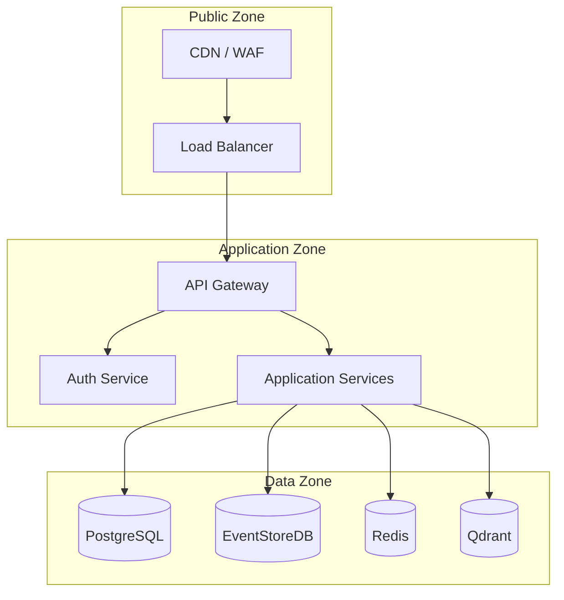
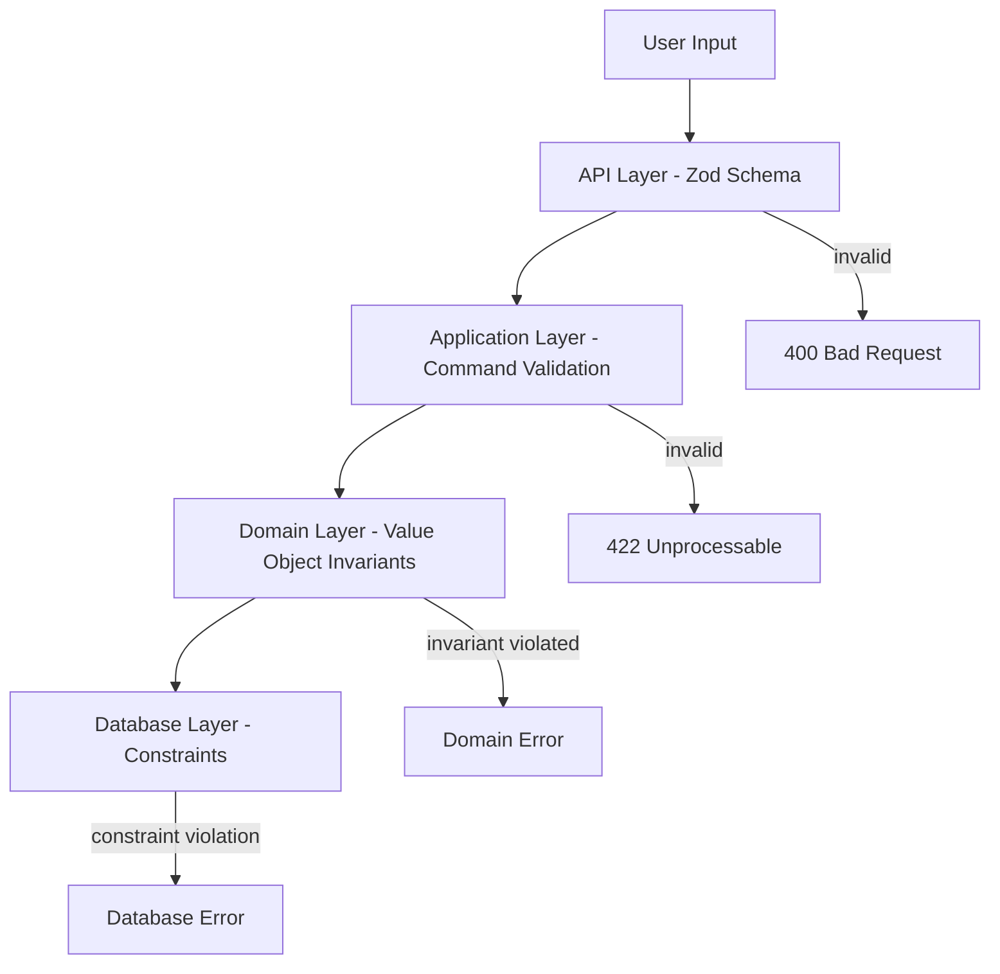

# 08 — Security Engineering

**Version:** 1.0  
**Status:** Normative  
**Parent:** RIOS Master Architecture Blueprint (MAB)  
**Cross-References:** Constitution §3, ADR-005 (Auth), DMS, Quality Attribute
#10 (Security)

---

## 1. Purpose

This document defines the complete security engineering standards for RIOS.
Security is integrated at every layer — authentication, authorization, data
protection, input validation, and audit logging.

---

## 2. Threat Model

### 2.1 STRIDE Analysis

| Threat                               | Category               | Risk     | Mitigation                                       |
| ------------------------------------ | ---------------------- | -------- | ------------------------------------------------ |
| Unauthorized access to research data | Information Disclosure | High     | JWT auth + RBAC + domain-level authorization     |
| Tampering with domain events         | Tampering              | Critical | Event store append-only + digital signatures     |
| Spoofing researcher identity         | Spoofing               | High     | OAuth2 + email verification + MFA                |
| Repudiation of research actions      | Repudiation            | Medium   | Comprehensive audit logging                      |
| Denial of service on API             | DoS                    | Medium   | Rate limiting + CDN + auto-scaling               |
| Information leak via AI context      | Information Disclosure | Medium   | Data sanitization + access control on AI context |

### 2.2 Security Boundaries



---

## 3. Authentication

### 3.1 Strategy

| Aspect         | Implementation                               |
| -------------- | -------------------------------------------- |
| Protocol       | OAuth 2.0 + OpenID Connect                   |
| Provider       | Auth0 or Clerk                               |
| Token format   | JWT (RS256)                                  |
| Token lifetime | Access: 15 min, Refresh: 7 days              |
| MFA            | TOTP (optional, recommended for researchers) |

### 3.2 JWT Token Structure

```json
{
  "sub": "researcher-uuid",
  "email": "researcher@university.edu",
  "roles": ["researcher"],
  "domains": {
    "identity": ["read", "write"],
    "knowledge": ["read", "write"],
    "narrative": ["read"],
    "publication": ["read", "write"]
  },
  "iat": 1700000000,
  "exp": 1700000900,
  "iss": "rios.auth0.com"
}
```

### 3.3 Authentication Rules

| ID       | Rule                                                              | Source                      |
| -------- | ----------------------------------------------------------------- | --------------------------- |
| AUTH-001 | All API endpoints require authentication unless explicitly public | Constitution §3             |
| AUTH-002 | JWT tokens are validated on every request                         | Security best practice      |
| AUTH-003 | Refresh tokens are stored in httpOnly secure cookies              | XSS prevention              |
| AUTH-004 | Access tokens are short-lived (15 min)                            | Token compromise mitigation |
| AUTH-005 | Failed login attempts are rate-limited (5 attempts / 15 min)      | Brute force prevention      |
| AUTH-006 | Password policy: minimum 12 chars, complexity requirements        | OWASP guidelines            |

---

## 4. Authorization

### 4.1 RBAC Model

| Role               | Identity | Knowledge | Narrative | Publication | Admin |
| ------------------ | -------- | --------- | --------- | ----------- | ----- |
| Researcher (owner) | CRUD     | CRUD      | CRUD      | CRUD        | —     |
| Collaborator       | R        | R         | R         | R           | —     |
| Reviewer           | R        | R         | R         | R           | —     |
| Admin              | CRUD     | CRUD      | CRUD      | CRUD        | CRUD  |
| Public             | —        | —         | —         | R           | —     |

### 4.2 Authorization Rules

| ID       | Rule                                                        | Source                          |
| -------- | ----------------------------------------------------------- | ------------------------------- |
| RBAC-001 | Authorization is enforced at the application service layer  | Architecture                    |
| RBAC-002 | Domain-level authorization (researcher owns their identity) | DDD ownership                   |
| RBAC-003 | Cross-domain access requires explicit permission            | Domain boundary                 |
| RBAC-004 | Admin operations require re-authentication                  | Privilege escalation prevention |
| RBAC-005 | Authorization failures are logged (not just 403)            | Audit                           |

### 4.3 Authorization Implementation

```typescript
// packages/infrastructure/src/auth/DomainAuthorizationService.ts

export class DomainAuthorizationService implements IAuthorizationService {
  async authorize(
    userId: string,
    domain: DomainName,
    action: DomainAction,
  ): Promise<boolean> {
    const permissions = await this.permissionRepository.getPermissions(
      userId,
      domain,
    );

    if (!permissions.includes(action)) {
      this.auditLog.record({
        action: 'AUTHORIZATION_DENIED',
        userId,
        domain,
        requestedAction: action,
      });
      return false;
    }

    return true;
  }

  async authorizeDomainResource(
    userId: string,
    domain: DomainName,
    resourceId: string,
    action: DomainAction,
  ): Promise<boolean> {
    // Check if user owns or has access to this specific resource
    const ownership = await this.ownershipRepository.getOwnership(
      domain,
      resourceId,
    );

    if (
      ownership.ownerId === userId ||
      ownership.collaborators.includes(userId)
    ) {
      return true;
    }

    return this.authorize(userId, domain, action);
  }
}
```

---

## 5. Secrets Management

### 5.1 Secret Categories

| Category               | Examples                   | Storage                     |
| ---------------------- | -------------------------- | --------------------------- |
| Application secrets    | API keys, DB passwords     | Environment variables       |
| Infrastructure secrets | TLS certs, SSH keys        | Vault / AWS Secrets Manager |
| User secrets           | Passwords (hashed), tokens | Database (hashed)           |
| AI secrets             | OpenAI API keys            | Environment variables       |

### 5.2 Secrets Rules

| ID      | Rule                                                      |
| ------- | --------------------------------------------------------- |
| SEC-001 | Secrets are NEVER committed to version control            |
| SEC-002 | `.env` files are in `.gitignore`                          |
| SEC-003 | Secrets rotate on a schedule (90 days minimum)            |
| SEC-004 | Production secrets are stored in a secrets manager        |
| SEC-005 | Development secrets use `.env.local` with safe defaults   |
| SEC-006 | Secrets are injected via environment variables at runtime |

---

## 6. Encryption

### 6.1 Encryption Strategy

| Layer              | Method           | Standard                  |
| ------------------ | ---------------- | ------------------------- |
| Transport          | TLS 1.3          | HTTPS everywhere          |
| At rest (database) | AES-256          | PostgreSQL pgcrypto       |
| At rest (files)    | AES-256          | S3 server-side encryption |
| Passwords          | bcrypt (cost 12) | OWASP recommended         |
| JWT signing        | RS256            | Asymmetric keys           |

### 6.2 Encryption Rules

| ID      | Rule                                         |
| ------- | -------------------------------------------- |
| ENC-001 | All communication uses TLS 1.3               |
| ENC-002 | Sensitive fields encrypted at rest           |
| ENC-003 | Passwords hashed with bcrypt (cost 12)       |
| ENC-004 | Encryption keys rotated annually             |
| ENC-005 | Key management via dedicated secrets manager |

---

## 7. Input Validation

### 7.1 Validation Layers



### 7.2 Validation Rules

| ID      | Rule                                                              |
| ------- | ----------------------------------------------------------------- |
| VAL-001 | All external input is validated at the API boundary (Zod schemas) |
| VAL-002 | Commands are validated before reaching aggregates                 |
| VAL-003 | Domain value objects enforce their own invariants                 |
| VAL-004 | SQL injection prevented by parameterized queries (TypeORM)        |
| VAL-005 | XSS prevented by output encoding (React auto-escaping)            |
| VAL-006 | CSRF protection via SameSite cookies + CSRF tokens                |
| VAL-007 | File uploads validated for type, size, and content                |

---

## 8. Rate Limiting

### 8.1 Rate Limit Tiers

| Endpoint Category      | Rate Limit | Window | Scope |
| ---------------------- | ---------- | ------ | ----- |
| Public (health, docs)  | 100 req    | 1 min  | IP    |
| Authenticated (read)   | 200 req    | 1 min  | User  |
| Authenticated (write)  | 50 req     | 1 min  | User  |
| AI endpoints           | 30 req     | 1 min  | User  |
| Auth endpoints (login) | 5 req      | 15 min | IP    |

### 8.2 Rate Limit Rules

| ID     | Rule                                                       |
| ------ | ---------------------------------------------------------- |
| RL-001 | Rate limiting enforced at API gateway level                |
| RL-002 | Rate limit headers included in responses (`X-RateLimit-*`) |
| RL-003 | Rate limit exceeded returns 429 with `Retry-After` header  |
| RL-004 | Rate limits are configurable per environment               |

---

## 9. Audit Logging

### 9.1 Security Audit Events

| Event                | Severity | Logged Data                        |
| -------------------- | -------- | ---------------------------------- |
| Login success        | INFO     | userId, IP, timestamp, userAgent   |
| Login failure        | WARN     | email, IP, timestamp, reason       |
| Password change      | INFO     | userId, IP, timestamp              |
| Authorization denied | WARN     | userId, domain, action, resourceId |
| Data access          | INFO     | userId, domain, resourceId, action |
| Admin action         | INFO     | adminId, action, target, changes   |
| API key used         | INFO     | keyId, endpoint, IP                |

### 9.2 Audit Rules

| ID          | Rule                                                |
| ----------- | --------------------------------------------------- |
| AUD-SEC-001 | All security events are logged                      |
| AUD-SEC-002 | Audit logs are immutable (append-only)              |
| AUD-SEC-003 | Audit logs include: who, what, when, where, outcome |
| AUD-SEC-004 | Audit logs are retained for 1 year minimum          |
| AUD-SEC-005 | PII in audit logs is masked where possible          |

---

## 10. Security Review Checklist

### 10.1 Per-Feature Security Checklist

- [ ] Authentication required on all non-public endpoints
- [ ] Authorization checked at application service layer
- [ ] Input validated with Zod schemas at API boundary
- [ ] SQL injection prevented (parameterized queries only)
- [ ] XSS prevented (no dangerouslySetInnerHTML, React auto-escaping)
- [ ] CSRF protection implemented for state-changing operations
- [ ] Rate limiting applied to endpoint category
- [ ] Audit logging for security-relevant operations
- [ ] Error messages don't leak internal details
- [ ] Secrets not exposed in logs, error messages, or responses

### 10.2 Security Dependency Checklist

- [ ] No known CVEs in dependencies (npm audit)
- [ ] Dependencies pinned to specific versions
- [ ] Security-critical dependencies reviewed manually
- [ ] Dependency updates tested in staging before production

---

_This document is part of the RIOS Engineering Blueprint. It is subordinate to
the Master Architecture Blueprint, Architecture Governance Standard, and all
normative architecture documents._
