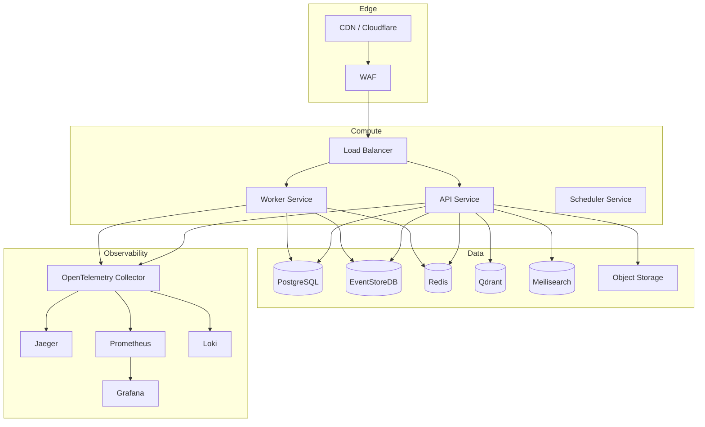

# 09 — Infrastructure Engineering

**Version:** 1.0  
**Status:** Normative  
**Parent:** RIOS Master Architecture Blueprint (MAB)  
**Cross-References:** Volume VII (Engineering), ADR-006, DMS

---

## 1. Purpose

This document defines the complete infrastructure engineering standards for
RIOS. It covers local development, containerization, cloud strategy, networking,
scalability, and disaster recovery.

---

## 2. Infrastructure Architecture

### 2.1 Infrastructure Overview



---

## 3. Docker Configuration

### 3.1 Docker Compose (Local Development)

```yaml
# docker-compose.yml

services:
  # Databases
  postgres:
    image: postgres:16
    environment:
      POSTGRES_DB: rios
      POSTGRES_USER: rios
      POSTGRES_PASSWORD: rios_dev
    ports:
      - '5432:5432'
    volumes:
      - postgres_data:/var/lib/postgresql/data
      - ./scripts/init-db.sql:/docker-entrypoint-initdb.d/init.sql
    healthcheck:
      test: ['CMD-SHELL', 'pg_isready -U rios']
      interval: 5s
      timeout: 5s
      retries: 5

  eventstore:
    image: eventstore/eventstore:23.10.0-jammy
    environment:
      EVENTSTORE_INSECURE: 'true'
      EVENTSTORE_ENABLE_ATOM_PUB_OVER_HTTP: 'true'
    ports:
      - '2113:2113'
    volumes:
      - eventstore_data:/var/lib/eventstore

  redis:
    image: redis:7-alpine
    ports:
      - '6379:6379'
    volumes:
      - redis_data:/data

  qdrant:
    image: qdrant/qdrant:latest
    ports:
      - '6333:6333'
    volumes:
      - qdrant_data:/qdrant/storage

  meilisearch:
    image: getmeili/meilisearch:latest
    ports:
      - '7700:7700'
    volumes:
      - meilisearch_data:/meili_data

  # Observability
  jaeger:
    image: jaegertracing/all-in-one:latest
    ports:
      - '16686:16686'
      - '4318:4318'

  prometheus:
    image: prom/prometheus:latest
    ports:
      - '9090:9090'
    volumes:
      - ./infrastructure/prometheus/prometheus.yml:/etc/prometheus/prometheus.yml

  grafana:
    image: grafana/grafana:latest
    ports:
      - '3001:3000'
    environment:
      GF_SECURITY_ADMIN_PASSWORD: admin

  loki:
    image: grafana/loki:latest
    ports:
      - '3100:3100'

volumes:
  postgres_data:
  eventstore_data:
  redis_data:
  qdrant_data:
  meilisearch_data:
```

### 3.2 Docker Rules

| ID       | Rule                                              |
| -------- | ------------------------------------------------- |
| DOCK-001 | All services have health checks defined           |
| DOCK-002 | Volumes used for data persistence in development  |
| DOCK-003 | Port mappings documented in docker-compose        |
| DOCK-004 | `.dockerignore` excludes node_modules, .git, .env |
| DOCK-005 | Multi-stage Dockerfiles for production images     |
| DOCK-006 | Base images pinned to specific versions           |

---

## 4. Local Development Setup

### 4.1 Development Environment Requirements

| Tool           | Version  | Purpose                       |
| -------------- | -------- | ----------------------------- |
| Node.js        | 20.x LTS | Runtime                       |
| pnpm           | 9.x      | Package manager               |
| Docker         | 24.x     | Container runtime             |
| Docker Compose | v2       | Multi-container orchestration |
| Git            | 2.x      | Version control               |
| psql           | 16.x     | Database CLI (optional)       |

### 4.2 Quick Start

```bash
# 1. Clone repository
git clone https://github.com/rios/rios.git
cd rios

# 2. Install dependencies
pnpm install

# 3. Start infrastructure
docker compose up -d

# 4. Run database migrations
pnpm run db:migrate

# 5. Seed development data
pnpm run db:seed

# 6. Start development servers
pnpm run dev
```

### 4.3 Development Scripts

```json
{
  "scripts": {
    "dev": "concurrently \"pnpm:dev:*\"",
    "dev:api": "pnpm --filter @rios/api dev",
    "dev:web": "pnpm --filter @rios/web dev",
    "dev:worker": "pnpm --filter @rios/worker dev",
    "build": "pnpm -r build",
    "test": "pnpm -r test",
    "test:ci": "pnpm -r test:ci",
    "lint": "pnpm -r lint",
    "db:migrate": "pnpm --filter @rios/infrastructure db:migrate",
    "db:seed": "pnpm --filter @rios/infrastructure db:seed",
    "db:reset": "pnpm --filter @rios/infrastructure db:reset",
    "infra:up": "docker compose up -d",
    "infra:down": "docker compose down",
    "infra:reset": "docker compose down -v && docker compose up -d"
  }
}
```

---

## 5. Environment Management

### 5.1 Environment Tiers

| Environment | Purpose           | Infrastructure       | Data                 |
| ----------- | ----------------- | -------------------- | -------------------- |
| Local       | Development       | Docker Compose       | Seeded test data     |
| Test (CI)   | Automated testing | Docker (ephemeral)   | Fixture data         |
| Staging     | Pre-production    | Cloud (mirrors prod) | Anonymized prod data |
| Production  | Live system       | Cloud (HA)           | Real data            |

### 5.2 Environment Variables

```bash
# .env.example (template for all environments)

# ── Application ──
NODE_ENV=development
API_PORT=4000
API_HOST=0.0.0.0
LOG_LEVEL=debug

# ── Database ──
DB_HOST=localhost
DB_PORT=5432
DB_USERNAME=rios
DB_PASSWORD=rios_dev
DB_NAME=rios
DB_SSL=false
DB_LOGGING=false

# ── Event Store ──
ES_HOST=localhost
ES_PORT=2113
ES_INSECURE=true

# ── Redis ──
REDIS_HOST=localhost
REDIS_PORT=6379
REDIS_PASSWORD=

# ── Search ──
QDRANT_HOST=localhost
QDRANT_PORT=6333
MEILISEARCH_HOST=localhost
MEILISEARCH_PORT=7700
MEILISEARCH_API_KEY=

# ── Auth ──
AUTH_PROVIDER=auth0
AUTH_DOMAIN=rios.auth0.com
AUTH_CLIENT_ID=
AUTH_CLIENT_SECRET=
AUTH_AUDIENCE=https://api.rios.dev

# ── AI ──
OPENAI_API_KEY=
OPENAI_MODEL=gpt-4o
EMBEDDING_MODEL=text-embedding-ada-002

# ── Object Storage ──
S3_ENDPOINT=http://localhost:9000
S3_BUCKET=rios-dev
S3_ACCESS_KEY=
S3_SECRET_KEY=

# ── Observability ──
OTEL_ENDPOINT=http://localhost:4318
OTEL_SERVICE_NAME=rios-api
```

### 5.3 Environment Rules

| ID      | Rule                                                         |
| ------- | ------------------------------------------------------------ |
| ENV-001 | All environment variables documented in `.env.example`       |
| ENV-002 | `.env` files are NEVER committed to Git                      |
| ENV-003 | Secrets use environment-specific values                      |
| ENV-004 | Default values for non-sensitive local development variables |
| ENV-005 | Environment validation on application startup (Zod schema)   |

---

## 6. Configuration Management

### 6.1 Configuration Schema

```typescript
// packages/shared/src/config/AppConfig.ts

import { z } from 'zod';

const AppConfigSchema = z.object({
  nodeEnv: z.enum(['development', 'test', 'staging', 'production']),
  api: z.object({
    port: z.number().int().min(1).max(65535),
    host: z.string(),
  }),
  database: z.object({
    host: z.string(),
    port: z.number().int(),
    username: z.string(),
    password: z.string(),
    name: z.string(),
    ssl: z.boolean(),
  }),
  eventStore: z.object({
    host: z.string(),
    port: z.number().int(),
    insecure: z.boolean(),
  }),
  redis: z.object({
    host: z.string(),
    port: z.number().int(),
    password: z.string().optional(),
  }),
  auth: z.object({
    provider: z.enum(['auth0', 'clerk']),
    domain: z.string(),
    clientId: z.string(),
    audience: z.string(),
  }),
  ai: z.object({
    apiKey: z.string(),
    model: z.string(),
    embeddingModel: z.string(),
  }),
});

export type AppConfig = z.infer<typeof AppConfigSchema>;

export function loadConfig(): AppConfig {
  return AppConfigSchema.parse({
    nodeEnv: process.env.NODE_ENV,
    api: {
      port: parseInt(process.env.API_PORT ?? '4000', 10),
      host: process.env.API_HOST ?? '0.0.0.0',
    },
    database: {
      host: process.env.DB_HOST ?? 'localhost',
      port: parseInt(process.env.DB_PORT ?? '5432', 10),
      username: process.env.DB_USERNAME ?? 'rios',
      password: process.env.DB_PASSWORD ?? '',
      name: process.env.DB_NAME ?? 'rios',
      ssl: process.env.DB_SSL === 'true',
    },
    eventStore: {
      host: process.env.ES_HOST ?? 'localhost',
      port: parseInt(process.env.ES_PORT ?? '2113', 10),
      insecure: process.env.ES_INSECURE === 'true',
    },
    redis: {
      host: process.env.REDIS_HOST ?? 'localhost',
      port: parseInt(process.env.REDIS_PORT ?? '6379', 10),
      password: process.env.REDIS_PASSWORD,
    },
    auth: {
      provider: (process.env.AUTH_PROVIDER ?? 'auth0') as 'auth0' | 'clerk',
      domain: process.env.AUTH_DOMAIN ?? '',
      clientId: process.env.AUTH_CLIENT_ID ?? '',
      audience: process.env.AUTH_AUDIENCE ?? '',
    },
    ai: {
      apiKey: process.env.OPENAI_API_KEY ?? '',
      model: process.env.OPENAI_MODEL ?? 'gpt-4o',
      embeddingModel: process.env.EMBEDDING_MODEL ?? 'text-embedding-ada-002',
    },
  });
}
```

---

## 7. Cloud Strategy

### 7.1 Cloud Provider

| Aspect         | Choice              | Rationale                                |
| -------------- | ------------------- | ---------------------------------------- |
| Primary cloud  | AWS                 | Enterprise maturity, global reach        |
| Compute        | ECS Fargate / EKS   | Managed containers, no server management |
| Database (PG)  | Amazon RDS          | Managed PostgreSQL with HA               |
| Cache          | Amazon ElastiCache  | Managed Redis                            |
| Object storage | Amazon S3           | Durable, scalable file storage           |
| CDN            | CloudFront          | Global edge distribution                 |
| Secrets        | AWS Secrets Manager | Encrypted secret storage                 |
| DNS            | Route 53            | DNS management                           |

### 7.2 Cloud Rules

| ID        | Rule                                                                    |
| --------- | ----------------------------------------------------------------------- |
| CLOUD-001 | Infrastructure as Code (Terraform)                                      |
| CLOUD-002 | Multi-AZ deployments for all stateful services                          |
| CLOUD-003 | Auto-scaling for compute services                                       |
| CLOUD-004 | Cost tagging on all resources                                           |
| CLOUD-005 | Cloud resources follow naming convention: `{env}-{service}-{component}` |

---

## 8. Networking

### 8.1 Network Architecture

| Network               | CIDR        | Purpose              |
| --------------------- | ----------- | -------------------- |
| VPC                   | 10.0.0.0/16 | Main VPC             |
| Public subnet         | 10.0.1.0/24 | Load balancers       |
| Private subnet (app)  | 10.0.2.0/24 | Application services |
| Private subnet (data) | 10.0.3.0/24 | Databases            |

### 8.2 Network Rules

| ID      | Rule                                                 |
| ------- | ---------------------------------------------------- |
| NET-001 | Databases in private subnets only (no public access) |
| NET-002 | Application services in private subnets              |
| NET-003 | Load balancers in public subnets                     |
| NET-004 | Security groups follow least-privilege principle     |
| NET-005 | VPC peering for cross-service communication          |

---

## 9. Scalability

### 9.1 Scaling Strategy

| Component      | Strategy                  | Triggers                 |
| -------------- | ------------------------- | ------------------------ |
| API Service    | Horizontal (auto-scaling) | CPU > 70%, request count |
| Worker Service | Horizontal (auto-scaling) | Queue depth > 100        |
| PostgreSQL     | Vertical + read replicas  | CPU/IO thresholds        |
| EventStoreDB   | Vertical                  | Storage/CPU              |
| Redis          | Vertical + clustering     | Memory usage             |
| Qdrant         | Horizontal                | Index size, query load   |

### 9.2 Scalability Rules

| ID        | Rule                                                   |
| --------- | ------------------------------------------------------ |
| SCALE-001 | All services are stateless (state in databases)        |
| SCALE-002 | Session state in Redis (not in-memory)                 |
| SCALE-003 | Connection pooling for all database connections        |
| SCALE-004 | Load testing before production launch                  |
| SCALE-005 | Auto-scaling policies defined for all compute services |

---

## 10. Disaster Recovery

### 10.1 Recovery Targets

| Metric                         | Target                |
| ------------------------------ | --------------------- |
| RPO (Recovery Point Objective) | 1 hour                |
| RTO (Recovery Time Objective)  | 4 hours               |
| Event store rebuild            | < 2 hours from backup |

### 10.2 Backup Strategy

| Component    | Method                   | Frequency  | Retention  | Cross-Region |
| ------------ | ------------------------ | ---------- | ---------- | ------------ |
| PostgreSQL   | Automated snapshots      | Daily      | 30 days    | Yes          |
| EventStoreDB | File backup              | Daily      | 90 days    | Yes          |
| Redis        | RDB snapshots            | 6 hours    | 7 days     | No           |
| Qdrant       | Snapshot                 | Daily      | 14 days    | Yes          |
| S3           | Versioning + replication | Continuous | Indefinite | Yes          |

### 10.3 Disaster Recovery Rules

| ID     | Rule                                          |
| ------ | --------------------------------------------- |
| DR-001 | Backups tested monthly (restore drill)        |
| DR-002 | Cross-region replication for critical data    |
| DR-003 | Runbook documented for each recovery scenario |
| DR-004 | Automated alerts on backup failures           |

---

_This document is part of the RIOS Engineering Blueprint. It is subordinate to
the Master Architecture Blueprint, Architecture Governance Standard, and all
normative architecture documents._
