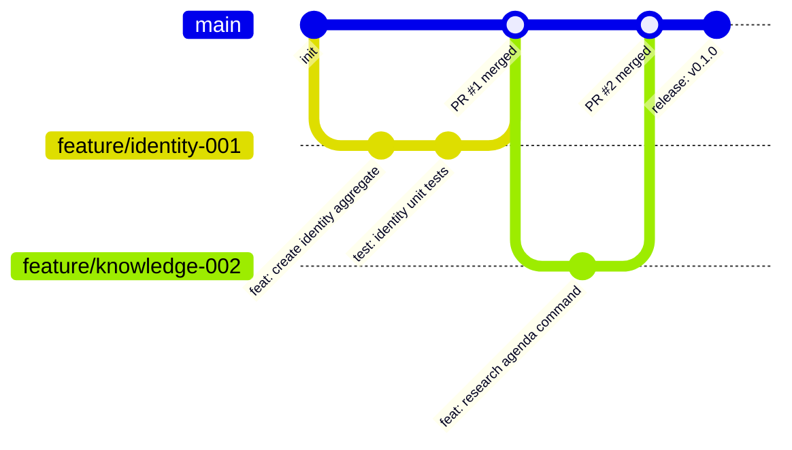
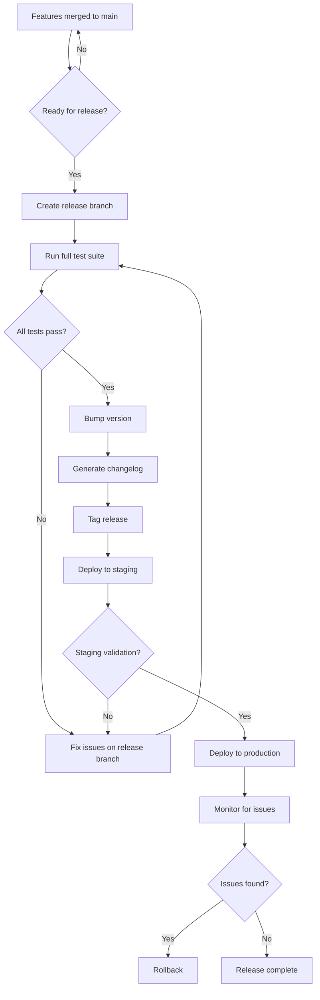
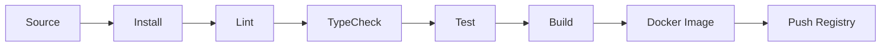

# 10 — CI/CD Engineering

**Version:** 1.0  
**Status:** Normative  
**Parent:** RIOS Master Architecture Blueprint (MAB)  
**Cross-References:** Volume VII (Engineering), DMS

---

## 1. Purpose

This document defines the complete CI/CD engineering standards for RIOS. It
covers Git strategy, branch conventions, commit conventions, build pipelines,
test pipelines, deployment pipelines, and rollback strategy.

---

## 2. Git Strategy

### 2.1 Branch Model: Trunk-Based Development



### 2.2 Branch Strategy

| Branch                           | Purpose               | Lifetime       | Merge Target |
| -------------------------------- | --------------------- | -------------- | ------------ |
| `main`                           | Production-ready code | Permanent      | —            |
| `feature/{ticket}-{description}` | Feature development   | 1-3 days       | `main`       |
| `fix/{ticket}-{description}`     | Bug fixes             | 1-2 days       | `main`       |
| `chore/{ticket}-{description}`   | Maintenance tasks     | 1-2 days       | `main`       |
| `release/{version}`              | Release stabilization | Until released | `main` + tag |

### 2.3 Branch Rules

| ID     | Rule                                          |
| ------ | --------------------------------------------- |
| BR-001 | `main` is always deployable                   |
| BR-002 | All changes go through Pull Requests          |
| BR-003 | PRs require 1 approval minimum                |
| BR-004 | PRs must pass all CI checks before merge      |
| BR-005 | Feature branches are short-lived (max 3 days) |
| BR-006 | No long-lived feature branches                |
| BR-007 | Squash merge to `main` (clean history)        |
| BR-008 | Delete branches after merge                   |

---

## 3. Commit Conventions

### 3.1 Conventional Commits

```
<type>(<scope>): <description>

[optional body]

[optional footer(s)]
```

### 3.2 Commit Types

| Type       | Description      | Example                                              |
| ---------- | ---------------- | ---------------------------------------------------- |
| `feat`     | New feature      | `feat(identity): add intellectual direction command` |
| `fix`      | Bug fix          | `fix(knowledge): correct evidence chain ordering`    |
| `test`     | Adding tests     | `test(identity): add aggregate unit tests`           |
| `docs`     | Documentation    | `docs(api): update OpenAPI schema`                   |
| `refactor` | Code refactoring | `refactor(narrative): extract narrative builder`     |
| `chore`    | Maintenance      | `chore(deps): update NestJS to v10`                  |
| `perf`     | Performance      | `perf(search): optimize vector query`                |
| `ci`       | CI/CD changes    | `ci(actions): add architecture test job`             |
| `style`    | Formatting       | `style(identity): fix linting errors`                |
| `build`    | Build changes    | `build(docker): optimize multi-stage build`          |

### 3.3 Commit Scopes

| Scope           | Domain               |
| --------------- | -------------------- |
| `identity`      | Identity domain      |
| `knowledge`     | Knowledge domain     |
| `narrative`     | Narrative domain     |
| `publication`   | Publication domain   |
| `visualization` | Visualization domain |
| `motion`        | Motion domain        |
| `engineering`   | Engineering domain   |
| `evolution`     | Evolution domain     |
| `api`           | API layer            |
| `web`           | Frontend             |
| `infra`         | Infrastructure       |
| `ci`            | CI/CD                |
| `shared`        | Shared packages      |

### 3.4 Commit Rules

| ID     | Rule                                                   |
| ------ | ------------------------------------------------------ |
| CM-001 | All commits follow Conventional Commits format         |
| CM-002 | Commit messages are in English                         |
| CM-003 | Description is in imperative mood ("add", not "added") |
| CM-004 | Description max 72 characters                          |
| CM-005 | Body explains "what" and "why", not "how"              |
| CM-006 | Breaking changes noted with `BREAKING CHANGE:` footer  |

---

## 4. Versioning

### 4.1 Semantic Versioning

```
MAJOR.MINOR.PATCH

MAJOR: Breaking API changes
MINOR: New features (backward compatible)
PATCH: Bug fixes (backward compatible)
```

### 4.2 Versioning Rules

| ID      | Rule                                                   |
| ------- | ------------------------------------------------------ |
| VER-001 | All packages follow Semantic Versioning 2.0.0          |
| VER-002 | Packages in `0.x.x` may have breaking changes          |
| VER-003 | Version bumps are automated via conventional commits   |
| VER-004 | Changelog generated automatically from commit messages |
| VER-005 | Git tags match version: `v0.1.0`                       |

---

## 5. Release Strategy

### 5.1 Release Flow



### 5.2 Release Rules

| ID      | Rule                                                   |
| ------- | ------------------------------------------------------ |
| REL-001 | Releases are cut from `main`                           |
| REL-002 | Release candidate deployed to staging first            |
| REL-003 | Staging validation before production deployment        |
| REL-004 | Rollback plan ready before every production deployment |
| REL-005 | Release notes generated from changelog                 |

---

## 6. GitHub Actions

### 6.1 CI Pipeline

```yaml
# .github/workflows/ci.yml

name: CI

on:
  push:
    branches: [main]
  pull_request:
    branches: [main]

concurrency:
  group: ci-${{ github.ref }}
  cancel-in-progress: true

jobs:
  # ── Lint ──
  lint:
    runs-on: ubuntu-latest
    steps:
      - uses: actions/checkout@v4
      - uses: pnpm/action-setup@v2
      - uses: actions/setup-node@v4
        with:
          node-version: 20
          cache: pnpm
      - run: pnpm install --frozen-lockfile
      - run: pnpm run lint

  # ── Type Check ──
  typecheck:
    runs-on: ubuntu-latest
    steps:
      - uses: actions/checkout@v4
      - uses: pnpm/action-setup@v2
      - uses: actions/setup-node@v4
        with:
          node-version: 20
          cache: pnpm
      - run: pnpm install --frozen-lockfile
      - run: pnpm run typecheck

  # ── Unit Tests ──
  test-unit:
    runs-on: ubuntu-latest
    steps:
      - uses: actions/checkout@v4
      - uses: pnpm/action-setup@v2
      - uses: actions/setup-node@v4
        with:
          node-version: 20
          cache: pnpm
      - run: pnpm install --frozen-lockfile
      - run: pnpm run test:unit
      - uses: actions/upload-artifact@v4
        if: always()
        with:
          name: unit-coverage
          path: coverage/

  # ── Integration Tests ──
  test-integration:
    runs-on: ubuntu-latest
    services:
      postgres:
        image: postgres:16
        env:
          POSTGRES_DB: rios_test
          POSTGRES_USER: rios
          POSTGRES_PASSWORD: rios_test
        ports:
          - 5432:5432
        options: >-
          --health-cmd "pg_isready -U rios" --health-interval 5s
          --health-timeout 5s --health-retries 5
      eventstore:
        image: eventstore/eventstore:23.10.0-jammy
        env:
          EVENTSTORE_INSECURE: 'true'
        ports:
          - 2113:2113
      redis:
        image: redis:7-alpine
        ports:
          - 6379:6379
    steps:
      - uses: actions/checkout@v4
      - uses: pnpm/action-setup@v2
      - uses: actions/setup-node@v4
        with:
          node-version: 20
          cache: pnpm
      - run: pnpm install --frozen-lockfile
      - run: pnpm run test:integration
        env:
          DB_HOST: localhost
          ES_HOST: localhost
          REDIS_HOST: localhost

  # ── Architecture Tests ──
  test-architecture:
    runs-on: ubuntu-latest
    steps:
      - uses: actions/checkout@v4
      - uses: pnpm/action-setup@v2
      - uses: actions/setup-node@v4
        with:
          node-version: 20
          cache: pnpm
      - run: pnpm install --frozen-lockfile
      - run: pnpm run test:architecture

  # ── Build ──
  build:
    runs-on: ubuntu-latest
    needs: [lint, typecheck, test-unit]
    steps:
      - uses: actions/checkout@v4
      - uses: pnpm/action-setup@v2
      - uses: actions/setup-node@v4
        with:
          node-version: 20
          cache: pnpm
      - run: pnpm install --frozen-lockfile
      - run: pnpm run build

  # ── E2E Tests ──
  test-e2e:
    runs-on: ubuntu-latest
    needs: [build]
    steps:
      - uses: actions/checkout@v4
      - uses: pnpm/action-setup@v2
      - uses: actions/setup-node@v4
        with:
          node-version: 20
          cache: pnpm
      - run: pnpm install --frozen-lockfile
      - run: pnpm run build
      - run: pnpm run test:e2e
```

### 6.2 CD Pipeline

```yaml
# .github/workflows/deploy.yml

name: Deploy

on:
  push:
    tags:
      - 'v*'

jobs:
  deploy-staging:
    runs-on: ubuntu-latest
    environment: staging
    steps:
      - uses: actions/checkout@v4
      - name: Build Docker images
        run:
          docker build -t rios-api:${{ github.ref_name }} -f apps/api/Dockerfile
          .
      - name: Deploy to staging
        run: |
          # Deploy to staging environment
          echo "Deploying ${{ github.ref_name }} to staging"
      - name: Run smoke tests
        run: pnpm run test:smoke -- --env staging

  deploy-production:
    runs-on: ubuntu-latest
    needs: [deploy-staging]
    environment: production
    steps:
      - uses: actions/checkout@v4
      - name: Deploy to production
        run: |
          # Deploy to production environment
          echo "Deploying ${{ github.ref_name }} to production"
      - name: Run smoke tests
        run: pnpm run test:smoke -- --env production
      - name: Notify deployment
        run: echo "Deployed ${{ github.tag_name }} to production"
```

### 6.3 Pipeline Rules

| ID       | Rule                                          |
| -------- | --------------------------------------------- |
| PIPE-001 | CI runs on every PR and push to `main`        |
| PIPE-002 | All checks must pass before merge             |
| PIPE-003 | CD runs on version tags only                  |
| PIPE-004 | Staging deployment required before production |
| PIPE-005 | Failed deployments trigger automatic rollback |
| PIPE-006 | Pipeline status badges in repository README   |

---

## 7. Testing Pipeline

### 7.1 Pipeline Stages

| Stage                 | Job                   | Failure Action |
| --------------------- | --------------------- | -------------- |
| 1. Lint               | ESLint + Prettier     | Block PR       |
| 2. Typecheck          | TypeScript strict     | Block PR       |
| 3. Unit Tests         | Vitest (all packages) | Block PR       |
| 4. Architecture Tests | Custom arch tests     | Block PR       |
| 5. Build              | TypeScript build      | Block PR       |
| 6. Integration Tests  | Vitest + real DBs     | Block PR       |
| 7. E2E Tests          | Playwright            | Block PR       |

### 7.2 Pipeline Rules

| ID     | Rule                                            |
| ------ | ----------------------------------------------- |
| TP-001 | Pipeline stages run in order (fail-fast)        |
| TP-002 | Unit tests run in parallel across packages      |
| TP-003 | Integration tests use Docker services           |
| TP-004 | E2E tests run after successful build            |
| TP-005 | Test results and coverage uploaded as artifacts |
| TP-006 | Coverage thresholds enforced (see Testing doc)  |

---

## 8. Build Pipeline

### 8.1 Build Stages



### 8.2 Build Rules

| ID        | Rule                                           |
| --------- | ---------------------------------------------- |
| BUILD-001 | Builds are reproducible (frozen lockfile)      |
| BUILD-002 | Build artifacts are immutable                  |
| BUILD-003 | Docker images tagged with version + SHA        |
| BUILD-004 | Build cache used for faster CI                 |
| BUILD-005 | Source maps generated for production debugging |

---

## 9. Rollback Strategy

### 9.1 Rollback Procedures

| Scenario                | Action                                  | Time      |
| ----------------------- | --------------------------------------- | --------- |
| Failed deployment       | Automatic rollback to previous version  | < 2 min   |
| Performance degradation | Manual rollback via CI/CD               | < 5 min   |
| Data corruption         | Event store replay + projection rebuild | < 2 hours |
| Security incident       | Immediate rollback + incident response  | < 1 min   |

### 9.2 Rollback Rules

| ID     | Rule                                                     |
| ------ | -------------------------------------------------------- |
| RB-001 | Every deployment has a rollback plan                     |
| RB-002 | Database migrations are backward-compatible              |
| RB-003 | Event store events are never deleted (replay capability) |
| RB-004 | Rollback tested in staging before production use         |
| RB-005 | Post-rollback monitoring for 30 minutes                  |

---

## 10. Pipeline Performance

| Metric                            | Target       |
| --------------------------------- | ------------ |
| CI pipeline duration (PR)         | < 10 minutes |
| CD pipeline duration (staging)    | < 15 minutes |
| CD pipeline duration (production) | < 20 minutes |
| Docker image build time           | < 3 minutes  |
| Test parallelization              | 4+ workers   |

---

_This document is part of the RIOS Engineering Blueprint. It is subordinate to
the Master Architecture Blueprint, Architecture Governance Standard, and all
normative architecture documents._
