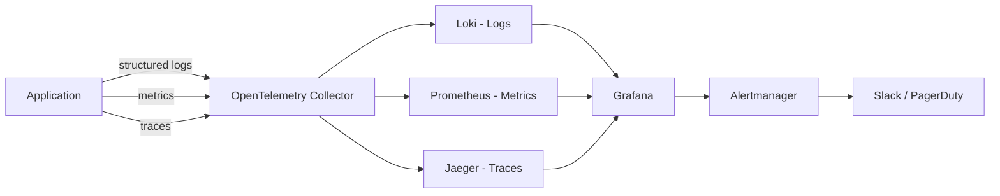
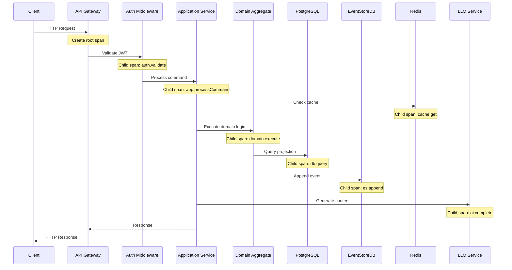

# 11 — Observability Engineering

**Version:** 1.0  
**Status:** Normative  
**Parent:** RIOS Master Architecture Blueprint (MAB)  
**Cross-References:** Volume VII (Engineering), Quality Attribute #8
(Operability), DMS

---

## 1. Purpose

This document defines the complete observability engineering standards for RIOS.
Observability is the ability to understand the internal state of a system from
its external outputs. RIOS implements the three pillars: logging, metrics, and
distributed tracing.

---

## 2. Observability Architecture

### 2.1 Three Pillars



### 2.2 Observability Stack

| Component  | Technology              | Purpose                        |
| ---------- | ----------------------- | ------------------------------ |
| Collector  | OpenTelemetry Collector | Unified telemetry collection   |
| Logs       | Grafana Loki            | Log aggregation and querying   |
| Metrics    | Prometheus              | Metrics collection and storage |
| Traces     | Jaeger                  | Distributed tracing            |
| Dashboards | Grafana                 | Visualization and alerting     |
| Alerting   | Alertmanager            | Alert routing and notification |

---

## 3. Structured Logging

### 3.1 Log Format

```typescript
// packages/infrastructure/src/logging/Logger.ts

interface LogEntry {
  level: 'debug' | 'info' | 'warn' | 'error' | 'fatal';
  message: string;
  timestamp: string; // ISO 8601
  service: string; // e.g., 'rios-api'
  version: string; // e.g., '1.0.0'
  traceId: string; // OpenTelemetry trace ID
  spanId: string; // OpenTelemetry span ID
  userId?: string; // Authenticated user
  domain?: string; // Domain context
  command?: string; // Command being processed
  requestId?: string; // HTTP request ID
  duration?: number; // Operation duration in ms
  error?: {
    name: string;
    message: string;
    stack?: string;
  };
  metadata?: Record<string, unknown>;
}
```

### 3.2 Log Levels

| Level   | When to Use                           | Example                                              |
| ------- | ------------------------------------- | ---------------------------------------------------- |
| `debug` | Development details, internal state   | Query parameters, cache hits                         |
| `info`  | Normal operations, significant events | User login, command processed, projection updated    |
| `warn`  | Unexpected but handled situations     | Rate limit approaching, fallback used, retry attempt |
| `error` | Failures requiring attention          | Database connection failed, external API error       |
| `fatal` | System cannot continue                | Database unreachable, configuration invalid          |

### 3.3 Logging Rules

| ID      | Rule                                                 |
| ------- | ---------------------------------------------------- |
| LOG-001 | All logs are structured JSON                         |
| LOG-002 | Logs include trace context (traceId, spanId)         |
| LOG-003 | Sensitive data NEVER logged (passwords, tokens, PII) |
| LOG-004 | Error logs include error object with stack trace     |
| LOG-005 | Request lifecycle logged (start, end, duration)      |
| LOG-006 | Domain events logged at INFO level                   |
| LOG-007 | Log levels configurable per environment              |
| LOG-008 | Production default: INFO level                       |

### 3.4 Log Examples

```json
{
  "level": "info",
  "message": "Command processed successfully",
  "timestamp": "2025-01-15T10:30:00.000Z",
  "service": "rios-api",
  "version": "1.0.0",
  "traceId": "abc123def456",
  "spanId": "span789",
  "userId": "researcher-uuid-123",
  "domain": "identity",
  "command": "SynthesizeIdentityCommand",
  "requestId": "req-uuid-456",
  "duration": 45,
  "metadata": {
    "aggregateId": "identity-uuid-789"
  }
}
```

---

## 4. Metrics

### 4.1 Metric Categories

| Category | Examples                             | Type               |
| -------- | ------------------------------------ | ------------------ |
| HTTP     | Request count, latency, status codes | Counter, Histogram |
| Domain   | Commands processed, events emitted   | Counter            |
| Database | Query duration, connection pool size | Histogram, Gauge   |
| Cache    | Hit rate, miss rate, eviction count  | Counter, Gauge     |
| AI       | Token usage, latency, cost           | Counter, Histogram |
| System   | CPU, memory, disk usage              | Gauge              |

### 4.2 Standard Metrics

```typescript
// Metrics exposed to Prometheus

// HTTP Metrics
http_requests_total{method, path, status}           // Counter
http_request_duration_seconds{method, path}          // Histogram

// Domain Metrics
domain_commands_total{domain, command, status}       // Counter
domain_events_total{domain, event}                   // Counter
domain_query_duration_seconds{domain, query}         // Histogram

// Database Metrics
db_query_duration_seconds{operation, table}          // Histogram
db_connection_pool_size{pool}                        // Gauge
db_connection_pool_active{pool}                      // Gauge

// Cache Metrics
cache_hits_total{cache}                              // Counter
cache_misses_total{cache}                            // Counter
cache_hit_ratio{cache}                               // Gauge

// AI Metrics
ai_requests_total{model, type}                       // Counter
ai_tokens_total{model, type}                         // Counter
ai_request_duration_seconds{model}                   // Histogram
ai_cost_usd{model}                                   // Counter

// Event Store Metrics
es_events_appended_total{stream}                     // Counter
es_events_read_total{stream}                         // Counter
es_projection_lag_seconds{projection}                // Gauge
```

### 4.3 Metrics Rules

| ID      | Rule                                                   |
| ------- | ------------------------------------------------------ |
| MET-001 | All services expose `/metrics` endpoint for Prometheus |
| MET-002 | Metrics use standard naming convention                 |
| MET-003 | Cardinality kept manageable (no user IDs as labels)    |
| MET-004 | Histogram buckets configured for latency distributions |
| MET-005 | Business metrics tracked alongside technical metrics   |

---

## 5. Distributed Tracing

### 5.1 Trace Architecture



### 5.2 Tracing Rules

| ID      | Rule                                                              |
| ------- | ----------------------------------------------------------------- |
| TRC-001 | OpenTelemetry SDK used for all instrumentation                    |
| TRC-002 | Trace context propagated across service boundaries                |
| TRC-003 | Every HTTP request creates a root span                            |
| TRC-004 | Database queries include span with query metadata                 |
| TRC-005 | External API calls create child spans                             |
| TRC-006 | Span attributes include domain context (command, aggregateId)     |
| TRC-007 | Sampling strategy: 100% in dev, 10% in production (errors always) |
| TRC-008 | Sensitive data excluded from span attributes                      |

---

## 6. Health Checks

### 6.1 Health Endpoints

| Endpoint              | Purpose   | Checks                     |
| --------------------- | --------- | -------------------------- |
| `GET /health`         | Liveness  | Application running        |
| `GET /health/ready`   | Readiness | All dependencies available |
| `GET /health/startup` | Startup   | Initialization complete    |

### 6.2 Health Check Response

```json
{
  "status": "healthy",
  "version": "1.0.0",
  "uptime": 3600,
  "checks": {
    "database": "healthy",
    "eventStore": "healthy",
    "redis": "healthy",
    "qdrant": "healthy"
  }
}
```

### 6.3 Health Check Rules

| ID     | Rule                                         |
| ------ | -------------------------------------------- |
| HC-001 | Liveness check does NOT query databases      |
| HC-002 | Readiness check verifies all dependencies    |
| HC-003 | Health checks return within 5 seconds        |
| HC-004 | Unhealthy service removed from load balancer |
| HC-005 | Health check failures trigger alerts         |

---

## 7. Alerting

### 7.1 Alert Rules

| Alert              | Condition               | Severity | Action             |
| ------------------ | ----------------------- | -------- | ------------------ |
| High error rate    | > 5% 5xx errors / 5 min | Critical | Page on-call       |
| High latency       | P95 > 3s / 5 min        | Warning  | Slack notification |
| Database down      | Connection failures     | Critical | Page on-call       |
| Event store lag    | Projection lag > 30s    | Warning  | Slack notification |
| Disk usage         | > 80%                   | Warning  | Slack notification |
| Memory usage       | > 85%                   | Warning  | Slack notification |
| AI cost spike      | > $50/hour              | Warning  | Slack notification |
| Certificate expiry | < 30 days               | Warning  | Slack notification |

### 7.2 Alerting Rules

| ID        | Rule                                                   |
| --------- | ------------------------------------------------------ |
| ALERT-001 | All critical alerts have runbooks                      |
| ALERT-002 | Alert fatigue avoided (proper thresholds)              |
| ALERT-003 | Alerts include context (dashboard link, runbook link)  |
| ALERT-004 | On-call rotation documented                            |
| ALERT-005 | Post-incident review for all critical alerts triggered |

---

## 8. Dashboards

### 8.1 Standard Dashboards

| Dashboard       | Audience      | Content                                           |
| --------------- | ------------- | ------------------------------------------------- |
| System Overview | Platform team | CPU, memory, disk, network for all services       |
| API Performance | Backend team  | Request rate, latency, error rate, saturation     |
| Domain Metrics  | Product team  | Commands processed, events emitted, user activity |
| AI Metrics      | AI team       | Token usage, latency, cost, model performance     |
| Database        | DBA           | Query performance, connections, replication lag   |
| Event Store     | Platform team | Event throughput, projection lag, stream health   |

### 8.2 Dashboard Rules

| ID       | Rule                                   |
| -------- | -------------------------------------- |
| DASH-001 | Dashboards version-controlled as JSON  |
| DASH-002 | Dashboards include SLO indicators      |
| DASH-003 | Dashboard panels have descriptions     |
| DASH-004 | Time range selectors on all dashboards |

---

## 9. Service Level Objectives (SLOs)

| SLO                    | Target  | Measurement                                   |
| ---------------------- | ------- | --------------------------------------------- |
| API availability       | 99.9%   | Successful requests / total requests          |
| API latency (P95)      | < 500ms | 95th percentile response time                 |
| API latency (P99)      | < 1s    | 99th percentile response time                 |
| Error rate             | < 0.1%  | 5xx responses / total responses               |
| Event processing lag   | < 5s    | Time from event emission to projection update |
| AI response time (P95) | < 3s    | 95th percentile AI completion time            |

---

_This document is part of the RIOS Engineering Blueprint. It is subordinate to
the Master Architecture Blueprint, Architecture Governance Standard, and all
normative architecture documents._
