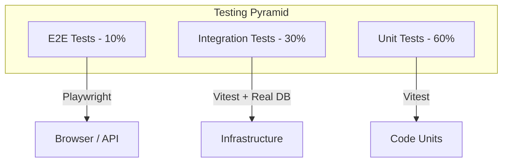

# 12 — Testing Strategy

**Version:** 1.0  
**Status:** Normative  
**Parent:** RIOS Master Architecture Blueprint (MAB)  
**Cross-References:** Volume VII (Engineering), DMS, Constitution §4

---

## 1. Purpose

This document defines the complete testing strategy for RIOS. Testing validates
that engineering correctly realizes architecture. Every test type serves a
specific purpose in the quality assurance pipeline.

---

## 2. Testing Pyramid

### 2.1 Test Distribution



### 2.2 Test Types

| Type          | Scope                      | Speed | Cost   | Coverage Target | Tool              |
| ------------- | -------------------------- | ----- | ------ | --------------- | ----------------- |
| Unit          | Single class/function      | < 1ms | Low    | 80% lines       | Vitest            |
| Integration   | Module + real dependencies | < 5s  | Medium | 70% paths       | Vitest + Docker   |
| E2E           | Full user journey          | < 30s | High   | Critical paths  | Playwright        |
| Architecture  | Dependency rules           | < 1s  | Low    | All boundaries  | Custom (ts-morph) |
| Contract      | API contracts              | < 2s  | Medium | All endpoints   | Zod schemas       |
| Performance   | Latency / throughput       | < 60s | High   | Critical paths  | k6 / Artillery    |
| Security      | Vulnerability scanning     | < 30s | Medium | OWASP Top 10    | OWASP ZAP         |
| Accessibility | WCAG compliance            | < 10s | Medium | All pages       | axe-core          |

---

## 3. Unit Tests

### 3.1 Unit Test Structure

```typescript
// packages/domains/identity/src/domain/__tests__/Researcher.test.ts

import { describe, it, expect } from 'vitest';
import { Researcher } from '../Researcher';
import { ResearcherName } from '../value-objects/ResearcherName';
import { Email } from '../value-objects/Email';

describe('Researcher Aggregate', () => {
  describe('creation', () => {
    it('should create researcher with valid name and email', () => {
      // Arrange
      const name = new ResearcherName('Dr. Jane Smith');
      const email = new Email('jane@university.edu');

      // Act
      const researcher = Researcher.create({
        name,
        email,
        orcid: '0000-0000-0000-0001',
      });

      // Assert
      expect(researcher).toBeDefined();
      expect(researcher.name.value).toBe('Dr. Jane Smith');
      expect(researcher.email.value).toBe('jane@university.edu');
      expect(researcher.orcid).toBe('0000-0000-0000-0001');
    });

    it('should emit ResearcherCreated event on creation', () => {
      const researcher = Researcher.create({
        name: new ResearcherName('Dr. Jane Smith'),
        email: new Email('jane@university.edu'),
        orcid: '0000-0000-0000-0001',
      });

      const events = researcher.getUncommittedEvents();

      expect(events).toHaveLength(1);
      expect(events[0].eventType).toBe('ResearcherCreated');
    });

    it('should reject empty researcher name', () => {
      expect(() => new ResearcherName('')).toThrow(
        'ResearcherName cannot be empty',
      );
    });

    it('should reject invalid email format', () => {
      expect(() => new Email('invalid-email')).toThrow('Invalid email format');
    });
  });

  describe('intellectual direction', () => {
    it('should add intellectual direction to researcher', () => {
      const researcher = createTestResearcher();

      researcher.addIntellectualDirection({
        name: 'Machine Learning',
        description: 'Deep learning research',
        category: 'COMPUTER_SCIENCE',
      });

      expect(researcher.intellectualDirections).toHaveLength(1);
      expect(researcher.intellectualDirections[0].name.value).toBe(
        'Machine Learning',
      );
    });

    it('should emit IntellectualDirectionAdded event', () => {
      const researcher = createTestResearcher();

      researcher.addIntellectualDirection({
        name: 'Machine Learning',
        description: 'Deep learning research',
        category: 'COMPUTER_SCIENCE',
      });

      const events = researcher.getUncommittedEvents();
      const directionEvent = events.find(
        (e) => e.eventType === 'IntellectualDirectionAdded',
      );

      expect(directionEvent).toBeDefined();
    });
  });
});

// Helper
function createTestResearcher(): Researcher {
  return Researcher.create({
    name: new ResearcherName('Dr. Jane Smith'),
    email: new Email('jane@university.edu'),
    orcid: '0000-0000-0000-0001',
  });
}
```

### 3.2 Unit Test Rules

| ID     | Rule                                        |
| ------ | ------------------------------------------- |
| UT-001 | Every aggregate has a test file             |
| UT-002 | Every value object has a test file          |
| UT-003 | Tests follow Arrange-Act-Assert pattern     |
| UT-004 | Tests are isolated (no shared state)        |
| UT-005 | Tests use descriptive names (what, not how) |
| UT-006 | Domain events verified in tests             |
| UT-007 | Invariant violations tested explicitly      |
| UT-008 | Helper functions for creating test fixtures |

---

## 4. Integration Tests

### 4.1 Integration Test Structure

```typescript
// packages/infrastructure/src/repositories/__tests__/ResearcherRepository.integration.test.ts

import { describe, it, expect, beforeAll, afterAll } from 'vitest';
import { PostgreSqlContainer } from '@testcontainers/postgresql';
import { ResearcherRepository } from '../ResearcherRepository';
import { Researcher } from '@rios/domains/identity';

describe('ResearcherRepository Integration', () => {
  let container: StartedPostgreSqlContainer;
  let repository: ResearcherRepository;

  beforeAll(async () => {
    container = await new PostgreSqlContainer().start();
    repository = new ResearcherRepository(container.getConnectionUri());
    await repository.migrate();
  });

  afterAll(async () => {
    await container.stop();
  });

  it('should persist and retrieve researcher', async () => {
    // Arrange
    const researcher = createTestResearcher();

    // Act
    await repository.save(researcher);
    const retrieved = await repository.findById(researcher.id);

    // Assert
    expect(retrieved).toBeDefined();
    expect(retrieved!.name.value).toBe('Dr. Jane Smith');
    expect(retrieved!.email.value).toBe('jane@university.edu');
  });

  it('should return null for non-existent researcher', async () => {
    const result = await repository.findById('non-existent-id');
    expect(result).toBeNull();
  });

  it('should handle concurrent updates with optimistic locking', async () => {
    const researcher = createTestResearcher();
    await repository.save(researcher);

    // Simulate concurrent updates
    const copy1 = await repository.findById(researcher.id);
    const copy2 = await repository.findById(researcher.id);

    copy1!.updateName(new ResearcherName('Updated Name 1'));
    copy2!.updateName(new ResearcherName('Updated Name 2'));

    await repository.save(copy1!);

    await expect(repository.save(copy2!)).rejects.toThrow(
      'Concurrent modification',
    );
  });
});
```

### 4.2 Integration Test Rules

| ID     | Rule                                                  |
| ------ | ----------------------------------------------------- |
| IT-001 | Integration tests use real databases (Testcontainers) |
| IT-002 | Each test suite gets its own database                 |
| IT-003 | Tests are independent (no ordering dependencies)      |
| IT-004 | Database state reset between tests                    |
| IT-005 | External services mocked at integration level         |

---

## 5. E2E Tests

### 5.1 E2E Test Structure

```typescript
// apps/web/e2e/identity.spec.ts

import { test, expect } from '@playwright/test';

test.describe('Identity Management', () => {
  test.beforeEach(async ({ page }) => {
    await page.goto('/dashboard');
    await page.waitForSelector('[data-testid="dashboard"]');
  });

  test('should create intellectual direction', async ({ page }) => {
    // Navigate to identity page
    await page.click('[data-testid="nav-identity"]');

    // Add intellectual direction
    await page.click('[data-testid="add-direction-btn"]');
    await page.fill('[data-testid="direction-name"]', 'Machine Learning');
    await page.fill(
      '[data-testid="direction-description"]',
      'Deep learning research',
    );
    await page.selectOption(
      '[data-testid="direction-category"]',
      'COMPUTER_SCIENCE',
    );
    await page.click('[data-testid="save-direction-btn"]');

    // Verify
    await expect(page.locator('[data-testid="direction-item"]')).toContainText(
      'Machine Learning',
    );
  });

  test('should display identity overview', async ({ page }) => {
    await page.click('[data-testid="nav-identity"]');

    await expect(page.locator('[data-testid="researcher-name"]')).toBeVisible();
    await expect(
      page.locator('[data-testid="intellectual-directions"]'),
    ).toBeVisible();
  });
});
```

### 5.2 E2E Test Rules

| ID      | Rule                                                 |
| ------- | ---------------------------------------------------- |
| E2E-001 | E2E tests cover critical user journeys only          |
| E2E-002 | Tests use data-testid attributes (not CSS selectors) |
| E2E-003 | Tests are independent and can run in parallel        |
| E2E-004 | Test data seeded before E2E suite runs               |
| E2E-005 | Screenshots captured on failure                      |
| E2E-006 | E2E tests run against staging environment in CI      |

---

## 6. Architecture Tests

### 6.1 Architecture Test Structure

```typescript
// packages/infrastructure/src/__tests__/architecture.test.ts

import { describe, it, expect } from 'vitest';
import { Project } from 'ts-morph';
import path from 'path';

describe('Architecture Rules', () => {
  const project = new Project({
    tsConfigFilePath: path.resolve(__dirname, '../../../../tsconfig.json'),
  });

  describe('Domain Layer', () => {
    it('domain entities should not import from infrastructure', () => {
      const domainFiles = project.getSourceFiles(
        'packages/domains/**/domain/**/*.ts',
      );

      for (const file of domainFiles) {
        const imports = file.getImportDeclarations();
        for (const imp of imports) {
          const moduleSpecifier = imp.getModuleSpecifierValue();
          expect(
            moduleSpecifier.startsWith('@rios/infrastructure'),
            `${file.getFilePath()} imports infrastructure: ${moduleSpecifier}`,
          ).toBe(false);
        }
      }
    });

    it('domain entities should not import from application layer', () => {
      const domainFiles = project.getSourceFiles(
        'packages/domains/**/domain/**/*.ts',
      );

      for (const file of domainFiles) {
        const imports = file.getImportDeclarations();
        for (const imp of imports) {
          const moduleSpecifier = imp.getModuleSpecifierValue();
          expect(
            moduleSpecifier.startsWith('@rios/infrastructure'),
            `${file.getFilePath()} imports application: ${moduleSpecifier}`,
          ).toBe(false);
        }
      }
    });
  });

  describe('Cross-Domain Dependencies', () => {
    it('identity domain should not import from knowledge domain', () => {
      const identityFiles = project.getSourceFiles(
        'packages/domains/identity/**/*.ts',
      );

      for (const file of identityFiles) {
        const imports = file.getImportDeclarations();
        for (const imp of imports) {
          const moduleSpecifier = imp.getModuleSpecifierValue();
          expect(
            !moduleSpecifier.includes('knowledge'),
            `${file.getFilePath()} cross-domain import: ${moduleSpecifier}`,
          ).toBe(true);
        }
      }
    });
  });

  describe('Shared Packages', () => {
    it('shared packages should not import from domain packages', () => {
      const sharedFiles = project.getSourceFiles('packages/shared/**/*.ts');

      for (const file of sharedFiles) {
        const imports = file.getImportDeclarations();
        for (const imp of imports) {
          const moduleSpecifier = imp.getModuleSpecifierValue();
          expect(
            !moduleSpecifier.startsWith('@rios/domains/'),
            `${file.getFilePath()} shared imports domain: ${moduleSpecifier}`,
          ).toBe(true);
        }
      }
    });
  });
});
```

### 6.2 Architecture Test Rules

| ID       | Rule                                                      |
| -------- | --------------------------------------------------------- |
| ARCH-001 | Architecture tests run in every CI pipeline               |
| ARCH-002 | Tests validate DDD layer boundaries                       |
| ARCH-003 | Tests validate domain isolation (no cross-domain imports) |
| ARCH-004 | Tests validate shared packages are dependency-free        |
| ARCH-005 | Tests validate infrastructure does not leak into domain   |

---

## 7. Contract Tests

### 7.1 API Contract Validation

```typescript
// packages/api/src/__tests__/contracts/identity.contract.test.ts

import { describe, it, expect } from 'vitest';
import { z } from 'zod';
import { SynthesizeIdentityResponseSchema } from '@rios/shared';

describe('Identity API Contracts', () => {
  it('SynthesizeIdentity response matches schema', async () => {
    const response = await api.post('/identity/synthesize', {
      researcherId: 'test-id',
    });

    const parsed = SynthesizeIdentityResponseSchema.safeParse(response.data);
    expect(parsed.success).toBe(true);
  });
});
```

### 7.2 Contract Test Rules

| ID     | Rule                                               |
| ------ | -------------------------------------------------- |
| CT-001 | All API responses validated against Zod schemas    |
| CT-002 | Schemas shared between frontend and backend        |
| CT-003 | Contract tests run in both frontend and backend CI |
| CT-004 | Schema changes require contract test updates       |

---

## 8. Performance Tests

### 8.1 Performance Test Scenarios

| Scenario            | Target        | Tool   |
| ------------------- | ------------- | ------ |
| API throughput      | > 1000 req/s  | k6     |
| API latency (P95)   | < 500ms       | k6     |
| Concurrent users    | 500           | k6     |
| Database query time | < 100ms (P95) | Custom |
| Event store append  | < 50ms        | Custom |
| Vector search       | < 200ms (P95) | Custom |

### 8.2 Performance Test Rules

| ID       | Rule                                            |
| -------- | ----------------------------------------------- |
| PERF-001 | Performance tests run weekly in CI              |
| PERF-002 | Performance regressions block release           |
| PERF-003 | Baseline performance metrics version-controlled |
| PERF-004 | Performance test environment mirrors production |

---

## 9. Coverage Strategy

### 9.1 Coverage Targets

| Package Type          | Line Coverage | Branch Coverage | Function Coverage |
| --------------------- | ------------- | --------------- | ----------------- |
| Domain                | 90%           | 85%             | 95%               |
| Application           | 80%           | 75%             | 85%               |
| Infrastructure        | 70%           | 65%             | 75%               |
| API                   | 70%           | 60%             | 75%               |
| Frontend (components) | 70%           | 60%             | 70%               |
| Shared                | 85%           | 80%             | 90%               |

### 9.2 Coverage Rules

| ID      | Rule                                       |
| ------- | ------------------------------------------ |
| COV-001 | Coverage thresholds enforced in CI         |
| COV-002 | Coverage reports uploaded as CI artifacts  |
| COV-003 | Coverage decreases block PR merge          |
| COV-004 | Coverage exclusions documented with reason |

---

## 10. Test Configuration

### 10.1 Vitest Configuration

```typescript
// vitest.config.ts

import { defineConfig } from 'vitest/config';

export default defineConfig({
  test: {
    globals: true,
    environment: 'node',
    include: ['**/*.test.ts'],
    exclude: ['**/*.integration.test.ts', '**/*.e2e.test.ts'],
    coverage: {
      provider: 'v8',
      reporter: ['text', 'lcov', 'html'],
      exclude: ['**/*.test.ts', '**/*.d.ts', '**/index.ts'],
    },
    setupFiles: ['./test/setup.ts'],
  },
});
```

### 10.2 Test Environment Variables

```bash
# .env.test
NODE_ENV=test
DB_HOST=localhost
DB_PORT=5432
DB_USERNAME=rios_test
DB_PASSWORD=rios_test
DB_NAME=rios_test
ES_HOST=localhost
REDIS_HOST=localhost
```

---

_This document is part of the RIOS Engineering Blueprint. It is subordinate to
the Master Architecture Blueprint, Architecture Governance Standard, and all
normative architecture documents._
