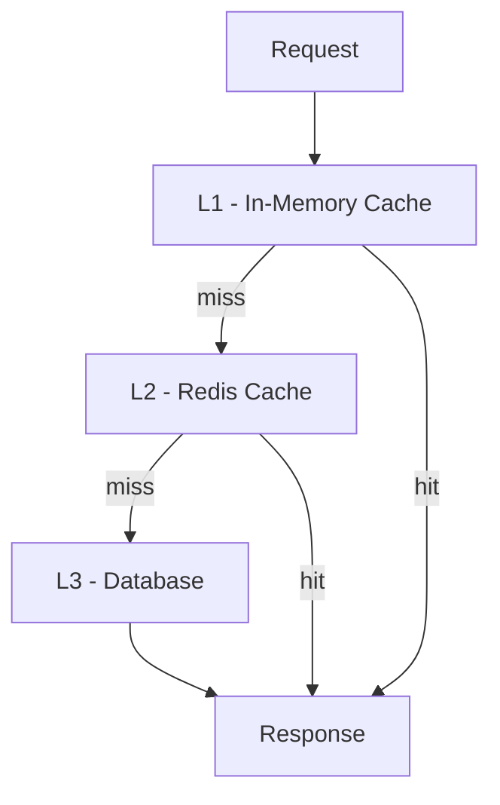
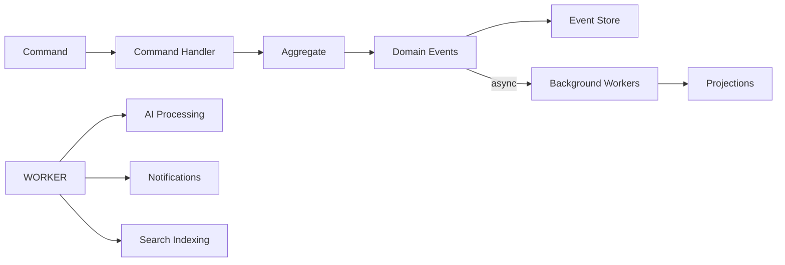

# 13 — Performance Engineering

**Version:** 1.0  
**Status:** Normative  
**Parent:** RIOS Master Architecture Blueprint (MAB)  
**Cross-References:** Volume VII (Engineering), Quality Attribute #6
(Performance), DMS

---

## 1. Purpose

This document defines the complete performance engineering standards for RIOS.
Performance is a quality attribute that must be designed in, not retrofitted.
Every engineering decision considers performance implications.

---

## 2. Performance Budgets

### 2.1 API Performance Budgets

| Metric                  | Target       | Measurement            |
| ----------------------- | ------------ | ---------------------- |
| API response time (P50) | < 100ms      | Prometheus histogram   |
| API response time (P95) | < 500ms      | Prometheus histogram   |
| API response time (P99) | < 1s         | Prometheus histogram   |
| API throughput          | > 1000 req/s | k6 load test           |
| Time to first byte      | < 100ms      | Load balancer metrics  |
| Error rate              | < 0.1%       | Status code monitoring |

### 2.2 Frontend Performance Budgets

| Metric                         | Target            | Tool             |
| ------------------------------ | ----------------- | ---------------- |
| Largest Contentful Paint (LCP) | < 2.5s            | Lighthouse       |
| First Input Delay (FID)        | < 100ms           | Web Vitals       |
| Cumulative Layout Shift (CLS)  | < 0.1             | Lighthouse       |
| First Contentful Paint (FCP)   | < 1.8s            | Lighthouse       |
| Time to Interactive (TTI)      | < 3.5s            | Lighthouse       |
| Total bundle size              | < 250KB (gzipped) | Webpack analyzer |
| Initial JS bundle              | < 100KB (gzipped) | Webpack analyzer |

### 2.3 Database Performance Budgets

| Metric                      | Target    | Measurement        |
| --------------------------- | --------- | ------------------ |
| Query execution (P95)       | < 100ms   | pg_stat_statements |
| Query execution (P99)       | < 500ms   | pg_stat_statements |
| Connection pool utilization | < 80%     | Pool metrics       |
| Slow query count            | < 10/hour | Query logging      |

### 2.4 AI Performance Budgets

| Metric                  | Target  | Measurement         |
| ----------------------- | ------- | ------------------- |
| AI response time (P95)  | < 3s    | Application metrics |
| AI response time (P99)  | < 5s    | Application metrics |
| Vector search (P95)     | < 200ms | Qdrant metrics      |
| Embedding generation    | < 500ms | Application metrics |
| RAG pipeline end-to-end | < 3s    | Application metrics |

---

## 3. Caching Strategy

### 3.1 Caching Layers



### 3.2 Cache Configuration

| Cache Layer    | Technology  | TTL               | Scope        | Use Case                   |
| -------------- | ----------- | ----------------- | ------------ | -------------------------- |
| L1 (In-memory) | Node.js Map | 30s               | Per-instance | Hot data, config           |
| L2 (Redis)     | Redis       | 5 min - 1 hour    | Shared       | Projections, sessions      |
| L3 (CDN)       | CloudFront  | 1 hour - 24 hours | Edge         | Static assets, public data |

### 3.3 Cache Policies

| Data Type          | Cache Layer | TTL              | Invalidation           |
| ------------------ | ----------- | ---------------- | ---------------------- |
| User session       | Redis       | 15 min (sliding) | Logout, timeout        |
| Researcher profile | Redis       | 15 min           | Profile update event   |
| Research agenda    | Redis       | 5 min            | Agenda update event    |
| Narrative drafts   | Redis       | 5 min            | Narrative update event |
| Static assets      | CDN         | 24 hours         | Versioned filename     |
| AI embeddings      | Redis       | 1 hour           | Knowledge update       |

### 3.4 Cache Rules

| ID        | Rule                                                          |
| --------- | ------------------------------------------------------------- |
| CACHE-001 | Cache is a performance optimization, NOT a source of truth    |
| CACHE-002 | Cache misses must not cause errors                            |
| CACHE-003 | Cache invalidation on domain events                           |
| CACHE-004 | Cache keys follow naming convention: `{domain}:{entity}:{id}` |
| CACHE-005 | Cache TTL is configurable per data type                       |
| CACHE-006 | Cache hit ratio monitored (target > 80%)                      |

---

## 4. Async Processing

### 4.1 Async Processing Architecture



### 4.2 Background Job Categories

| Category                | Priority | Queue             | Retry           |
| ----------------------- | -------- | ----------------- | --------------- |
| Projection updates      | High     | `projections`     | 3x, exponential |
| Search indexing         | Medium   | `search-indexing` | 3x, exponential |
| AI embedding generation | Medium   | `ai-embeddings`   | 2x, exponential |
| Email notifications     | Low      | `notifications`   | 5x, exponential |
| Analytics events        | Low      | `analytics`       | 1x              |
| Export generation       | Low      | `exports`         | 2x, linear      |

### 4.3 Async Processing Rules

| ID        | Rule                                               |
| --------- | -------------------------------------------------- |
| ASYNC-001 | Domain events are the trigger for async processing |
| ASYNC-002 | Background workers are idempotent                  |
| ASYNC-003 | Failed jobs are retried with exponential backoff   |
| ASYNC-004 | Dead letter queue for permanently failed jobs      |
| ASYNC-005 | Job processing time monitored and alerted          |

---

## 5. Query Optimization

### 5.1 Database Query Guidelines

| Guideline          | Implementation                               |
| ------------------ | -------------------------------------------- |
| Use indexes        | All WHERE, JOIN, ORDER BY columns indexed    |
| Avoid N+1          | Use DataLoader or eager loading              |
| Limit results      | Always use LIMIT/OFFSET or cursor pagination |
| Projection         | SELECT only needed columns                   |
| Connection pooling | PgBouncer or TypeORM pool                    |

### 5.2 Pagination Strategy

```typescript
// Cursor-based pagination (preferred)

interface PaginationCursor {
  id: string;
  createdAt: string; // ISO 8601
}

interface PaginatedResult<T> {
  items: T[];
  cursor: PaginationCursor | null;
  hasMore: boolean;
  total?: number; // Only when explicitly requested
}

// Implementation
async function findWithCursor(
  query: PaginationQuery,
): Promise<PaginatedResult<ResearcherDTO>> {
  const qb = this.repository.createQueryBuilder('r');

  if (query.cursor) {
    qb.where('(r.created_at, r.id) < (:createdAt, :id)', {
      createdAt: query.cursor.createdAt,
      id: query.cursor.id,
    });
  }

  qb.orderBy('r.created_at', 'DESC')
    .addOrderBy('r.id', 'DESC')
    .limit(query.limit + 1); // Fetch one extra to determine hasMore

  const results = await qb.getMany();
  const hasMore = results.length > query.limit;
  const items = hasMore ? results.slice(0, query.limit) : results;

  return {
    items: items.map(this.mapper.toDTO),
    cursor: hasMore
      ? {
          id: items[items.length - 1].id,
          createdAt: items[items.length - 1].createdAt,
        }
      : null,
    hasMore,
  };
}
```

### 5.3 Query Rules

| ID        | Rule                                           |
| --------- | ---------------------------------------------- |
| QUERY-001 | All list endpoints use cursor-based pagination |
| QUERY-002 | Default page size: 20, max: 100                |
| QUERY-003 | N+1 queries prevented (DataLoader pattern)     |
| QUERY-004 | Slow queries logged (> 100ms)                  |
| QUERY-005 | Query plans reviewed for critical paths        |

---

## 6. Memory Management

### 6.1 Memory Rules

| ID      | Rule                                                    |
| ------- | ------------------------------------------------------- |
| MEM-001 | No global mutable state in application code             |
| MEM-002 | Event listeners cleaned up on component unmount         |
| MEM-003 | Large datasets processed in streams (not all in memory) |
| MEM-004 | Memory usage monitored (heap size, GC frequency)        |
| MEM-005 | Memory leaks investigated immediately                   |

### 6.2 Node.js Memory Configuration

```json
{
  "scripts": {
    "start:api": "node --max-old-space-size=1024 --expose-gc dist/apps/api/main.js",
    "start:worker": "node --max-old-space-size=512 dist/apps/worker/main.js"
  }
}
```

---

## 7. Scalability

### 7.1 Horizontal Scaling Rules

| ID              | Rule                                               |
| --------------- | -------------------------------------------------- |
| SCALABILITY-001 | All services are stateless                         |
| SCALABILITY-002 | State stored in databases, not in-memory           |
| SCALABILITY-003 | Session state in Redis                             |
| SCALABILITY-004 | WebSocket connections tracked in Redis             |
| SCALABILITY-005 | File processing in object storage (not local disk) |

### 7.2 Load Testing

| Scenario       | Virtual Users | Duration | Target               |
| -------------- | ------------- | -------- | -------------------- |
| Normal load    | 100           | 10 min   | P95 < 500ms          |
| Peak load      | 500           | 5 min    | P95 < 1s             |
| Stress test    | 1000          | 5 min    | Graceful degradation |
| Endurance test | 200           | 60 min   | No memory leaks      |

---

## 8. Network Optimization

### 8.1 Optimization Strategies

| Strategy       | Implementation                      |
| -------------- | ----------------------------------- |
| Compression    | gzip/brotli for API responses       |
| HTTP/2         | Enabled on load balancer            |
| Keep-alive     | Connection reuse for database pools |
| Batch requests | DataLoader for GraphQL              |
| Response size  | Field selection, pagination         |

### 8.2 Network Rules

| ID      | Rule                             |
| ------- | -------------------------------- |
| NET-001 | API responses compressed (gzip)  |
| NET-002 | Static assets served from CDN    |
| NET-003 | HTTP/2 enabled for all services  |
| NET-004 | Connection keep-alive configured |

---

## 9. Performance Monitoring

### 9.1 Key Performance Indicators

| KPI                     | Alert Threshold | Dashboard       |
| ----------------------- | --------------- | --------------- |
| API P95 latency         | > 500ms         | API Performance |
| Error rate              | > 1%            | System Overview |
| Database P95 query time | > 100ms         | Database        |
| Cache hit ratio         | < 70%           | Cache Dashboard |
| AI P95 response time    | > 3s            | AI Metrics      |
| Memory usage            | > 85%           | System Overview |
| CPU usage               | > 70%           | System Overview |

### 9.2 Performance Review Process

| Step | Action                        | Frequency             |
| ---- | ----------------------------- | --------------------- |
| 1    | Review performance dashboards | Weekly                |
| 2    | Analyze slow query log        | Weekly                |
| 3    | Review bundle size changes    | Per PR                |
| 4    | Run load tests                | Before major releases |
| 5    | Review cache hit ratios       | Weekly                |
| 6    | Performance regression review | Per sprint            |

---

_This document is part of the RIOS Engineering Blueprint. It is subordinate to
the Master Architecture Blueprint, Architecture Governance Standard, and all
normative architecture documents._
