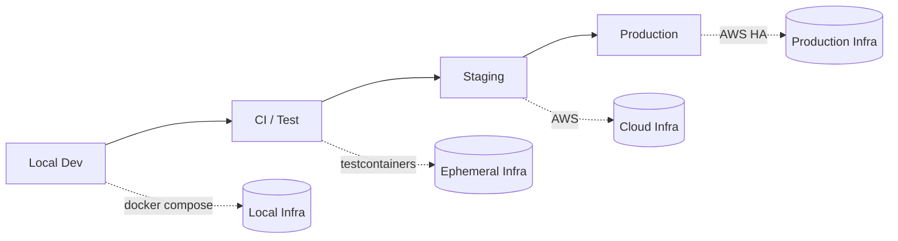
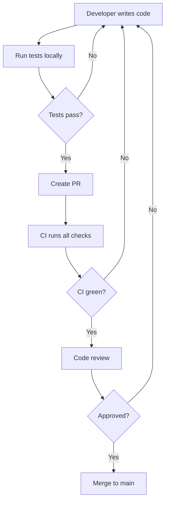
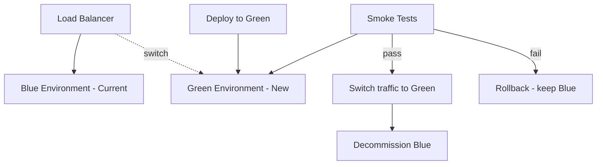
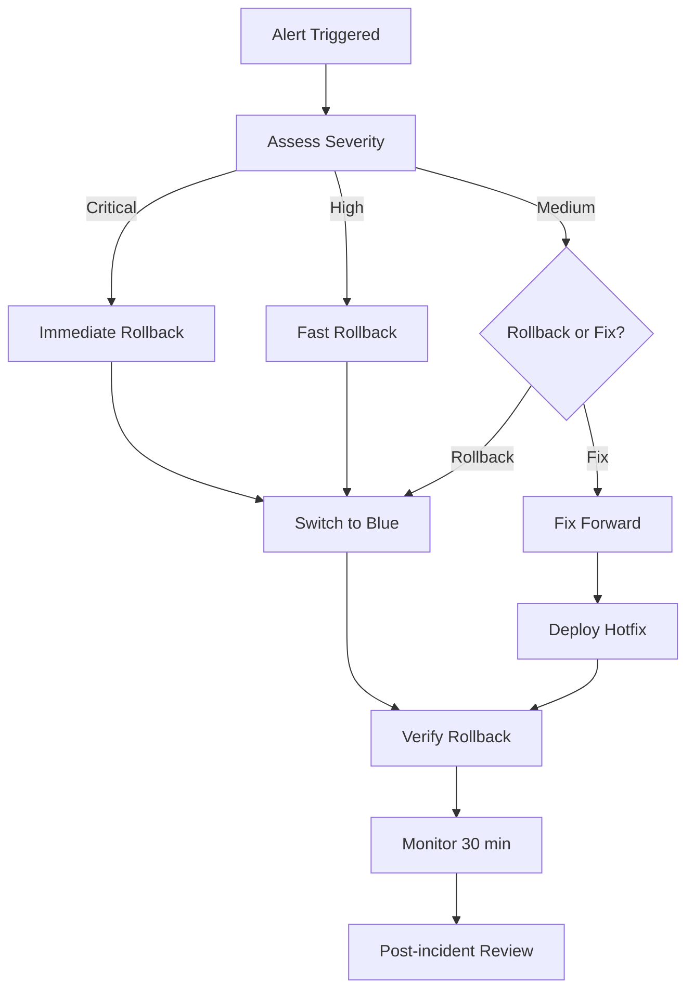

# 14 — Deployment Engineering

**Version:** 1.0  
**Status:** Normative  
**Parent:** RIOS Master Architecture Blueprint (MAB)  
**Cross-References:** Volume VII (Engineering), 09-Infrastructure.md,
10-CI-CD.md, DMS

---

## 1. Purpose

This document defines the complete deployment engineering standards for RIOS. It
covers all environments from local development through production, deployment
strategies, validation, and rollback procedures.

---

## 2. Environment Architecture

### 2.1 Environment Pipeline



### 2.2 Environment Specifications

| Environment | Infrastructure       | Data            | Access         | Uptime       |
| ----------- | -------------------- | --------------- | -------------- | ------------ |
| Local       | Docker Compose       | Seeded          | Developer only | On-demand    |
| CI/Test     | Ephemeral containers | Fixtures        | GitHub Actions | Per pipeline |
| Staging     | AWS (mirrors prod)   | Anonymized prod | Team + QA      | 24/7         |
| Production  | AWS (multi-AZ)       | Real            | Public         | 99.9% SLA    |

### 2.3 Environment Promotion Rules

| ID          | Rule                                                          |
| ----------- | ------------------------------------------------------------- |
| ENV-PRO-001 | Code promotes: local → CI → staging → production              |
| ENV-PRO-002 | No skipping environments (every change passes through all)    |
| ENV-PRO-003 | Staging must pass before production deployment                |
| ENV-PRO-004 | Production deployment requires successful staging smoke tests |
| ENV-PRO-005 | Hotfixes follow same pipeline (expedited)                     |

---

## 3. Development Environment

### 3.1 Local Development Workflow



### 3.2 Local Development Rules

| ID      | Rule                                               |
| ------- | -------------------------------------------------- |
| DEV-001 | `docker compose up -d` starts all infrastructure   |
| DEV-002 | `pnpm run dev` starts all application services     |
| DEV-003 | Hot reload enabled for development                 |
| DEV-004 | Seed data available via `pnpm run db:seed`         |
| DEV-005 | Environment variables documented in `.env.example` |

---

## 4. Staging Environment

### 4.1 Staging Configuration

| Aspect         | Configuration                     |
| -------------- | --------------------------------- |
| Infrastructure | AWS (mirrors production)          |
| Databases      | RDS PostgreSQL (smaller instance) |
| Event Store    | EventStoreDB (single node)        |
| Redis          | ElastiCache (smaller instance)    |
| Compute        | ECS Fargate (min 1, max 2)        |
| Domain         | staging.rios.dev                  |
| TLS            | Let's Encrypt                     |

### 4.2 Staging Data Strategy

| Data Type     | Strategy                   |
| ------------- | -------------------------- |
| User accounts | Anonymized production data |
| Research data | Synthetic test data        |
| Events        | Synthetic event streams    |
| AI models     | Same as production         |

### 4.3 Staging Rules

| ID      | Rule                                                   |
| ------- | ------------------------------------------------------ |
| STG-001 | Staging mirrors production architecture                |
| STG-002 | Staging data refreshed weekly                          |
| STG-003 | Staging smoke tests run automatically after deployment |
| STG-004 | Staging available 24/7 for QA                          |
| STG-005 | Staging deployment triggers Slack notification         |

---

## 5. Production Environment

### 5.1 Production Configuration

| Aspect         | Configuration                           |
| -------------- | --------------------------------------- |
| Infrastructure | AWS (multi-AZ)                          |
| Databases      | RDS PostgreSQL (Multi-AZ, read replica) |
| Event Store    | EventStoreDB (cluster)                  |
| Redis          | ElastiCache (cluster mode)              |
| Compute        | ECS Fargate (min 2, max 10)             |
| Domain         | rios.dev                                |
| TLS            | ACM (auto-renewed)                      |
| CDN            | CloudFront                              |
| DNS            | Route 53                                |

### 5.2 Production Rules

| ID       | Rule                                                 |
| -------- | ---------------------------------------------------- |
| PROD-001 | Production deployments during maintenance windows    |
| PROD-002 | Maintenance window: Tuesday/Thursday 10:00-12:00 UTC |
| PROD-003 | No deployments on Fridays (except critical hotfixes) |
| PROD-004 | Production access requires approval                  |
| PROD-005 | All production changes audited                       |

---

## 6. Blue/Green Deployment

### 6.1 Strategy



### 6.2 Blue/Green Process

| Step | Action                                  | Duration |
| ---- | --------------------------------------- | -------- |
| 1    | Deploy new version to Green environment | 5-10 min |
| 2    | Run smoke tests against Green           | 2-5 min  |
| 3    | Switch load balancer to Green           | < 1 min  |
| 4    | Monitor for issues                      | 15 min   |
| 5    | Decommission Blue                       | 5 min    |

### 6.3 Blue/Green Rules

| ID     | Rule                                              |
| ------ | ------------------------------------------------- |
| BG-001 | Database migrations are backward-compatible       |
| BG-002 | Both environments share the same database         |
| BG-003 | Rollback is switching back to Blue (< 1 min)      |
| BG-004 | Green environment validated before traffic switch |
| BG-005 | DNS TTL reduced before deployment (60s)           |

---

## 7. Release Validation

### 7.1 Pre-Deployment Checklist

- [ ] All CI checks passing
- [ ] Staging deployment successful
- [ ] Staging smoke tests passing
- [ ] Database migrations backward-compatible
- [ ] Performance tests show no regression
- [ ] Security scan clean
- [ ] Rollback plan documented
- [ ] On-call engineer identified
- [ ] Deployment announced in Slack

### 7.2 Post-Deployment Checklist

- [ ] Health checks passing
- [ ] Error rate within normal range
- [ ] Latency within normal range
- [ ] No increase in error logs
- [ ] Key user journeys verified
- [ ] Monitoring dashboards reviewed
- [ ] Deployment logged in release tracker

### 7.3 Smoke Test Suite

```typescript
// tests/smoke/production.smoke.test.ts

import { describe, it, expect } from 'vitest';

const BASE_URL = process.env.SMOKE_TEST_URL ?? 'https://api.rios.dev';

describe('Production Smoke Tests', () => {
  it('health endpoint returns healthy', async () => {
    const response = await fetch(`${BASE_URL}/health`);
    const data = await response.json();

    expect(response.status).toBe(200);
    expect(data.status).toBe('healthy');
  });

  it('health/ready endpoint returns all dependencies healthy', async () => {
    const response = await fetch(`${BASE_URL}/health/ready`);
    const data = await response.json();

    expect(response.status).toBe(200);
    expect(data.checks.database).toBe('healthy');
    expect(data.checks.eventStore).toBe('healthy');
    expect(data.checks.redis).toBe('healthy');
  });

  it('API returns proper error for unauthenticated request', async () => {
    const response = await fetch(`${BASE_URL}/api/v1/identity`);

    expect(response.status).toBe(401);
  });

  it('API version matches expected', async () => {
    const response = await fetch(`${BASE_URL}/health`);
    const data = await response.json();

    expect(data.version).toBe(process.env.EXPECTED_VERSION);
  });
});
```

---

## 8. Rollback Procedures

### 8.1 Rollback Decision Matrix

| Scenario                | Severity | Action                | Time         |
| ----------------------- | -------- | --------------------- | ------------ |
| Smoke tests fail        | Critical | Do not switch traffic | 0 min        |
| Error rate spike (>5%)  | Critical | Switch back to Blue   | < 1 min      |
| Latency spike (>2x)     | High     | Switch back to Blue   | < 1 min      |
| Partial feature failure | Medium   | Assess + decide       | 5-10 min     |
| Cosmetic issues         | Low      | Fix forward           | Next release |

### 8.2 Rollback Process



### 8.3 Rollback Rules

| ID       | Rule                                                          |
| -------- | ------------------------------------------------------------- |
| ROLL-001 | Rollback decision made within 5 minutes of incident detection |
| ROLL-002 | Rollback to Blue environment via load balancer switch         |
| ROLL-003 | Database rollbacks via backward-compatible migrations only    |
| ROLL-004 | Event store is NEVER rolled back (events are immutable)       |
| ROLL-005 | Post-incident review within 48 hours                          |

---

## 9. Database Migration Strategy for Deployments

### 9.1 Migration Compatibility

| Change Type           | Strategy           | Deployment                                            |
| --------------------- | ------------------ | ----------------------------------------------------- |
| Add column (nullable) | Forward-compatible | Deploy code → add column                              |
| Add column (required) | Two-phase          | Add nullable → deploy code → backfill → make required |
| Remove column         | Two-phase          | Stop using → deploy code → remove column              |
| Rename column         | Three-phase        | Add new → copy → remove old                           |
| Add index             | Non-blocking       | `CREATE INDEX CONCURRENTLY`                           |
| Add table             | Forward-compatible | Create table → deploy code                            |

### 9.2 Migration Rules

| ID      | Rule                                                      |
| ------- | --------------------------------------------------------- |
| MIG-001 | All migrations are backward-compatible                    |
| MIG-002 | Migrations run before application code deploys            |
| MIG-003 | Migrations tested in staging first                        |
| MIG-004 | Long-running migrations use `CONCURRENTLY`                |
| MIG-005 | Migrations are idempotent (can run multiple times safely) |

---

_This document is part of the RIOS Engineering Blueprint. It is subordinate to
the Master Architecture Blueprint, Architecture Governance Standard, and all
normative architecture documents._
