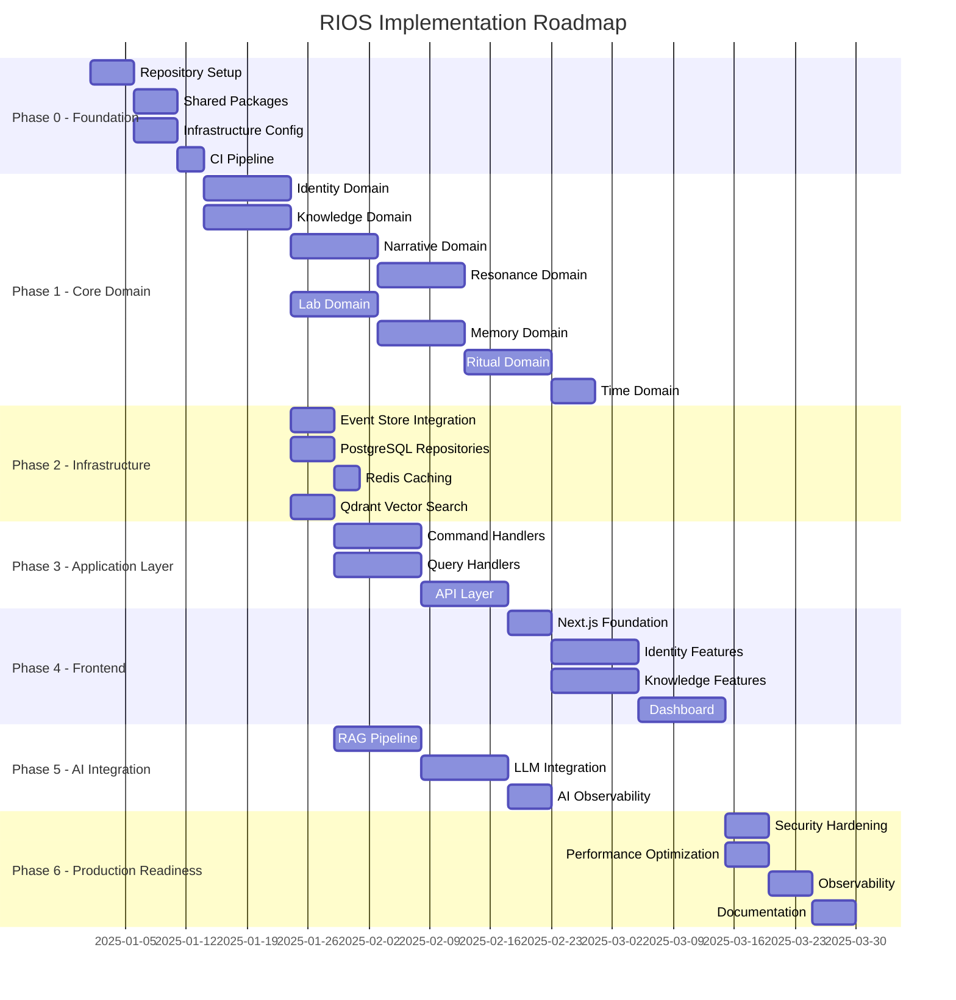

# 16 — Implementation Roadmap

**Version:** 1.0  
**Status:** Normative  
**Parent:** RIOS Master Architecture Blueprint (MAB)  
**Cross-References:** All Volumes, All ADRs, ATM, Constitution

---

## 1. Purpose

This document translates the RIOS architecture into an executable engineering
roadmap. It defines milestones, phases, dependency order, critical path, and
parallel work opportunities for deterministic implementation.

---

## 2. Roadmap Overview

---

## 3. Phase 0 — Foundation (Weeks 1-2)

### 3.1 Objectives

- Establish monorepo with all tooling
- Create shared packages
- Configure CI/CD pipeline
- Set up local development environment

### 3.2 Tasks

| Task                                      | Owner   | Duration | Dependencies |
| ----------------------------------------- | ------- | -------- | ------------ |
| Initialize Turborepo monorepo             | Backend | 1 day    | None         |
| Configure TypeScript, ESLint, Prettier    | Backend | 1 day    | Monorepo     |
| Create `@rios/shared` package             | Backend | 2 days   | Monorepo     |
| Create `@rios/domains/*` package stubs    | Backend | 1 day    | Monorepo     |
| Create `@rios/infrastructure` package     | Backend | 1 day    | Monorepo     |
| Docker Compose for local infra            | DevOps  | 1 day    | None         |
| GitHub Actions CI pipeline                | DevOps  | 2 days   | Monorepo     |
| Database migration setup (Drizzle)        | Backend | 1 day    | Docker       |
| Seed data scripts                         | Backend | 1 day    | Docker       |
| Developer documentation (CONTRIBUTING.md) | All     | 1 day    | None         |

### 3.3 Deliverables

- [ ] Working monorepo with all packages
- [ ] `pnpm run dev` starts full local environment
- [ ] `pnpm run test` runs all tests
- [ ] `pnpm run lint` passes with zero errors
- [ ] CI pipeline green on main branch

---

## 4. Phase 1 — Core Domain (Weeks 3-8)

### 4.1 Objectives

- Implement all eight domain packages
- Domain events, aggregates, value objects
- Domain services and factories
- Unit tests for all domain logic

### 4.2 Implementation Order

| Order | Domain    | Rationale                                | Duration |
| ----- | --------- | ---------------------------------------- | -------- |
| 1     | Identity  | Foundation domain, no dependencies       | 10 days  |
| 2     | Knowledge | Depends on Identity (researcher context) | 10 days  |
| 3     | Narrative | Depends on Identity + Knowledge          | 10 days  |
| 4     | Resonance | Depends on Identity + Knowledge          | 10 days  |
| 5     | Lab       | Depends on Knowledge                     | 10 days  |
| 6     | Memory    | Depends on Knowledge                     | 10 days  |
| 7     | Ritual    | Depends on Identity + Lab                | 10 days  |
| 8     | Time      | Depends on all (temporal orchestration)  | 5 days   |

### 4.3 Per-Domain Deliverables

- [ ] Aggregate(s) with domain events
- [ ] Value objects with validation
- [ ] Domain services
- [ ] Factory classes
- [ ] Domain error classes
- [ ] Unit tests (90%+ coverage)
- [ ] Package README

---

## 5. Phase 2 — Infrastructure (Weeks 6-10)

### 5.1 Objectives

- Implement repository layer
- Event store integration
- Caching layer
- Vector search integration

### 5.2 Tasks

| Task                                 | Dependencies        | Duration |
| ------------------------------------ | ------------------- | -------- |
| EventStoreDB client integration      | Phase 0             | 5 days   |
| PostgreSQL repositories (per domain) | Phase 1 domains     | 10 days  |
| Redis caching layer                  | Phase 0             | 3 days   |
| Qdrant vector search integration     | Phase 1 (Knowledge) | 5 days   |
| Integration tests (all repositories) | Repositories        | 5 days   |

---

## 6. Phase 3 — Application Layer (Weeks 8-12)

### 6.1 Objectives

- Command handlers for all domains
- Query handlers for all domains
- REST API endpoints
- API validation and error handling

### 6.2 Tasks

| Task                          | Dependencies           | Duration |
| ----------------------------- | ---------------------- | -------- |
| NestJS application setup      | Phase 0                | 2 days   |
| Command handlers (per domain) | Phase 1 + 2            | 10 days  |
| Query handlers (per domain)   | Phase 1 + 2            | 10 days  |
| API controllers (per domain)  | Command/Query handlers | 10 days  |
| Zod validation middleware     | API setup              | 2 days   |
| API documentation (OpenAPI)   | API controllers        | 3 days   |
| API integration tests         | API controllers        | 5 days   |

---

## 7. Phase 4 — Frontend (Weeks 10-16)

### 7.1 Objectives

- Next.js application with App Router
- All feature modules
- Design system integration
- Accessibility compliance

### 7.2 Tasks

| Task                                   | Dependencies    | Duration |
| -------------------------------------- | --------------- | -------- |
| Next.js App Router setup               | Phase 0         | 2 days   |
| Design system (shadcn/ui + RIOS theme) | Next.js setup   | 3 days   |
| Authentication flow (Clerk)            | Next.js setup   | 3 days   |
| Identity feature module                | API (Identity)  | 10 days  |
| Knowledge feature module               | API (Knowledge) | 10 days  |
| Narrative feature module               | API (Narrative) | 10 days  |
| Dashboard                              | All features    | 5 days   |
| E2E tests (Playwright)                 | All features    | 5 days   |
| Accessibility audit                    | All features    | 3 days   |

---

## 8. Phase 5 — AI Integration (Weeks 12-16)

### 8.1 Objectives

- RAG pipeline implementation
- LLM integration
- Embedding lifecycle
- AI observability

### 8.2 Tasks

| Task                        | Dependencies           | Duration |
| --------------------------- | ---------------------- | -------- |
| Embedding service           | Qdrant setup           | 5 days   |
| RAG pipeline                | Embeddings + Knowledge | 10 days  |
| LLM integration (Anthropic) | Phase 0                | 5 days   |
| Prompt template system      | LLM integration        | 5 days   |
| AI evaluation framework     | RAG pipeline           | 5 days   |
| Token management            | LLM integration        | 3 days   |
| AI observability            | All AI components      | 5 days   |

---

## 9. Phase 6 — Production Readiness (Weeks 16-20)

### 9.1 Objectives

- Security hardening
- Performance optimization
- Full observability
- Documentation

### 9.2 Tasks

| Task                                | Dependencies   | Duration |
| ----------------------------------- | -------------- | -------- |
| Security audit                      | All features   | 5 days   |
| Performance testing + optimization  | All features   | 5 days   |
| Observability setup (OpenTelemetry) | All services   | 5 days   |
| Alerting configuration              | Observability  | 2 days   |
| Runbook documentation               | All services   | 3 days   |
| User documentation                  | All features   | 5 days   |
| Staging environment setup           | Infrastructure | 3 days   |
| Production deployment rehearsal     | Staging        | 2 days   |

---

## 10. Critical Path

The critical path runs through the Identity domain, as it is the foundation for
all other domains.

---

## 11. Parallel Work Opportunities

| Workstream A              | Workstream B               | Workstream C   |
| ------------------------- | -------------------------- | -------------- |
| Identity domain (backend) | Knowledge domain (backend) | CI/CD pipeline |
| Narrative domain          | Resonance domain           | Docker setup   |
| API controllers           | Frontend foundation        | AI pipeline    |
| Domain tests              | Infrastructure tests       | E2E tests      |
| Security hardening        | Performance testing        | Documentation  |

---

## 12. Risk Mitigation

| Risk                             | Impact | Mitigation                                           |
| -------------------------------- | ------ | ---------------------------------------------------- |
| Domain complexity underestimated | High   | Start with Identity (simplest), learn patterns       |
| EventStoreDB learning curve      | Medium | Spike in Phase 0, document patterns early            |
| AI integration complexity        | High   | Prototype RAG pipeline in Phase 0                    |
| Cross-domain dependency issues   | Medium | Architecture tests enforce boundaries from day 1     |
| Performance issues at scale      | Medium | Load testing in Phase 6, design for scale from start |
| Team knowledge gaps              | Medium | Pair programming, architecture walkthroughs          |

---

_This document is part of the RIOS Engineering Blueprint. It is subordinate to
the Master Architecture Blueprint, Architecture Governance Standard, and all
normative architecture documents._
