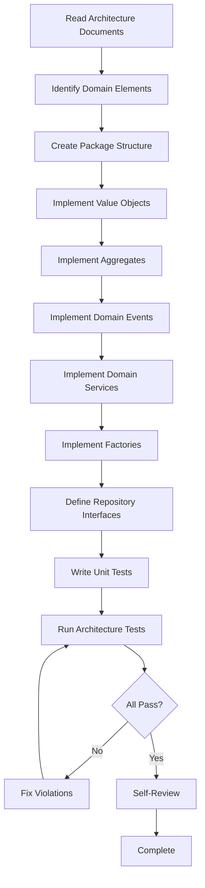

# 17 — AI Engineering Playbook

**Version:** 1.0  
**Status:** Normative  
**Parent:** RIOS Master Architecture Blueprint (MAB)  
**Cross-References:** Constitution, All ADRs, ATM, All Volumes

---

## 1. Purpose

This playbook teaches AI coding agents (Claude Code, Codex, Cursor, Gemini CLI,
GitHub Copex) exactly how to implement RIOS. It provides deterministic
workflows, validation steps, and escalation procedures.

---

## 2. AI Agent Operating Principles

### 2.1 Core Rules for AI Agents

| ID        | Rule                                                          |
| --------- | ------------------------------------------------------------- |
| AI-OP-001 | Architecture is frozen — never redesign                       |
| AI-OP-002 | Architecture ALWAYS wins over engineering preferences         |
| AI-OP-003 | Read architecture documents BEFORE implementing               |
| AI-OP-004 | Consult ADRs before making technology decisions               |
| AI-OP-005 | Verify Traceability Matrix entries before coding              |
| AI-OP-006 | Follow Constitution rules without exception                   |
| AI-OP-007 | When uncertain, escalate — never guess                        |
| AI-OP-008 | Validate implementation against architecture after completion |
| AI-OP-009 | Maintain DDD layer boundaries at all times                    |
| AI-OP-010 | Generate code that is explicit, maintainable, and testable    |

---

## 3. Implementation Workflow — Domain Package

### 3.1 Preparation Checklist

```
Before implementing any domain package:

□ Read the relevant Volume (e.g., Volume I for Identity)
□ Read the relevant ADR(s)
□ Read ATM entries for the domain
□ Read Constitution §2 (Domain-Driven Design)
□ Read Constitution §3 (Event Sourcing)
□ Read Engineering/03-Backend-Engineering.md
□ Read Engineering/15-Engineering-Standards.md
□ Identify aggregates, value objects, domain events
□ Identify domain services and factories
□ Identify repository interfaces
```

### 3.2 Step-by-Step Workflow



### 3.3 File Generation Order

For each domain (e.g., Identity):

```
1. src/domain/value-objects/        — Value objects first
2. src/domain/events/               — Domain events
3. src/domain/                      — Aggregate root
4. src/domain/services/             — Domain services
5. src/domain/factories/            — Factory classes
6. src/domain/errors/               — Domain errors
7. src/domain/repositories/         — Repository interfaces
8. src/domain/__tests__/            — Unit tests
9. src/index.ts                     — Public API (barrel)
10. package.json                    — Package manifest
11. tsconfig.json                   — TypeScript config
12. README.md                       — Package documentation
```

### 3.4 Code Template — Value Object

```typescript
// packages/domains/identity/src/domain/value-objects/ResearcherName.ts

import { z } from 'zod';
import { ValueObject } from '@rios/shared';

const ResearcherNameSchema = z.object({
  value: z.string().min(1, 'ResearcherName cannot be empty').max(200),
});

type ResearcherNameProps = z.infer<typeof ResearcherNameSchema>;

/**
 * Represents a researcher's name as a value object.
 *
 * Invariants:
 * - Cannot be empty
 * - Cannot exceed 200 characters
 * - Trimmed of leading/trailing whitespace
 *
 * @see Volume I — Identity Domain
 * @see ADR-004 — Value Object Pattern
 */
export class ResearcherName extends ValueObject<ResearcherNameProps> {
  private constructor(props: ResearcherNameProps) {
    super(props);
  }

  static create(name: string): ResearcherName {
    const trimmed = name.trim();
    const validated = ResearcherNameSchema.parse({ value: trimmed });
    return new ResearcherName(validated);
  }

  get value(): string {
    return this.props.value;
  }

  equals(other: ResearcherName): boolean {
    return this.props.value === other.props.value;
  }
}
```

### 3.5 Code Template — Aggregate

```typescript
// packages/domains/identity/src/domain/Researcher.ts

import { AggregateRoot, DomainEvent } from '@rios/shared';
import { randomUUID } from 'node:crypto';
import { ResearcherName } from './value-objects/ResearcherName';
import { Email } from './value-objects/Email';
import { ResearcherCreatedEvent } from './events/ResearcherCreatedEvent';
import { IntellectualDirectionAddedEvent } from './events/IntellectualDirectionAddedEvent';
import { IntellectualDirection } from './value-objects/IntellectualDirection';

interface ResearcherProps {
  name: ResearcherName;
  email: Email;
  orcid: string;
  intellectualDirections: IntellectualDirection[];
  createdAt: Date;
  updatedAt: Date;
  version: number;
}

/**
 * Researcher aggregate root.
 *
 * The Researcher represents a researcher's identity within RIOS.
 * It manages the researcher's core attributes and intellectual directions.
 *
 * Invariants:
 * - Name is always valid (enforced by ResearcherName value object)
 * - Email is always valid (enforced by Email value object)
 * - ORCID format is validated
 * - Intellectual directions are unique by name
 *
 * @see Volume I — Identity Domain
 * @see ADR-001 — Domain-Driven Design
 * @see ADR-004 — Value Object Pattern
 * @see ATM — Identity section
 */
export class Researcher extends AggregateRoot<ResearcherProps> {
  private constructor(id: string, props: ResearcherProps) {
    super(id, props);
  }

  static create(input: {
    name: ResearcherName;
    email: Email;
    orcid: string;
  }): Researcher {
    const id = randomUUID();
    const now = new Date();

    const researcher = new Researcher(id, {
      name: input.name,
      email: input.email,
      orcid: input.orcid,
      intellectualDirections: [],
      createdAt: now,
      updatedAt: now,
      version: 1,
    });

    researcher.addEvent(
      new ResearcherCreatedEvent({
        aggregateId: id,
        name: input.name.value,
        email: input.email.value,
        orcid: input.orcid,
        occurredAt: now,
      }),
    );

    return researcher;
  }

  addIntellectualDirection(input: {
    name: string;
    description: string;
    category: string;
  }): void {
    const direction = IntellectualDirection.create(input);

    // Invariant: no duplicate direction names
    const exists = this.props.intellectualDirections.some(
      (d) => d.name === direction.name,
    );
    if (exists) {
      throw new Error(`Intellectual direction '${input.name}' already exists`);
    }

    this.props.intellectualDirections.push(direction);
    this.props.updatedAt = new Date();
    this.props.version++;

    this.addEvent(
      new IntellectualDirectionAddedEvent({
        aggregateId: this.id,
        directionName: input.name,
        directionCategory: input.category,
        occurredAt: new Date(),
      }),
    );
  }

  get name(): ResearcherName {
    return this.props.name;
  }

  get email(): Email {
    return this.props.email;
  }

  get orcid(): string {
    return this.props.orcid;
  }

  get intellectualDirections(): IntellectualDirection[] {
    return [...this.props.intellectualDirections];
  }

  get version(): number {
    return this.props.version;
  }
}
```

### 3.6 Code Template — Domain Event

```typescript
// packages/domains/identity/src/domain/events/ResearcherCreatedEvent.ts

import { DomainEvent } from '@rios/shared';

interface ResearcherCreatedPayload {
  aggregateId: string;
  name: string;
  email: string;
  orcid: string;
  occurredAt: Date;
}

/**
 * Domain event emitted when a new Researcher is created.
 *
 * @see Volume I — Identity Domain
 */
export class ResearcherCreatedEvent extends DomainEvent<ResearcherCreatedPayload> {
  readonly eventType = 'ResearcherCreated';
  readonly aggregateType = 'Researcher';

  constructor(payload: ResearcherCreatedPayload) {
    super(payload);
  }
}
```

---

## 4. Implementation Workflow — Command Handler

### 4.1 Preparation Checklist

```
Before implementing a command handler:

□ Read the aggregate that the command operates on
□ Read the domain events the aggregate emits
□ Read the repository interface
□ Read Engineering/03-Backend-Engineering.md §CQRS
□ Read Constitution §1 (Aggregate Boundary Rule)
□ Identify validation requirements
□ Identify error scenarios
```

### 4.2 Code Template — Command Handler

```typescript
// packages/domains/identity/src/application/commands/CreateResearcher/CreateResearcherCommandHandler.ts

import { CommandHandler } from '@rios/shared';
import { Researcher } from '../../../domain/Researcher';
import { ResearcherName } from '../../../domain/value-objects/ResearcherName';
import { Email } from '../../../domain/value-objects/Email';
import { IResearcherRepository } from '../../../domain/repositories/IResearcherRepository';
import { CreateResearcherCommand } from './CreateResearcherCommand';
import { CreateResearcherResponse } from './CreateResearcherResponse';
import { DuplicateEmailError } from '../../../domain/errors/DuplicateEmailError';

/**
 * Handles the CreateResearcherCommand.
 *
 * Flow:
 * 1. Validate command input
 * 2. Check email uniqueness
 * 3. Create Researcher aggregate
 * 4. Persist to repository
 * 5. Return response
 *
 * @see Volume I — Identity Domain
 * @see ADR-001 — DDD
 */
export class CreateResearcherCommandHandler implements CommandHandler<
  CreateResearcherCommand,
  CreateResearcherResponse
> {
  constructor(private readonly repository: IResearcherRepository) {}

  async handle(
    command: CreateResearcherCommand,
  ): Promise<CreateResearcherResponse> {
    // 1. Validate
    const name = ResearcherName.create(command.name);
    const email = Email.create(command.email);

    // 2. Check uniqueness
    const existing = await this.repository.findByEmail(email.value);
    if (existing) {
      throw new DuplicateEmailError(command.email);
    }

    // 3. Create aggregate
    const researcher = Researcher.create({
      name,
      email,
      orcid: command.orcid,
    });

    // 4. Persist
    await this.repository.save(researcher);

    // 5. Return
    return {
      id: researcher.id,
      name: researcher.name.value,
      email: researcher.email.value,
    };
  }
}
```

---

## 5. Implementation Workflow — API Controller

### 5.1 Preparation Checklist

```
Before implementing an API controller:

□ Read the command/query handler
□ Read Engineering/15-Engineering-Standards.md §API Standards
□ Read Constitution §4 (API Contract Rule)
□ Define Zod request schema
□ Define Zod response schema
□ Identify HTTP status codes
□ Identify error responses
```

### 5.2 Code Template — API Controller

```typescript
// apps/api/src/modules/identity/identity.controller.ts

import { Controller, Post, Body, HttpCode, HttpStatus } from '@nestjs/common';
import { z } from 'zod';
import { CreateResearcherCommandHandler } from '@rios/domains/identity';
import { ZodValidationPipe } from '../../shared/pipes/zod-validation.pipe';

const CreateResearcherBodySchema = z.object({
  name: z.string().min(1).max(200),
  email: z.string().email(),
  orcid: z.string().regex(/^\d{4}-\d{4}-\d{4}-\d{3}[\dX]$/),
});

type CreateResearcherBody = z.infer<typeof CreateResearcherBodySchema>;

/**
 * Identity module API controller.
 *
 * @see Volume I — Identity Domain
 * @see ADR-001 — DDD
 */
@Controller('api/v1/identity')
export class IdentityController {
  constructor(
    private readonly createResearcherHandler: CreateResearcherCommandHandler,
  ) {}

  @Post('researchers')
  @HttpCode(HttpStatus.CREATED)
  async createResearcher(
    @Body(new ZodValidationPipe(CreateResearcherBodySchema))
    body: CreateResearcherBody,
  ) {
    const result = await this.createResearcherHandler.handle({
      name: body.name,
      email: body.email,
      orcid: body.orcid,
    });

    return {
      data: result,
    };
  }
}
```

---

## 6. Self-Review Checklist

After completing any implementation, the AI agent must verify:

### 6.1 Architecture Compliance

```
□ Domain layer has NO imports from infrastructure
□ Domain layer has NO imports from application layer
□ No cross-domain imports
□ All domain events extend DomainEvent
□ All aggregates extend AggregateRoot
□ All value objects extend ValueObject
□ Repository interfaces defined in domain layer
□ Repository implementations in infrastructure layer
```

### 6.2 Code Quality

```
□ TypeScript strict mode passes
□ No `any` types used
□ All public methods have JSDoc
□ Return types explicitly declared
□ Naming conventions followed
□ File size limits respected (< 300 lines)
□ Function size limits respected (< 50 lines)
□ ESLint passes with zero errors
□ Prettier formatting applied
```

### 6.3 Testing

```
□ Unit tests for all domain logic
□ Domain events verified in tests
□ Invariant violations tested
□ Error scenarios tested
□ Coverage targets met (90% for domain, 80% for application)
```

### 6.4 Traceability

```
□ Implementation maps to ATM entries
□ ADRs consulted and followed
□ Constitution rules verified
□ Volume references documented in JSDoc
```

---

## 7. Escalation Procedures

### 7.1 When to Escalate

| Scenario                                          | Action                                            |
| ------------------------------------------------- | ------------------------------------------------- |
| Architecture ambiguity                            | Document the question, flag for human review      |
| ADR conflict with implementation need             | Follow ADR, escalate the conflict                 |
| Constitution rule cannot be satisfied             | Document the conflict, flag for governance review |
| Cross-domain dependency needed                    | Escalate — use domain events instead              |
| Technology choice not in architecture             | Escalate — do not introduce new technology        |
| Performance concern requires architectural change | Escalate — do not change architecture             |

### 7.2 Escalation Template

```markdown
## Escalation Report

**Date:** YYYY-MM-DD **Agent:** [Agent Name] **Task:** [Description of what was
being implemented] **Issue:** [Clear description of the conflict or ambiguity]
**Architecture Reference:** [Which document conflicts] **Recommendation:**
[Agent's recommended approach] **Impact:** [What happens if not resolved]
**Urgency:** [Low / Medium / High / Critical]
```

---

## 8. Domain-Specific Implementation Guides

### 8.1 Identity Domain Guide

| Element                | Architecture Reference | Key Decisions              |
| ---------------------- | ---------------------- | -------------------------- |
| Researcher aggregate   | Volume I               | Root entity, event-sourced |
| Intellectual Direction | Volume I               | Value object on Researcher |
| Identity Synthesis     | Volume I               | Domain service, AI-powered |
| Evidence Chains        | Volume I               | Linked value objects       |

### 8.2 Knowledge Domain Guide

| Element             | Architecture Reference | Key Decisions                  |
| ------------------- | ---------------------- | ------------------------------ |
| Research Agenda     | Volume II              | Aggregate root                 |
| Evidence            | Volume II              | Value object, linked to agenda |
| Knowledge Retrieval | Volume II              | Domain service, RAG-powered    |
| Vector Embeddings   | Volume II, ADR-006     | Infrastructure concern         |

### 8.3 Narrative Domain Guide

| Element             | Architecture Reference | Key Decisions           |
| ------------------- | ---------------------- | ----------------------- |
| Narrative Draft     | Volume III             | Aggregate root, mutable |
| Narrative Templates | Volume III             | Domain service          |
| Document Export     | Volume III             | Application service     |

### 8.4 Resonance Domain Guide

| Element             | Architecture Reference | Key Decisions                |
| ------------------- | ---------------------- | ---------------------------- |
| Resonance Score     | Volume IV              | Value object, computed       |
| Similarity Analysis | Volume IV              | Domain service, vector-based |
| Resonance Mapping   | Volume IV              | Aggregate root               |

### 8.5 Lab Domain Guide

| Element           | Architecture Reference | Key Decisions  |
| ----------------- | ---------------------- | -------------- |
| Experiment        | Volume V               | Aggregate root |
| Methodology       | Volume V               | Value object   |
| Research Protocol | Volume V               | Domain service |

### 8.6 Memory Domain Guide

| Element          | Architecture Reference | Key Decisions               |
| ---------------- | ---------------------- | --------------------------- |
| Memory Entry     | Volume VI              | Aggregate root              |
| Knowledge Graph  | Volume VI              | Domain service, graph-based |
| Memory Retrieval | Volume VI              | Domain service, RAG-powered |

### 8.7 Ritual Domain Guide

| Element          | Architecture Reference | Key Decisions  |
| ---------------- | ---------------------- | -------------- |
| Research Ritual  | Volume VII             | Aggregate root |
| Ritual Template  | Volume VII             | Value object   |
| Ritual Scheduler | Volume VII             | Domain service |

### 8.8 Time Domain Guide

| Element               | Architecture Reference | Key Decisions                           |
| --------------------- | ---------------------- | --------------------------------------- |
| Temporal Context      | Volume VIII            | Aggregate root                          |
| Time Window           | Volume VIII            | Value object                            |
| Temporal Orchestrator | Volume VIII            | Domain service, coordinates all domains |

---

## 9. Common Anti-Patterns to Avoid

| Anti-Pattern                                | Correct Approach                                         |
| ------------------------------------------- | -------------------------------------------------------- |
| Putting business logic in controllers       | Business logic belongs in domain services/aggregates     |
| Direct database queries in command handlers | Use repository interfaces                                |
| Importing infrastructure in domain          | Define interfaces in domain, implement in infrastructure |
| Mutable value objects                       | Value objects are immutable                              |
| Missing domain events                       | Every state change emits a domain event                  |
| God aggregates                              | Keep aggregates small and focused                        |
| Anemic domain models                        | Rich domain behavior in aggregates                       |
| Shared mutable state                        | No global state, aggregates own their state              |

---

_This document is part of the RIOS Engineering Blueprint. It is subordinate to
the Master Architecture Blueprint, Architecture Governance Standard, and all
normative architecture documents._
