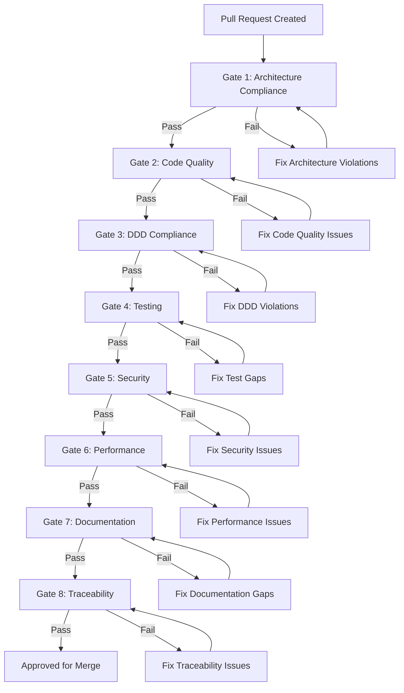

# 18 — Quality Gates

**Version:** 1.0  
**Status:** Normative  
**Parent:** RIOS Master Architecture Blueprint (MAB)  
**Cross-References:** Constitution, All ADRs, ATM, All Volumes

---

## 1. Purpose

This document defines mandatory quality gates that must pass before any code is
accepted into the RIOS codebase. Quality gates are non-negotiable — they protect
architectural integrity, code quality, security, and long-term maintainability.

---

## 2. Quality Gate Overview



---

## 3. Gate 1 — Architecture Compliance

### 3.1 Criteria

| ID     | Criterion                                               | Verification                           |
| ------ | ------------------------------------------------------- | -------------------------------------- |
| AC-001 | Domain layer has no infrastructure imports              | Architecture test (dependency-cruiser) |
| AC-002 | Domain layer has no application layer imports           | Architecture test                      |
| AC-003 | No cross-domain imports                                 | Architecture test                      |
| AC-004 | Infrastructure only depends on domain interfaces        | Architecture test                      |
| AC-005 | Application layer depends on domain, not infrastructure | Architecture test                      |
| AC-006 | API layer depends on application, not domain directly   | Architecture test                      |
| AC-007 | Frontend only calls API, never domain directly          | Architecture test                      |
| AC-008 | No circular dependencies                                | ESLint import/no-cycle                 |

### 3.2 Automation

```javascript
// .dependency-cruiser.cjs
module.exports = {
  forbidden: [
    {
      name: 'domain-no-infrastructure',
      comment: 'Domain layer must not import infrastructure',
      severity: 'error',
      from: { path: 'packages/domains/.*/src/domain/' },
      to: { path: 'packages/domains/.*/src/infrastructure/' },
    },
    {
      name: 'domain-no-application',
      comment: 'Domain layer must not import application layer',
      severity: 'error',
      from: { path: 'packages/domains/.*/src/domain/' },
      to: { path: 'packages/domains/.*/src/application/' },
    },
    {
      name: 'no-cross-domain',
      comment: 'No cross-domain imports',
      severity: 'error',
      from: { path: 'packages/domains/identity/' },
      to: { path: 'packages/domains/(?!identity)[^/]+/' },
    },
  ],
};
```

---

## 4. Gate 2 — Code Quality

### 4.1 Criteria

| ID     | Criterion                      | Verification                  |
| ------ | ------------------------------ | ----------------------------- |
| CQ-001 | ESLint passes with zero errors | `pnpm run lint`               |
| CQ-002 | Prettier formatting applied    | `pnpm run format:check`       |
| CQ-003 | TypeScript strict mode passes  | `pnpm run typecheck`          |
| CQ-004 | No `any` types                 | ESLint rule                   |
| CQ-005 | File size ≤ 300 lines          | ESLint custom rule / CI check |
| CQ-006 | Function size ≤ 50 lines       | ESLint custom rule            |
| CQ-007 | Cyclomatic complexity ≤ 10     | ESLint complexity rule        |
| CQ-008 | No unused variables            | ESLint no-unused-vars         |
| CQ-009 | Import order correct           | ESLint import/order           |

---

## 5. Gate 3 — DDD Compliance

### 5.1 Criteria

| ID      | Criterion                                     | Verification           |
| ------- | --------------------------------------------- | ---------------------- |
| DDD-001 | All aggregates extend AggregateRoot           | Architecture test      |
| DDD-002 | All value objects extend ValueObject          | Architecture test      |
| DDD-003 | All domain events extend DomainEvent          | Architecture test      |
| DDD-004 | Value objects are immutable                   | Code review / test     |
| DDD-005 | Aggregates emit domain events on state change | Unit test verification |
| DDD-006 | Repository interfaces in domain layer         | Architecture test      |
| DDD-007 | Repository implementations in infrastructure  | Architecture test      |
| DDD-008 | Domain services have no infrastructure deps   | Architecture test      |
| DDD-009 | Factory classes create valid aggregates       | Unit test              |
| DDD-010 | Domain errors extend DomainError              | Architecture test      |

---

## 6. Gate 4 — Testing

### 6.1 Criteria

| ID       | Criterion                                | Threshold | Verification                |
| -------- | ---------------------------------------- | --------- | --------------------------- |
| TEST-001 | Unit test coverage (domain)              | ≥ 90%     | Vitest coverage report      |
| TEST-002 | Unit test coverage (application)         | ≥ 80%     | Vitest coverage report      |
| TEST-003 | Unit test coverage (infrastructure)      | ≥ 70%     | Vitest coverage report      |
| TEST-004 | All unit tests pass                      | 100%      | `pnpm run test`             |
| TEST-005 | Integration tests pass                   | 100%      | `pnpm run test:integration` |
| TEST-006 | Architecture tests pass                  | 100%      | `pnpm run test:arch`        |
| TEST-007 | E2E tests pass                           | 100%      | `pnpm run test:e2e`         |
| TEST-008 | No skipped tests (without justification) | 0         | CI check                    |
| TEST-009 | Domain events verified in tests          | Per event | Code review                 |

---

## 7. Gate 5 — Security

### 7.1 Criteria

| ID      | Criterion                                          | Verification              |
| ------- | -------------------------------------------------- | ------------------------- |
| SEC-001 | No hardcoded secrets                               | `secretlint` scan         |
| SEC-002 | Input validation on all API endpoints              | Zod schemas present       |
| SEC-003 | Authentication required on protected routes        | Integration test          |
| SEC-004 | Authorization checks in place                      | Integration test          |
| SEC-005 | SQL injection prevention (parameterized queries)   | Drizzle ORM (automatic)   |
| SEC-006 | XSS prevention (React auto-escaping + CSP headers) | Security headers          |
| SEC-007 | Rate limiting configured                           | Configuration check       |
| SEC-008 | HTTPS enforced                                     | Configuration check       |
| SEC-009 | Dependencies audited                               | `pnpm audit`              |
| SEC-010 | OWASP Top 10 addressed                             | Security review checklist |

---

## 8. Gate 6 — Performance

### 8.1 Criteria

| ID       | Criterion                    | Threshold       | Verification         |
| -------- | ---------------------------- | --------------- | -------------------- |
| PERF-001 | API response time (p95)      | < 200ms         | Load test            |
| PERF-002 | API response time (p99)      | < 500ms         | Load test            |
| PERF-003 | Database query time          | < 50ms          | Query profiling      |
| PERF-004 | Page load time (LCP)         | < 2.5s          | Lighthouse           |
| PERF-005 | Bundle size                  | < 250KB gzipped | CI bundle analyzer   |
| PERF-006 | No N+1 queries               | 0               | Integration tests    |
| PERF-007 | Caching strategy implemented | Per design      | Code review          |
| PERF-008 | No memory leaks              | Stable          | Load test monitoring |

---

## 9. Gate 7 — Documentation

### 9.1 Criteria

| ID        | Criterion                               | Verification         |
| --------- | --------------------------------------- | -------------------- |
| DOC-G-001 | Public APIs have JSDoc                  | ESLint jsdoc plugin  |
| DOC-G-002 | README.md exists in every package       | CI check             |
| DOC-G-003 | Complex algorithms have inline comments | Code review          |
| DOC-G-004 | API endpoints documented (OpenAPI)      | OpenAPI spec         |
| DOC-G-005 | Breaking changes documented             | Changelog check      |
| DOC-G-006 | Environment variables documented        | `.env.example` check |

---

## 10. Gate 8 — Traceability

### 10.1 Criteria

| ID        | Criterion                               | Verification           |
| --------- | --------------------------------------- | ---------------------- |
| TRACE-001 | Implementation maps to ATM entry        | ATM review             |
| TRACE-002 | ADRs consulted for technology decisions | JSDoc / PR description |
| TRACE-003 | Constitution rules followed             | Checklist              |
| TRACE-004 | Volume references in JSDoc `@see` tags  | Code review            |
| TRACE-005 | Domain boundaries match architecture    | Architecture test      |

---

## 11. Quality Gate Automation

### 11.1 CI Pipeline Integration

```yaml
# .github/workflows/quality-gates.yml

name: Quality Gates

on:
  pull_request:
    branches: [main]

jobs:
  gate-1-architecture:
    runs-on: ubuntu-latest
    steps:
      - uses: actions/checkout@v4
      - uses: pnpm/action-setup@v2
      - run: pnpm install
      - run: pnpm run test:arch

  gate-2-code-quality:
    runs-on: ubuntu-latest
    steps:
      - uses: actions/checkout@v4
      - uses: pnpm/action-setup@v2
      - run: pnpm install
      - run: pnpm run lint
      - run: pnpm run format:check
      - run: pnpm run typecheck

  gate-3-ddd-compliance:
    runs-on: ubuntu-latest
    needs: gate-1-architecture
    steps:
      - uses: actions/checkout@v4
      - uses: pnpm/action-setup@v2
      - run: pnpm install
      - run: pnpm run test:arch
      - run: pnpm run test:unit

  gate-4-testing:
    runs-on: ubuntu-latest
    needs: gate-2-code-quality
    steps:
      - uses: actions/checkout@v4
      - uses: pnpm/action-setup@v2
      - run: pnpm install
      - run: pnpm run test:unit -- --coverage
      - run: pnpm run test:integration
      - name: Check coverage thresholds
        run: pnpm run test:coverage:check

  gate-5-security:
    runs-on: ubuntu-latest
    steps:
      - uses: actions/checkout@v4
      - uses: pnpm/action-setup@v2
      - run: pnpm install
      - run: pnpm audit --audit-level=high
      - run: pnpm run lint:secrets

  gate-6-performance:
    runs-on: ubuntu-latest
    needs: gate-4-testing
    if: github.event.pull_request.base.ref == 'main'
    steps:
      - uses: actions/checkout@v4
      - uses: pnpm/action-setup@v2
      - run: pnpm install
      - run: pnpm run build
      - run: pnpm run bundle:check

  gate-7-documentation:
    runs-on: ubuntu-latest
    steps:
      - uses: actions/checkout@v4
      - run: |
          for dir in packages/*/; do
            if [ ! -f "${dir}README.md" ]; then
              echo "Missing README.md in ${dir}"
              exit 1
            fi
          done

  gate-8-traceability:
    runs-on: ubuntu-latest
    steps:
      - uses: actions/checkout@v4
      - name: Check JSDoc @see tags
        run: pnpm run check:traceability
```

### 11.2 PR Merge Requirements

| Requirement                                  | Setting  |
| -------------------------------------------- | -------- |
| All quality gate checks must pass            | Required |
| Minimum 1 approving review                   | Required |
| Code owner review for infrastructure changes | Required |
| All conversations resolved                   | Required |
| Branch up to date with main                  | Required |

---

## 12. Quality Gate Exceptions

| ID         | Rule                                             |
| ---------- | ------------------------------------------------ |
| QG-EXC-001 | No exceptions without documented justification   |
| QG-EXC-002 | Exceptions require engineering lead approval     |
| QG-EXC-003 | Exceptions are time-bound (must be resolved)     |
| QG-EXC-004 | Exception count tracked (max 3 open at any time) |
| QG-EXC-005 | Architecture gates never excepted                |

---

## 13. Quality Metrics Dashboard

| Metric                                   | Target     | Tracking         |
| ---------------------------------------- | ---------- | ---------------- |
| Code coverage (domain)                   | ≥ 90%      | CI report        |
| Code coverage (overall)                  | ≥ 80%      | CI report        |
| Architecture test pass rate              | 100%       | CI report        |
| Security vulnerabilities (high/critical) | 0          | Dependabot       |
| Mean PR review time                      | < 24 hours | GitHub metrics   |
| Quality gate pass rate (first attempt)   | ≥ 80%      | CI metrics       |
| Production incident rate                 | < 1/week   | Incident tracker |

---

_This document is part of the RIOS Engineering Blueprint. It is subordinate to
the Master Architecture Blueprint, Architecture Governance Standard, and all
normative architecture documents._
