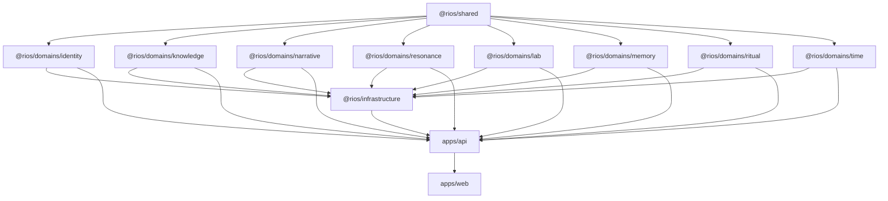
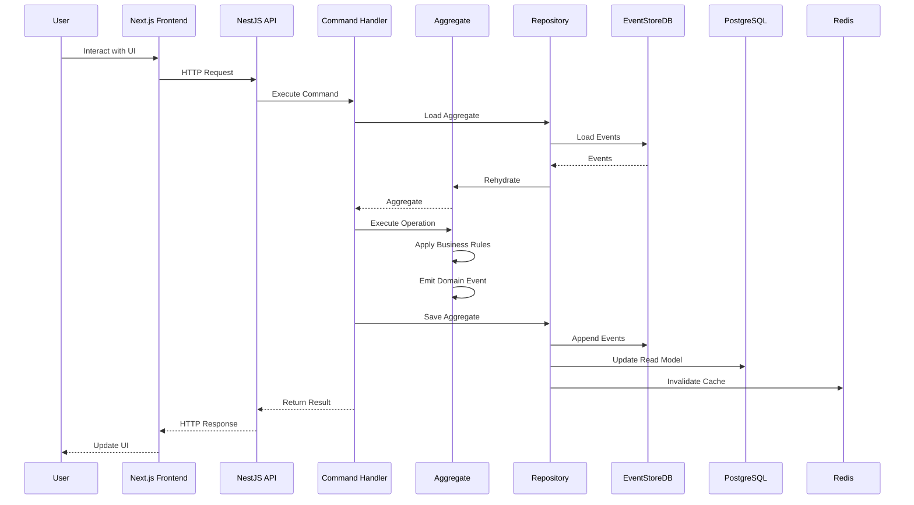

# Appendix — Engineering Appendices

**Version:** 1.0  
**Status:** Normative  
**Parent:** RIOS Master Architecture Blueprint (MAB)  
**Cross-References:** All Engineering Documents, All Volumes, ADRs, ATM,
Constitution

---

## A. Engineering Glossary

| Term                 | Definition                                                                           |
| -------------------- | ------------------------------------------------------------------------------------ |
| Aggregate Root       | Entry point to a cluster of domain objects treated as a single unit for data changes |
| ADR                  | Architecture Decision Record — documents significant architectural decisions         |
| ATM                  | Architecture Traceability Matrix — maps requirements to architecture elements        |
| BFF                  | Backend for Frontend — API gateway pattern for frontend-specific needs               |
| CQRS                 | Command Query Responsibility Segregation — separates read and write operations       |
| DDD                  | Domain-Driven Design — software approach centered on business domain                 |
| DMS                  | Document Management System — RIOS's documentation governance standard                |
| Domain Event         | A record of something that happened in the domain                                    |
| ES                   | Event Sourcing — storing state changes as a sequence of events                       |
| EventStoreDB         | Database optimized for event sourcing                                                |
| Factory              | Pattern for creating complex objects and aggregates                                  |
| HNSW                 | Hierarchical Navigable Small World — graph algorithm for vector search               |
| IaC                  | Infrastructure as Code                                                               |
| Idempotent           | Operation that produces same result regardless of repetition                         |
| Layered Architecture | DDD layering: Domain → Application → Infrastructure                                  |
| MAB                  | Master Architecture Blueprint — the primary RIOS architecture document               |
| Monorepo             | Single repository containing multiple packages                                       |
| OBS                  | Open Build Service or Observability                                                  |
| OpenTelemetry        | Vendor-neutral observability framework                                               |
| ORCID                | Open Researcher and Contributor ID                                                   |
| Polyrepo             | Multiple repositories, each containing a single project                              |
| RAG                  | Retrieval-Augmented Generation — combining retrieval with LLM generation             |
| Repository (DDD)     | Interface for accessing and persisting aggregates                                    |
| Repository (Git)     | Version-controlled code storage                                                      |
| RIOS                 | Research Identity Operating System                                                   |
| Turborepo            | High-performance build system for JavaScript monorepos                               |
| Ubiquitous Language  | Shared language between developers and domain experts                                |
| Value Object         | Immutable object defined by its attributes rather than identity                      |
| Vector Embedding     | Numerical representation of text/data in high-dimensional space                      |
| Vercel               | Cloud platform for frontend deployment                                               |

---

## B. Technology Matrix

| Technology     | Version | Purpose            | Lifecycle Status        |
| -------------- | ------- | ------------------ | ----------------------- |
| TypeScript     | 5.x     | Primary language   | Active                  |
| Node.js        | 20 LTS  | Runtime            | Active (LTS until 2026) |
| NestJS         | 10.x    | Backend framework  | Active                  |
| Next.js        | 14.x    | Frontend framework | Active                  |
| React          | 18.x    | UI library         | Active                  |
| PostgreSQL     | 16      | Primary database   | Active                  |
| EventStoreDB   | 23.10   | Event store        | Active                  |
| Redis          | 7.x     | Cache              | Active                  |
| Qdrant         | 1.x     | Vector database    | Active                  |
| pnpm           | 9.x     | Package manager    | Active                  |
| Turborepo      | 2.x     | Monorepo build     | Active                  |
| Vitest         | 1.x     | Test runner        | Active                  |
| Playwright     | 1.x     | E2E testing        | Active                  |
| Docker         | 25.x    | Containerization   | Active                  |
| GitHub Actions | —       | CI/CD              | Active                  |
| OpenTelemetry  | 1.x     | Observability      | Active                  |
| Drizzle ORM    | 0.x     | Database ORM       | Active                  |
| Zod            | 3.x     | Schema validation  | Active                  |
| Clerk          | —       | Authentication     | Active                  |
| Tailwind CSS   | 3.x     | Styling            | Active                  |
| shadcn/ui      | —       | Component library  | Active                  |
| Anthropic SDK  | 1.x     | LLM integration    | Active                  |
| Vercel AI SDK  | 3.x     | AI framework       | Active                  |

---

## C. Repository Map

```
rios/
├── .github/
│   ├── workflows/
│   │   ├── ci.yml
│   │   ├── quality-gates.yml
│   │   ├── deploy-staging.yml
│   │   └── deploy-production.yml
│   ├── CODEOWNERS
│   └── pull_request_template.md
├── apps/
│   ├── api/                          # NestJS backend
│   │   ├── src/
│   │   │   ├── modules/
│   │   │   │   ├── identity/
│   │   │   │   ├── knowledge/
│   │   │   │   ├── narrative/
│   │   │   │   ├── resonance/
│   │   │   │   ├── lab/
│   │   │   │   ├── memory/
│   │   │   │   ├── ritual/
│   │   │   │   └── time/
│   │   │   ├── shared/
│   │   │   ├── infrastructure/
│   │   │   └── main.ts
│   │   ├── test/
│   │   ├── package.json
│   │   └── tsconfig.json
│   └── web/                          # Next.js frontend
│       ├── app/
│       │   ├── (auth)/
│       │   ├── (dashboard)/
│       │   ├── api/
│       │   └── layout.tsx
│       ├── components/
│       │   ├── ui/
│       │   ├── features/
│       │   └── shared/
│       ├── lib/
│       ├── styles/
│       ├── package.json
│       └── tsconfig.json
├── packages/
│   ├── shared/
│   │   └── src/
│   │       ├── domain/
│   │       ├── errors/
│   │       └── index.ts
│   ├── domains/
│   │   ├── identity/
│   │   │   └── src/
│   │   │       ├── domain/
│   │   │       ├── application/
│   │   │       ├── infrastructure/
│   │   │       └── index.ts
│   │   ├── knowledge/
│   │   ├── narrative/
│   │   ├── resonance/
│   │   ├── lab/
│   │   ├── memory/
│   │   ├── ritual/
│   │   └── time/
│   ├── infrastructure/
│   │   └── src/
│   │       ├── database/
│   │       ├── event-store/
│   │       ├── cache/
│   │       ├── search/
│   │       └── index.ts
│   └── config/
│       ├── eslint-config/
│       ├── typescript-config/
│       └── tailwind-config/
├── infrastructure/
│   ├── docker/
│   │   ├── Dockerfile.api
│   │   └── Dockerfile.web
│   ├── docker-compose.yml
│   └── docker-compose.prod.yml
├── docs/
│   ├── architecture/
│   ├── engineering/
│   ├── adr/
│   └── runbooks/
├── scripts/
│   ├── setup.sh
│   ├── seed.sh
│   └── deploy.sh
├── turbo.json
├── pnpm-workspace.yaml
├── package.json
├── .prettierrc
├── eslint.config.js
├── .env.example
└── README.md
```

---

## D. Dependency Diagram



---

## E. Architecture-to-Code Mapping

| Architecture Element       | Volume      | Code Location                                             | ADR     |
| -------------------------- | ----------- | --------------------------------------------------------- | ------- |
| Researcher Aggregate       | Volume I    | `packages/domains/identity/src/domain/Researcher.ts`      | ADR-001 |
| Intellectual Direction VO  | Volume I    | `packages/domains/identity/src/domain/value-objects/`     | ADR-004 |
| Research Agenda Aggregate  | Volume II   | `packages/domains/knowledge/src/domain/ResearchAgenda.ts` | ADR-001 |
| Evidence Value Object      | Volume II   | `packages/domains/knowledge/src/domain/value-objects/`    | ADR-004 |
| Vector Search Service      | Volume II   | `packages/domains/knowledge/src/domain/services/`         | ADR-006 |
| Narrative Draft Aggregate  | Volume III  | `packages/domains/narrative/src/domain/NarrativeDraft.ts` | ADR-001 |
| Resonance Score VO         | Volume IV   | `packages/domains/resonance/src/domain/value-objects/`    | ADR-004 |
| Experiment Aggregate       | Volume V    | `packages/domains/lab/src/domain/Experiment.ts`           | ADR-001 |
| Memory Entry Aggregate     | Volume VI   | `packages/domains/memory/src/domain/MemoryEntry.ts`       | ADR-001 |
| Research Ritual Aggregate  | Volume VII  | `packages/domains/ritual/src/domain/ResearchRitual.ts`    | ADR-001 |
| Temporal Context Aggregate | Volume VIII | `packages/domains/time/src/domain/TemporalContext.ts`     | ADR-001 |
| PostgreSQL Schema          | All Volumes | `packages/infrastructure/src/database/`                   | ADR-005 |
| EventStoreDB Integration   | All Volumes | `packages/infrastructure/src/event-store/`                | ADR-002 |
| Redis Cache                | All Volumes | `packages/infrastructure/src/cache/`                      | ADR-007 |
| Qdrant Vector DB           | Volume II   | `packages/infrastructure/src/search/`                     | ADR-006 |
| REST API                   | All Volumes | `apps/api/src/modules/`                                   | ADR-008 |
| Next.js Frontend           | All Volumes | `apps/web/`                                               | ADR-009 |
| Authentication             | All Volumes | `apps/api/src/shared/auth/`                               | ADR-010 |

---

## F. Implementation Checklists

### F.1 New Domain Package Checklist

```
□ Create package directory structure
□ Create package.json with @rios/domains/{name} scope
□ Create tsconfig.json extending base config
□ Implement value objects (with validation)
□ Implement domain events
□ Implement aggregate(s)
□ Implement domain services
□ Implement factory classes
□ Define repository interface(s)
□ Implement domain errors
□ Write unit tests (≥ 90% coverage)
□ Write package README.md
□ Export public API via index.ts
□ Run architecture tests
□ Run ESLint + Prettier
□ Verify no cross-domain imports
□ Verify no infrastructure imports in domain
```

### F.2 New API Endpoint Checklist

```
□ Define Zod request schema
□ Define Zod response schema
□ Implement command/query handler
□ Implement controller method
□ Add authentication guard
□ Add authorization check
□ Add input validation
□ Add error handling
□ Write integration test
□ Document in OpenAPI spec
□ Verify HTTP status codes
□ Verify error response format
□ Run quality gates
```

### F.3 New Database Migration Checklist

```
□ Migration is backward-compatible
□ Migration is idempotent
□ Migration tested in staging
□ Indexes created with CONCURRENTLY (if applicable)
□ No breaking schema changes
□ Migration file follows naming convention
□ Migration documented in changelog
```

---

## G. Review Checklists

### G.1 Code Review Checklist

```
Architecture
□ No DDD layer violations
□ No cross-domain dependencies
□ Repository interfaces in domain layer
□ Events emitted for state changes

Code Quality
□ Naming conventions followed
□ File size limits respected
□ Function size limits respected
□ No `any` types
□ JSDoc on public APIs
□ Error handling present

Testing
□ Unit tests included
□ Edge cases tested
□ Error scenarios tested
□ Coverage targets met

Security
□ Input validation present
□ No hardcoded secrets
□ No SQL injection vectors
□ No XSS vectors
```

### G.2 Architecture Review Checklist

```
□ Implementation matches Volume specification
□ ADRs followed
□ ATM entries verified
□ Constitution rules followed
□ Domain boundaries respected
□ Aggregate invariants enforced
□ Value objects immutable
□ Domain events complete
□ No architectural drift
```

---

## H. Release Checklists

### H.1 Pre-Release Checklist

```
□ All quality gates passing
□ Staging deployment successful
□ Smoke tests passing in staging
□ Database migrations backward-compatible
□ Performance benchmarks within budget
□ Security scan clean
□ Rollback plan documented
□ On-call engineer identified
□ Release notes drafted
□ Stakeholders notified
```

### H.2 Post-Release Checklist

```
□ Production health checks passing
□ Error rate within normal range
□ Latency within normal range
□ No increase in error logs
□ Key user journeys verified
□ Monitoring dashboards reviewed
□ Release tagged in Git
□ Changelog updated
□ Post-deployment smoke test complete
```

---

## I. Module Interaction Diagram



---

## J. Error Code Registry

| Code                     | Domain    | Error Class                 | HTTP Status |
| ------------------------ | --------- | --------------------------- | ----------- |
| RESEARCHER_NOT_FOUND     | Identity  | ResearcherNotFoundError     | 404         |
| DUPLICATE_EMAIL          | Identity  | DuplicateEmailError         | 409         |
| INVALID_ORCID            | Identity  | InvalidOrcidError           | 400         |
| AGENDA_NOT_FOUND         | Knowledge | AgendaNotFoundError         | 404         |
| INSUFFICIENT_EVIDENCE    | Knowledge | InsufficientEvidenceError   | 422         |
| NARRATIVE_NOT_FOUND      | Narrative | NarrativeNotFoundError      | 404         |
| NARRATIVE_LOCKED         | Narrative | NarrativeLockedError        | 409         |
| RESONANCE_LOW            | Resonance | ResonanceLowError           | 422         |
| EXPERIMENT_NOT_FOUND     | Lab       | ExperimentNotFoundError     | 404         |
| EXPERIMENT_IN_PROGRESS   | Lab       | ExperimentInProgressError   | 409         |
| MEMORY_ENTRY_NOT_FOUND   | Memory    | MemoryEntryNotFoundError    | 404         |
| RITUAL_NOT_FOUND         | Ritual    | RitualNotFoundError         | 404         |
| RITUAL_ALREADY_ACTIVE    | Ritual    | RitualAlreadyActiveError    | 409         |
| TEMPORAL_CONTEXT_INVALID | Time      | TemporalContextInvalidError | 400         |
| CONCURRENT_MODIFICATION  | All       | ConcurrentModificationError | 409         |

---

_This document is part of the RIOS Engineering Blueprint. It is subordinate to
the Master Architecture Blueprint, Architecture Governance Standard, and all
normative architecture documents._
